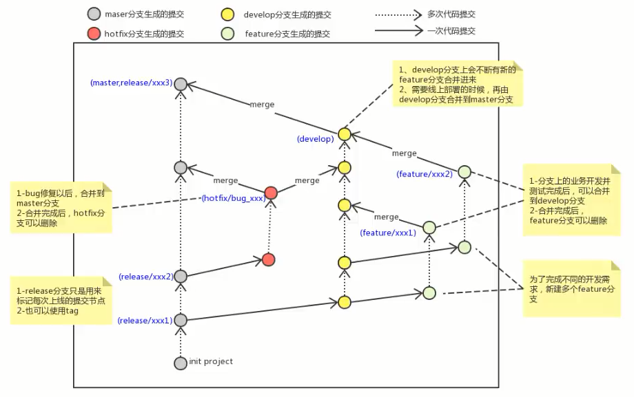

# 分支

凡乎所有的版本控制系统都以某种形式支持分支.使用分支意味着你可以把你的工作从开发主线上分离开来进行重大的Bug修改,开发新的功能,以免影响开发主线

## 查看分支列表

列出现有的分支列表

`git branch`

## 新建分支

创建一个新的分支

`git branch 分支名`

## 切换分支

切换当前分支

`git checkout 要切换分支名`

创建并切换分支

`git checkout -b 分支名`

## 删除分支

不能删除当前分支,只能删除其他分支

`git branch -d 分支名`删除分支时,需要做检查,防止误操作

`git branch -D 分支名`删除分支时,不做检查,强制删除

## 合并分支

当前分支和另一个分支进行合并

`git merge 分支名`

## 解决合并冲突

当两个分支上对文件的修改可能会存在冲突,例如同时修改了同一个文件的同一行,这时就需要手动解决冲突,解决冲突步骤如下:

1. 处理文件中冲突的地方
    1. 手动打开文件
    2. 找到有冲突的地方
    3. 删除不需要的内容
2. 将解决完冲突的文件加入暂存区(add)
3. 提交到仓库(commit)

## 开发中分支使用原则与流程

几乎所有的版本控制系统都以某种形式支持分支.使用分支意味着你可以把你的工作从开发主线上分离开来进行重大的Bug修改,开发新的功能,以免影响开发主线.

在开发中,一般有如下分支使用原则与流程:

* master
    * 生产分支
    * 线上分支,主分支,中小规模项目作为线上运行的应用对应的分支
* develop
    * 开发分支
    * 是从 master 创建的分支,一般作为开发部门的主要开发分支,如果没有其他并行开发不同期上线要求,都可以在此版本进行开发,阶段开发完成后,需要是合并到 master 分支,准备上线
* feature/xxxx
    * 从 develop 创建的分支,一般是同期并行开发,但不同期上线时创建的分支,分支上的研发任务完成后合并到 develop 分支
* hotfix/xxxx
    * 从 master 派生的分支,一般作为线上bug修复使用,修复完成后需要合并到 master,test,develop 分支
    * 还有一些其他分支,在此不再详述,例如test分支(用于代码测试),pre分支(预上线分支)等等

