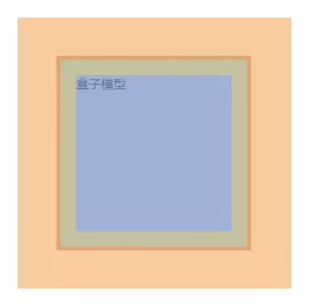
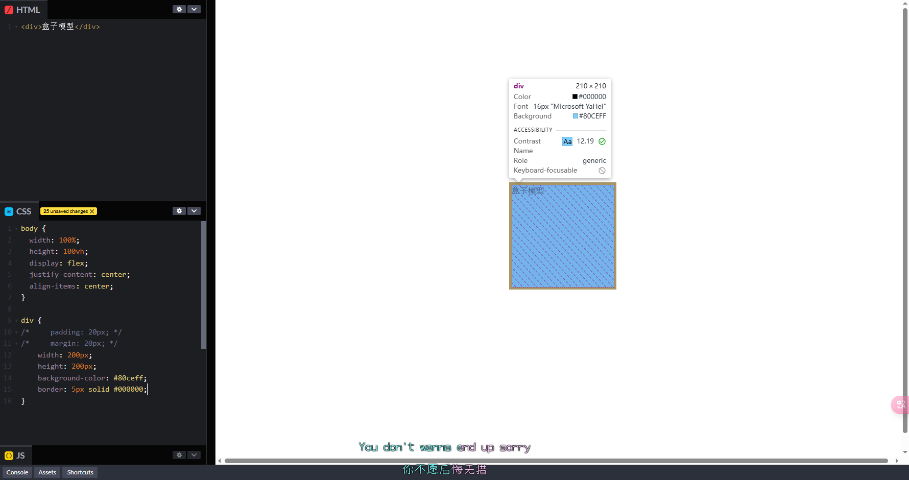
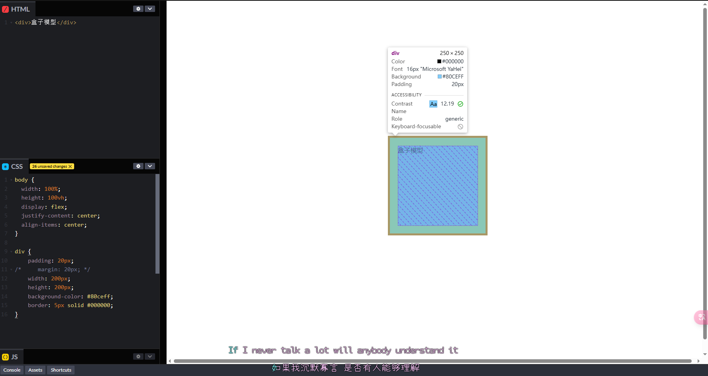
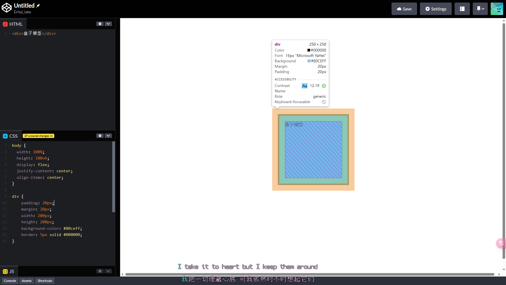
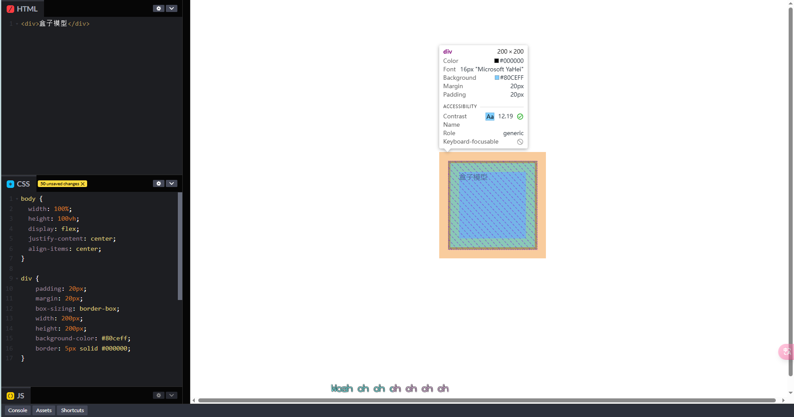

# 盒子模型

:::warning
盒子模型是网页布局的基础, 是网页最难理解也是最重要的内容之一
:::

盒子模型是网页布局的基础, 所有网页元素都是由盒子组成的, CSS盒模型定义了盒子的尺寸, 盒子由内边距/边框和内容三部分组成, 外边距则定义了盒子与外界的距离

## 组成

* 内容区域
  * `width`和`height`
* 内边距
  * `padding`(出现在内容区域与边框之间)
* 外边距
  * `margin`(出现在盒子与外界之间)
* 边框线
  * `border`



## 内容区域

```html
<div>盒子模型</div>
```

```css {2-3}
div {
    width: 200px;
    height: 200px;
    background-color: #80ceff;
}
```


## 边框线

`border: 大小 样式 颜色`(没有顺序)

样式值:

* solid: 实线
* dashed: 虚线
* dotted: 点线
* double: 双实线
* groove: 3D凹槽
* inset: 3D凹入
* outset: 3D凸出
* ridge: 3D脊线
* none: 无边框

可以加入方向:

* `border-top`: 顶部
* `border-right`: 右边
* `border-bottom`: 底部
* `border-left`: 左边

```html
<div>盒子模型</div>
```

```css {5}
div {
    width: 200px;
    height: 200px;
    background-color: #80ceff;
    border: 5px solid #fff;
}
```



## 内边距

`padding: 全部`

`padding: 上下 左右`

`padding: 上 左右 下`

`padding: 上 右 下 左`

可以加入方向:

* `padding-top`: 顶部
* `padding-right`: 右边
* `padding-bottom`: 底部
* `padding-left`: 左边

```html
<div>盒子模型</div>
```

```css {2}
div {
    padding: 20px;
    width: 200px;
    height: 200px;
    background-color: #80ceff;
    border: 5px solid #fff;
}
```



## 外边距

`margin: 全部`

`margin: 上下 左右`

`margin: 上 左右 下`

`margin: 上 右 下 左`

可以加入方向:

* `margin-top`: 顶部
* `margin-right`: 右边
* `margin-bottom`: 底部
* `margin-left`: 左边

```html
<div>盒子模型</div>
```

```css {3}
div {
    padding: 20px;
    margin: 20px;
    width: 200px;
    height: 200px;
    background-color: #80ceff;
    border: 5px solid #fff;
}
```



## 尺寸计算

盒子模型中的尺寸计算: `盒子尺寸 = width + padding + border + margin`

加`padding`和`border`会影响盒子尺寸

如果不想改变盒子尺寸, 可以使用内减模式:`box-sizing: border-box;`


