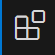
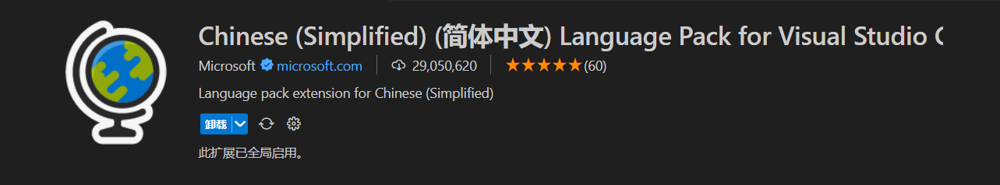
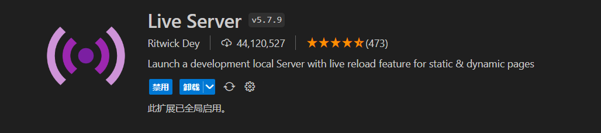
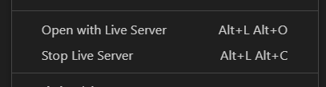
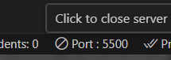

# 环境

## 浏览器

推荐使用**chromegw**, **Edge**

教程中使用**Edge**

**Edge**是微软开发的, Win10及以上系统自带的浏览器

[官网地址](//www.microsoft.com/zh-cn/edge)

## 编辑器

推荐使用**Sublime Text**, **WebStorm**, **HBuilder**, **Visual Studio Code**

教程中使用**Visual Studio Code(VS Code)**

**VS Code**是由微软开发的免费开源的代码编辑器(我更喜欢归为文本编辑器)

它支持多种编程语言, 拥有丰富的扩展生态系统, 并且几乎全平台

安装的时候, 记得关联文件资源管理器就可以了

[官网地址](//code.visualstudio.com/)

### VS Code插件

VS Code需要安装两个插件

点击侧边栏的这个图标(Ctrl + Shift + X) 

#### 中文汉化

第一个:`Chinese (Simplified) (简体中文) Language Pack for Visual Studio Code`

用于汉化VS Code, 属于选装插件

#### 内网服务器

第二个:`Live Server`

这个插件可以创建一个内网, 用于实时更新网页代码等

在`.html`或者`.htm`后缀的文件, 右键鼠标, 可以看见右键菜单里, 多了两项

Open with Live Server 是打开网页

Stop Live Server 就是关闭了

正常来说, 打开网页后, 浏览器会自动跳转, 没有自动跳转也没关系, 在浏览器输入内网网址也可以, 默认为`http://localhost:5500`

5500是端口号, 在VS Code右下角可以看见, 点击这个也可以关闭或打开网页

