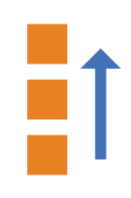
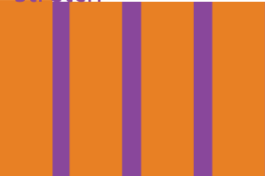
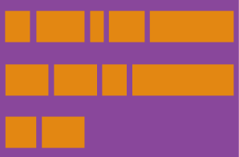
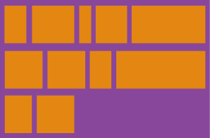

# 弹性布局

Flex布局是**浏览器提倡**的布局模型, 非常使用结构化布局, 提供强大的**空间布局**和**对齐**能力

Flex模型**不会**产生浮动布局中的**脱标**现象, 布局网页**更简单, 更灵活**

Flex模型有6个属性:

* `flex-direction`
* `flex-wrap`
* `flex-flow`
* `justify-content`
* `align-items`
* `align-content`

项目也有6个属性:

* `order`
* `flex-grow`
* `flex-shrink`
* `flex-basis`
* `flex`
* `align-self`

## 基本概念

采用`Flex`布局的元素, 称为Flex容器(flex container), 简称**容器**

它的所有子元素自动成为容器成员, 称为Flex项目(flex item), 简称**项目**


容器默认存在两根轴:**水平的主轴(main axis)**和**垂直的交叉轴(cross axis)**

主轴的开始位置(与边框的交叉点)叫做main start, 结束位置叫做main end

交叉轴的开始位置叫做cross start, 结束位置叫做cross end

项目默认沿主轴排列

单个项目占据的主轴空间叫做main size, 占据的交叉轴空间叫做cross size

## flex-direction属性

`flex-direction`属性决定主轴的方向(即项目的排列方向)

属性值:

`row`:主轴为**水平方向**, 起点在**左端**(默认值)


`row-reverse`:主轴为**水平方向**, 起点在**右端**


`column`:主轴为**垂直方向**, 起点在**上沿**


`column-reverse`:主轴为**垂直方向**, 起点在**下沿**



## flex-wrap属性

默认情况下, 项目都排在一条线(轴线)上.

`flex-wrap`属性定义, 如果一条轴线排不下, 如何换行

属性值:

`nowrap`:不换行(默认值)


`wrap`:换行, 第一行在**上方**


`wrap-reverse`:换行, 第一行在**下方**


## flex-flow属性

`flex-flow`属性是`flex-direction`属性和`flex-wrap`属性的简写形式

默认值为:`row nowrap`

## justify-content属性

`justify-content`属性定义了项目在主轴上的对齐方式

属性值:

`flex-start`:左对齐(默认值)


`flex-end`:右对齐


`center`:居中


`space-between`:两端对齐, 项目之间的间隔都相等


`space-around`:每个项目两侧的间隔相等.所以, 项目之间的间隔比项目与边框的间隔大一倍


`space-evenly`:均匀排列每个元素, 每个元素之间的间隔相等


## align-items属性

`align-items`属性定义项目在交叉轴上如何对齐

属性值:

`flex-start`:交叉轴的起点对齐


`flex-end`:交叉轴的终点对齐


`center`:交叉轴的中点对齐


`baseline`:项目的第一行文字的基线对齐


`stretch`:如果项目未设置高度或设为auto, 将占满整个容器的高度(默认值)



## align-content属性

`align-content`属性定义了多根轴线的对齐方式.如果项目只有一根轴线, 该属性不起作用

属性值:

`flex-start`:与交叉轴的起点对齐


`flex-end`:与交叉轴的终点对齐


`center`:与交叉轴的中点对齐


`space-between`:与交叉轴两端对齐, 轴线之间的间隔平均分布


`space-around`:每根轴线两侧的间隔都相等.所以, 轴线之间的间隔比轴线与边框的间隔大一倍



`stretch`:轴线占满整个交叉轴(默认值)



## order属性

`order`属性定义项目的排列顺序.数值越小, 排列越靠前, 默认为0


## flex-grow属性

`flex-grow`属性定义项目的放大比例, 默认为0, 即如果存在剩余空间, 也不放大

如果所有项目的`flex-grow`属性都为1, 则它们将等分剩余空间(如果有的话).如果一个项目的`flex-grow`属性为2, 其他项目都为1, 则前者占据的剩余空间将比其他项多一倍


## flex-shrink属性

`flex-shrink`属性定义了项目的缩小比例, 默认为1, 即如果空间不足, 该项目将缩小

如果所有项目的`flex-shrink`属性都为1, 当空间不足时, 都将等比例缩小.如果一个项目的`flex-shrink`属性为0, 其他项目都为1, 则空间不足时, 前者不缩小

负值对该属性无效


## flex-basis属性

`flex-basis`属性定义了在分配多余空间之前, 项目占据的主轴空间(main size).浏览器根据这个属性, 计算主轴是否有多余空间.它的默认值为auto, 即项目的本来大小

它可以设为跟width或height属性一样的值, 则项目将占据固定空间

## flex属性

`flex`属性是`flex-grow`, `flex-shrink`和`flex-basis`的简写, 默认值为0 1 auto.后两个属性可选

该属性有两个快捷值:`auto`(1 1 auto)和`none`(0 0 auto)

建议优先使用这个属性, 而不是单独写三个分离的属性, 因为浏览器会推算相关值

## align-self属性

`align-self`属性允许单个项目有与其他项目不一样的对齐方式, 可覆盖`align-items`属性.默认值为`auto`, 表示继承父元素的`align-items`属性, 如果没有父元素, 则等同于`stretch`

该属性可能取6个值, 除了`auto`, 其他都与`align-items`属性完全一致


## 例子

```html
<div class="box">
    <div>1</div>
    <div>2</div>
    <div>3</div>
    <div>4</div>
</div>
```

```css
.box {
    width: 50%;
    padding: 20px;
    background-color: pink;
    display: flex;
    justify-content: space-around;
}

.box div{
    width: 100px;
    height: 100px;
    background-color: yellow;
}
```


## 布局生成器

老规矩, 发几个生成器的网址

[Flex在线工具](//jack.jackafan.top/zsd/css/flex/) ☆

[Flexible Box Display](//kexiaolong.gitee.io/flexible-box-display/)
