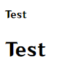
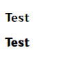
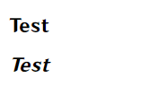
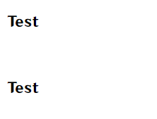
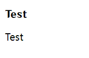
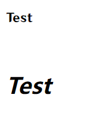
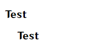
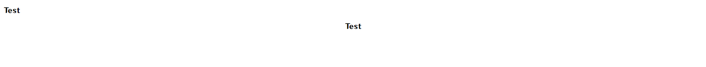
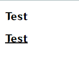
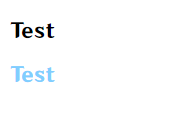

# 字体修饰属性

|      属性名       |     描述     |
| :---------------: | :----------: |
|    `font-size`    |   文字大小   |
|   `font-weight`   |   字体粗细   |
|   `font-style`    |   字体倾斜   |
|   `line-height`   |     行高     |
|   `font-family`   |     字体     |
|      `font`       | 字体复合属性 |
|   `text-indent`   |   文本缩进   |
|   `text-align`    |   文本对齐   |
| `text-decoration` |    修饰线    |
|      `color`      |     颜色     |

```html
<p>Test</p>
<p class="a">Test</p>
```

## 文字大小

属性名:`font-size`

数值

```css
.a{
    font-size: 30px;
}
```



## 字体粗细

属性名:`font-size`

数值(100~900的整数, 默认为400)

关键词(如:加粗`bold`, 默认为`normal`)

```css
.a{
    font-weight: 900;
}
```



## 字体倾斜

属性名:`font-style`

关键词(正常:`normal`, 倾斜:`italic`)

```css
.a{
    font-style: italic;
}
```



## 行高

属性名:`line-height`

数值

```css
.a{
    line-height: 100px;
}
```



## 字体

属性名:`font-family`

字体名(可以设置多个, 如果没有字体, 就按从左到右的顺序读取下一个)

```css
.a{
   font-family: "微软雅黑";
}
```



## 字体复合属性

属性名:`font`

```css
/* 完整写法 */
.a{
    font-style: italic;
    font-weight: 900;
    font-size: 30px;
    line-height: 100px;
    font-family: "微软雅黑";
}

/* font缩写 */
.a{
	font: italic 900 30px/100px "微软雅黑";
}

/* 两种写法功能一样 */
```



## 文本缩进

属性名:`text-indent`

数值

```css
.a{
    text-indent: 20px;
}
```



## 文本对齐

属性名:`text-align`

关键词(左对齐(默认):`left`, 居中:`center`, 右对齐:`right`)

```css
.a{
    text-align: center;
}
```



## 修饰线

属性名:`text-decoration`

关键词(无:`none`, 下划线:`underline`, 删除线:`line-through`, 上划线:`overline`)

```css
.a{
    text-decoration: underline;
}
```



## 颜色

属性名:`color`

颜色

```css
.a{
    color: #80ceff;
}
```


