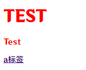
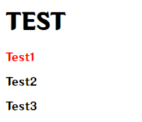
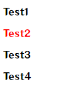
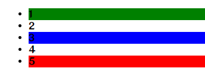

# 初识CSS

**CSS**是一种样式表语言, 用来美化网页内容

## 特性

**CSS**具有3大特性

### 继承性

给父元素设置的样式, 会继承给子元素

如果标签有自己的默认颜色, 则不继续

例子:

```html
<div>
    <h1>TEST</h1>
    <p>Test</p>
    <a href="#">a标签</a>
</div>
```

```css
div {
    color: red;
}
```



### 层叠性

相同的属性会**覆盖**:**前面**的样式覆盖**后面**的样式

不同的样式会**叠加**: 不同的样式都生效

例子:

```html
<p>Test</p>
```

```css
p{
    color: red;
    font-weight: bold;
}

p{
    color: green;
    font-size: 30px;
}
```


### 优先级

优先级也叫权重, 当一个标签使用了**多种**选择器时, 基于不同种类的选择器的**匹配规则**

选择器优先级高的样式生效

通用选择器 < 标签选择器 < 类选择器 < ID选择器 < 行内样式 < `!important`

`!important`: 强制, 最高优先级, 最低继承性, **慎用!**

```html
<p class="p1">Test1</p>
<p class="p2">Test2</p>
<p class="p3">Test3</p>
<p class="p4" id="p4">Test4</p>
<p class="p5" style="color: blue;">Test5</p>
<p class="p6" style="color: blue;">Test6</p>
```

```css
*{
    color: green;
}

p{
    color: grey;
}

.p3{
    color: red;
}

#p4{
    color: goldenrod;
}

.p6{
    color: purple !important;
}
```


## 引用

**CSS**有3中引用方式, 分别是:**内部样式表**, **外部样式表**, **行内样式表**

### 内部样式表

将**CSS**代码写在`style`标签内

```html
<!DOCTYPE html>
<html lang="zh_CN">
<head>
    <meta charset="UTF-8">
    <meta name="viewport" content="width=device-width, initial-scale=1.0">
    <title>初识CSS</title>
    <style>
        p{
            color: red;
        }
    </style>
</head>
<body>
    <p>Test</p>
</body>
</html>
```


### 外部样式表

将**CSS**代码写在另一个文件中, 后缀为`.css`

使用`link`标签引用, `rel`属性为`stylesheet`, `href`属性填CSS地址

```html
<!DOCTYPE html>
<html lang="zh_CN">
<head>
    <meta charset="UTF-8">
    <meta name="viewport" content="width=device-width, initial-scale=1.0">
    <title>初识CSS</title>
    <link rel="stylesheet" href="style.css">
</head>
<body>
    <p>Test</p>
</body>
</html>
```

```css
p{
    color: red;
}
```


### 行内样式表

在标签中加入`style`属性, 在`style`属性中直接写**CSS**

```html
<!DOCTYPE html>
<html lang="zh_CN">
<head>
    <meta charset="UTF-8">
    <meta name="viewport" content="width=device-width, initial-scale=1.0">
    <title>初识CSS</title>
</head>
<body>
    <p style="color: red;">Test</p>
</body>
</html>
```


在代码量较少的时候, 可以使用**内部样式表**, 方便查看, 但代码量大了, 反而会臃肿杂乱, 这时候就可以使用**外部样式表**了, **行内样式表**一般配合**Js**使用

## 注释

在**CSS**中, 注释是由`/* 注释 */`组成的

## 选择器

作用: 规定**CSS**样式会被应用到哪些元素上

选择器有很多, 按下面就行分类, 详见 [Mozilla文档](//developer.mozilla.org/zh-CN/docs/Web/CSS/CSS_Selectors)

* [基本选择器](//developer.mozilla.org/zh-CN/docs/Web/CSS/CSS_Selectors#%E5%9F%BA%E6%9C%AC%E9%80%89%E6%8B%A9%E5%99%A8)
  * [通用选择器](//developer.mozilla.org/zh-CN/docs/Web/CSS/Universal_selectors)
  * [标签选择器](//developer.mozilla.org/zh-CN/docs/Web/CSS/Type_selectors)
  * [类选择器](//developer.mozilla.org/zh-CN/docs/Web/CSS/Class_selectors)
  * [ID 选择器](//developer.mozilla.org/zh-CN/docs/Web/CSS/ID_selectors)
  * [属性选择器](//developer.mozilla.org/zh-CN/docs/Web/CSS/Attribute_selectors)
* [分组选择器](//developer.mozilla.org/zh-CN/docs/Web/CSS/CSS_Selectors#%E5%88%86%E7%BB%84%E9%80%89%E6%8B%A9%E5%99%A8%EF%BC%88grouping_selector%EF%BC%89)
  * [选择器列表](//developer.mozilla.org/zh-CN/docs/Web/CSS/Selector_list)
* [组合器](//developer.mozilla.org/zh-CN/docs/Web/CSS/CSS_Selectors#%E7%BB%84%E5%90%88%E5%99%A8%EF%BC%88combinator%EF%BC%89)
  * [后代组合器](//developer.mozilla.org/zh-CN/docs/Web/CSS/Descendant_combinator)
  * [直接子代组合器](//developer.mozilla.org/zh-CN/docs/Web/CSS/Child_combinator)
  * [一般兄弟组合器](//developer.mozilla.org/zh-CN/docs/Web/CSS/Subsequent-sibling_combinator)
  * [紧邻兄弟组合器](//developer.mozilla.org/zh-CN/docs/Web/CSS/Next-sibling_combinator)
  * [列组合器](//developer.mozilla.org/zh-CN/docs/Web/CSS/Column_combinator)
* [伪选择器](//developer.mozilla.org/zh-CN/docs/Web/CSS/CSS_Selectors#%E4%BC%AA%E9%80%89%E6%8B%A9%E5%99%A8%EF%BC%88pseudo%EF%BC%89)
  * [伪类](//developer.mozilla.org/zh-CN/docs/Web/CSS/Pseudo-classes)
  * [伪元素](//developer.mozilla.org/zh-CN/docs/Web/CSS/Pseudo-elements)

### 基本选择器

本文档只介绍基本选择器, 其他请自行阅读 [Mozilla文档](//developer.mozilla.org/zh-CN/docs/Web/CSS/CSS_Selectors)

#### 通用选择器

选择所有元素

`* {}`

例子:

```html
<h1>TEST</h1>
<p>Test</p>
```

```css
* {
    color: red;
}
```


#### 标签选择器

选择所有相同标签的元素

`标签名 {}`

例子:

```html
<h1>TEST</h1>
<p>Test</p>
```

```css
p {
    color: red;
}
```


#### 类选择器

按照给定的`class`属性值, 选择所有匹配的元素

`.class属性值 {}`

例子:

```html
<h1 class="title">TEST</h1>
<p>Test</p>
```

```css
.title {
    color: red;
}
```


补充:

1. `class`属性可以塞多项, 用空格分割, 例如`<h1 class="title title2 ...">TEST</h1>`
2. `class`属性可以使用中文赋值, 虽然可以, 但是并不推荐, 请按规范命名!
3. `class`属性的赋值不能以数字或特殊字符开头, 但是`_`下划线可以

#### ID 选择器

按照给定的`id`属性值, 选择一个与之匹配的元素

每个网页中, `id`属性应当是唯一的

`#id属性值 {}`

例子:

```html
<h1>TEST</h1>
<p id="s">Test</p>
```

```css
#s {
    color: red;
}
```


补充:

1. `id`属性可以塞多项, 用空格分割, 例如`<p id="s1 s2 ...">Test</p>`
2. `id`属性可以使用中文赋值, 虽然可以, 但是并不推荐, 请按规范命名!
3. `id`属性的赋值不能以数字或特殊字符开头, 但是`_`下划线可以

#### 属性选择器

按照给定的属性, 选择所有匹配的元素

`选择器[属性]`, `选择器[属性="属性值"]`

例子([来源Mozilla文档](//developer.mozilla.org/zh-CN/docs/Web/CSS/Attribute_selectors)):

```html
<a href="#internal">内部链接</a>
<a href="http://example.com">示例链接</a>
<a href="#InSensitive">非敏感内部链接</a>
<a href="http://example.org">示例 org 链接</a>
<a href="https://example.org">示例 https org 链接</a>
```

```css
a {
    color: blue;
}

/* 以 "#" 开头的页面内部链接 */
a[href^="#"] {
    background-color: gold;
}

/* 包含 "example" 的链接 */
a[href*="example"] {
    background-color: silver;
}

/* 包含 "insensitive" 的链接，不区分大小写 */
a[href*="insensitive" i] {
    color: cyan;
}

/* 包含 "cAsE" 的链接，区分大小写 */
a[href*="cAsE" s] {
    color: pink;
}

/* 以 ".org" 结尾的链接 */
a[href$=".org"] {
    color: red;
}

/* 以 "https" 开始，".org" 结尾的链接 */
a[href^="https"][href$=".org"] {
    color: green;
}
```


### 分组选择器

#### 选择器列表

选择该列表的所有元素, 每项用`, `分割

`选择器, 选择器 {}`

例子:

```html
<h1>TEST</h1>
<p>Test</p>
```

```css
h1, p {
    color: red;
}
```


### 组合器

#### 后代组合器

选择器之间用空格分割, 组合器选择前一个元素的后代节点

比如说:`div .a`, 选择器将选择`div`标签里的`.a`标签

`选择器 选择器 {}`

例子:

```html
<h1>TEST</h1>
<div>
    <p class="a">Test1</p>
    <p>Test2</p>
</div>
<p>Test3</p>
```

```css
div .a {
    color: red;
}
```



#### 直接子代组合器

选择器之间用`>`分割, 组合器选择前一个元素的直接子代的节点

比如说:`div > span`, 选择器将选择`div`标签里的`span`标签

`选择器 > 选择器 {}`

例子:

```html
<div>
    <span>
      1 号 span, 在 div 中.
      <span>2 号 span, 在 div 中的 span 中.</span>
	</span>
</div>
<span>3 号 span, 不在 div 中.</span>
```

```css
span {
  background-color: aqua;
}

div > span {
  background-color: yellow;
}
```


#### 一般兄弟组合器

选择器之间用`~`分割, 组合器选择兄弟元素, 也就是说, 后一个节点在前一个节点后面的任意位置, 并且共享同一个父节点

比如说:`p ~ span`, 选择器将选择`p`标签后面的`span`标签

`选择器 ~ 选择器 {}`

例子:

```html
<h1>TEST</h1>
<span>Test1</span>
<p>Test2</p>
<span>Test3</span>
<span>Test4</span>
<p>Test5</p>
```

```css
p ~ span {
  color: red;
}
```


#### 紧邻兄弟组合器

选择器之间用`+`分割, 组合器选择相邻元素, 即后一个元素紧跟在前一个之后, 并且共享同一个父节点

比如说:`.a + p`, 选择器将选择`.a`标签后一个标签

`选择器 + 选择器 {}`

例子:

```html
<div>
    <p class="a">Test1</p>
    <p>Test2</p>
</div>
<p class="a">Test3</p>
<p>Test4</p>
```

```css
div .a + p{
    color: red;
}
```



#### 列组合器

选择器之间用`||`分割, 组合器选择属于某个表格行的节点

`选择器 || 选择器 {}`

~~PS:老实说, 我并不知道这个选择器是干什么用的~~

### 伪选择器

#### 伪类

伪类表示元素**状态**, 选中元素的某个状态设置样式

如果你想写多个, 就按照 LVHA 的顺序写, 否则可能导致某个状态的样式无法生效

`选择器:link`:访问前

`选择器:visited`:访问后

`选择器:hover`:鼠标悬停

`选择器:active`:点击时

##### 结构伪类选择器

根据元素的**结构关系**查找元素

`选择器:first-child`:查找第一个选择器元素

`选择器:last-child`:查找最好一个选择器元素

`选择器:nth-child(N)`:查找第N个选择器元素(第一个元素N值为1)

N可以套公式, 例:

|        功能         |    公式     |
| :-----------------: | :---------: |
|      偶数标签       |    `2n`     |
|      奇数标签       | `2n+1;2n-1` |
|  找到5的倍数的标签  |    `5n`     |
| 找到第5个以后的标签 |    `n+5`    |
| 找到第5个以前的标签 |   `-n+5`    |

```html
<ul>
    <li>1</li>
    <li>2</li>
    <li>3</li>
    <li>4</li>
    <li>5</li>
</ul>
```

```css
li:first-child{
    background-color: green;
}

li:last-child{
    background-color: red;
}

li:nth-child(3){
    background-color: blue;
}
```



#### 伪元素

创建**虚拟**元素(伪元素), 用来摆放**装饰性**的内容

`选择器::before`:在选择器**里面**最**前**面添加一个伪元素

`选择器::after`:在选择器**里面**最**后**面添加一个伪元素

:::warning
* **必须**设置`content:""`属性, 用来设置**伪元素的内容**, 如果没有内容, 则引号**留空**即可
* 伪元素默认是**行内**显示模式
* **权重**和**标签选择器**相同
:::

## CSS 单位

来源 [Mozilla文档](//developer.mozilla.org/zh-CN/docs/Learn/CSS/Building_blocks/Values_and_units)

### 长度单位

#### 绝对长度单位

| 单位  |     名称     |         等价换算         |
| :---: | :----------: | :----------------------: |
| `cm`  |     厘米     | 1cm = 37.8px = 25.2/64in |
| `mm`  |     毫米     |   1mm = 1/10th of 1cm    |
|  `Q`  | 四分之一毫米 |    1Q = 1/40th of 1cm    |
| `in`  |     英寸     |   1in = 2.54cm = 96px    |
| `pc`  |     派卡     |    1pc = 1/6th of 1in    |
| `pt`  |      点      |   1pt = 1/72th of 1in    |
| `px`  |     像素     |   1px = 1/96th of 1in    |

#### 相对长度单位

|    单位     |                                            相对于                                            |
| :---------: | :------------------------------------------------------------------------------------------: |
|    `em`     | 在`font-size`中使用是相对于父元素的字体大小, 在其他属性中使用是相对于自身的字体大小, 如`width` |
|    `ex`     |                                        字符“x”的高度                                         |
|    `ch`     |                                        数字“0”的宽度                                         |
|    `rem`    |                                       根元素的字体大小                                       |
|    `lh`     |                                          元素的行高                                          |
|    `rlh`    |     根元素的行高.当用于根元素的`font-size`或`line-height`属性时, 它指的是这些属性的初始值     |
|    `vw`     |                                        视口宽度的 1%                                         |
|    `vh`     |                                        视口高度的 1%                                         |
|   `vmin`    |                                      视口较小尺寸的 1%                                       |
|   `vmax`    |                                       视口大尺寸的 1%                                        |
|    `vb`     |                            在根元素的块向上, 初始包含块的尺寸的 1%                            |
|    `vi`     |                            在根元素的行向上, 初始包含块的尺寸的 1%                            |
| `svw`, `svh` |                             分别为视口较小尺寸的宽度和高度的 1%                              |
| `lvw`, `lvh` |                              分别为视口大尺寸的宽度和高度的 1%                               |
| `dvw`, `dvh` |                               分别为动态视口的宽度和高度的 1%                                |

### 颜色

#### 颜色关键词

直接写颜色的名字, 例如

红色`red`

黄色`yellow`

绿色`green`

蓝色`blue`

#### Hex值(十六进制)

`#`后面跟上颜色的Hex值, 例如

红色:`#ff0000`

黄色`#ffff00`

绿色`#008000`

蓝色`#0000ff`

红色半透明`#ff000080`

#### RGB 值和 RGBA 值

RGB分别表示颜色的3个通道, 红, 绿, 蓝, 取值为 0~255

A表示透明通道, 取值为 0~1

例如:

红色`rgb(255, 0, 0)`

黄色`rgb(255, 255, 0)`

绿色`rgb(0, 128, 0)`

蓝色`rgb(0, 0, 255)`

红色半透明`rgba(255, 0, 0, 0.5)`

#### HSL 值和 HSLA 值

HSL分别表示色相, 饱和度, 亮度

色相的取值为 0~360

饱和度和亮度的取值为 0~100%

A表示透明通道, 取值为 0~1

例子:

红色`hsl(0, 100%, 50%)`

黄色`hsl(60, 100%, 50%)`

绿色`hsl(120, 100%, 25%)`

蓝色`hsl(240, 100%, 50%)`

红色半透明`hsla(0, 100%, 50%, 0.502)`
