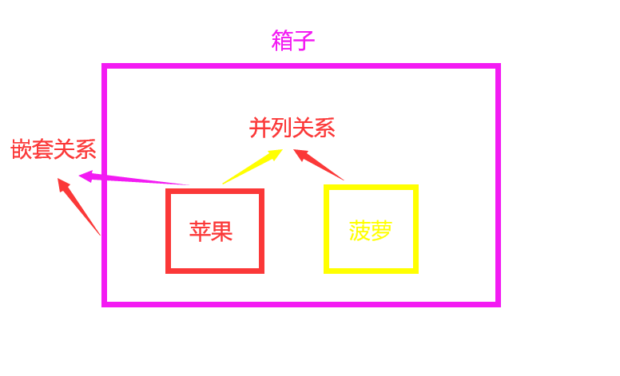
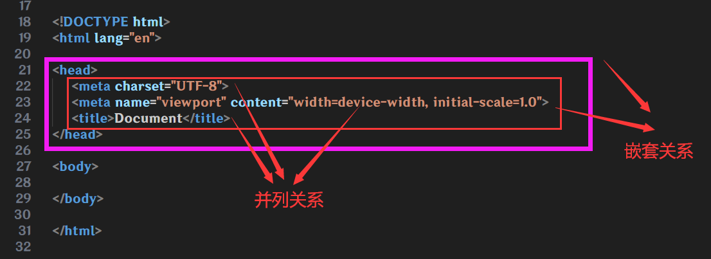
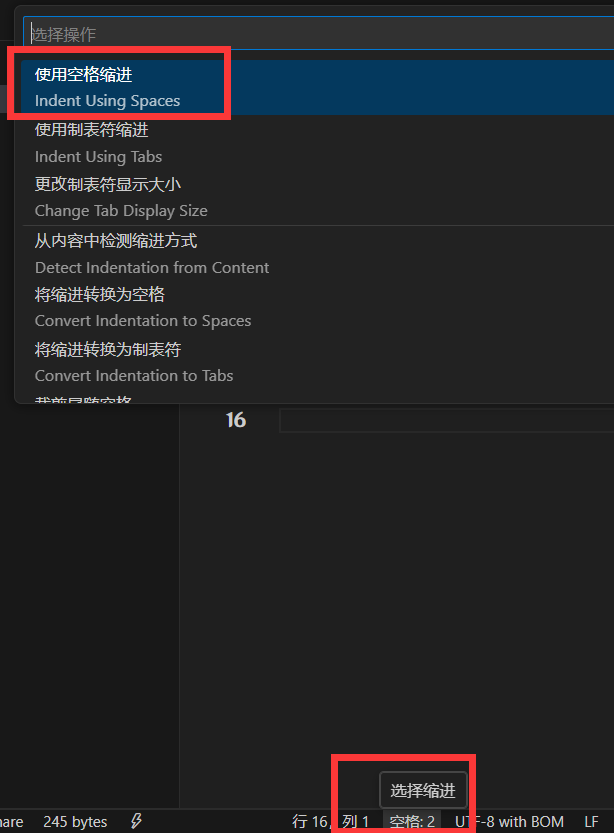

# 标签关系

作用:明确代码的书写关系

假设, 一个箱子, 里面放了一个苹果🍎和一个菠萝🍍

这时候, 箱子和苹果或菠萝的关系就是**父子关系(嵌套关系)**, 苹果和菠萝的关系就是**兄弟关系(并列关系)**

## 代码缩进

养成良好编码(编写代码)习惯, 写代码嵌套关系要记得缩进, 快捷键**Tab**, 向后缩进一格, 快捷键**Shift + Tab**, 向前回退一个, VSCode中, 默认一格为4个空格

点击**VSCode**右下角的选择缩进, 在弹窗的选择框里, 选择使用空格缩进, 即可设置一格为多少个空格, 一般4个就可以了

右键**VSCode**的编辑界面, 在右键菜单找到**格式化文档**可以自动对齐(不要太依靠了, 有时候对齐了更乱)
