# 编辑器

> 工欲善其事必先利其器

编辑器可以使用**VS Code**, 也可以使用**IDEA**, 这篇文档会使用**IDEA**进行编写

我们也十分推荐你使用**IDEA**, 因为他真的很好用

## IDEA介绍

**IntelliJ IDEA**是由**JetBrains**公司开发的一款集成开发环境(IDE), 主要用于Java, Groovy, Kotlin等编程语言的开发(后面简称**IDEA**或者**IJ**)

它被认为是当前**市场上最智能的Java IDE之一**, 提供了丰富的特性和工具, 极大地提高了开发效率

## IDEA的下载

[软件的官方下载地址在这里](//www.jetbrains.com/zh-cn/idea/download/?section=windows)

:::warning
软件本体是付费的, 这里也不会教你们

破解资源请自行查找, 出现任何问题, 也与洱海工作室无关
:::

如果你又不想找, 还想使用IDEA, 没关系

还是刚刚那个下载链接, 往下滑, 下面有一个免费的社区版

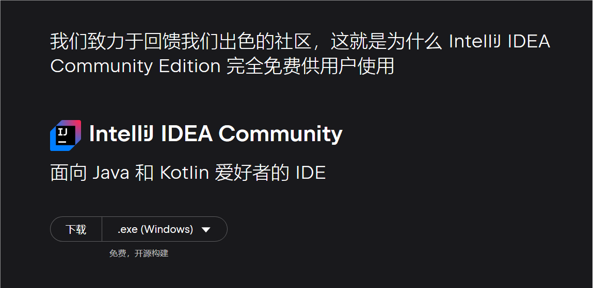

和企业版的区别仅仅是缺少了些许无伤大雅的功能

## IDEA的汉化

点击`Plugins`插件

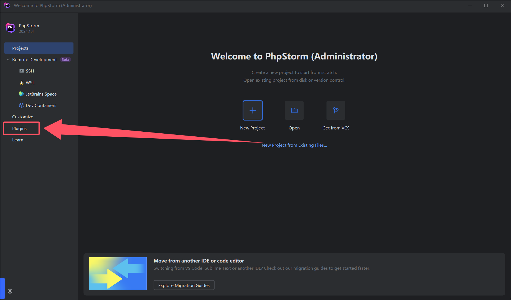

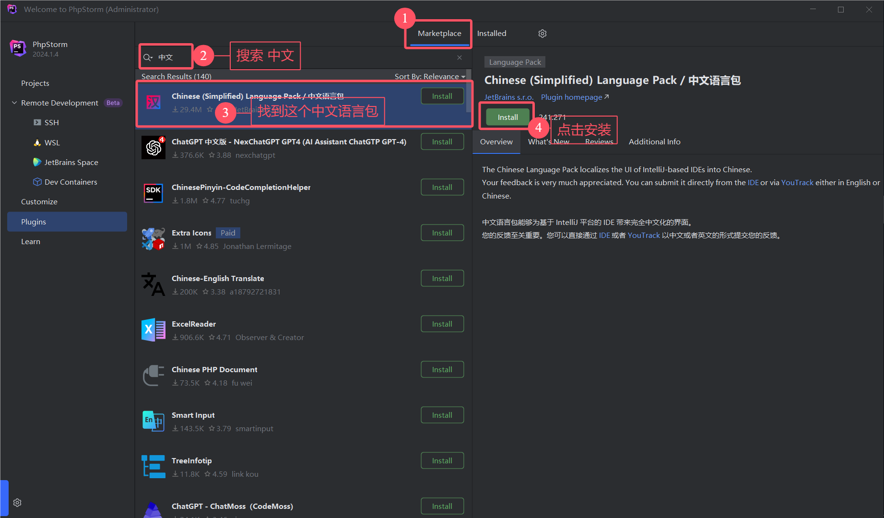

安装完后, 需要重启IDE

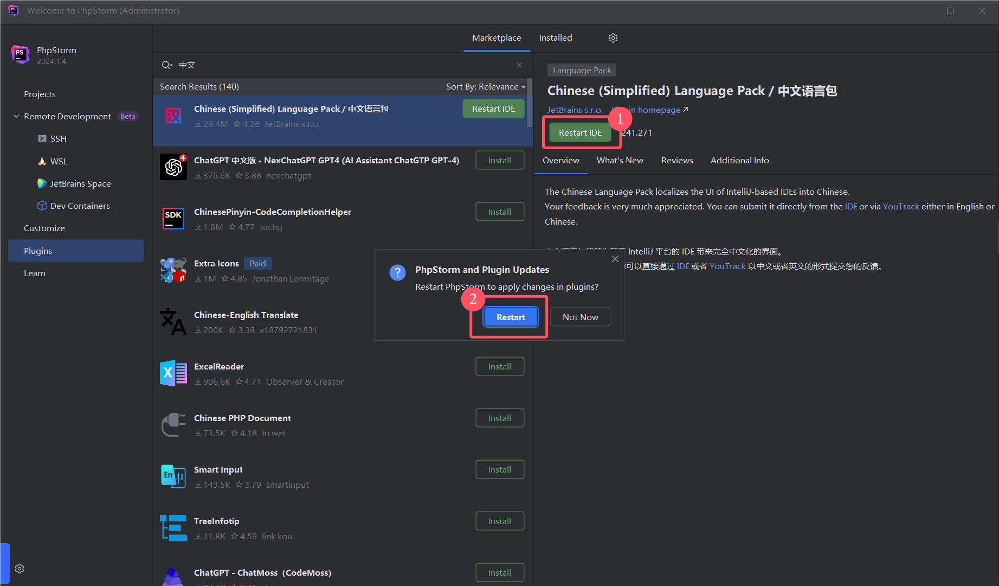

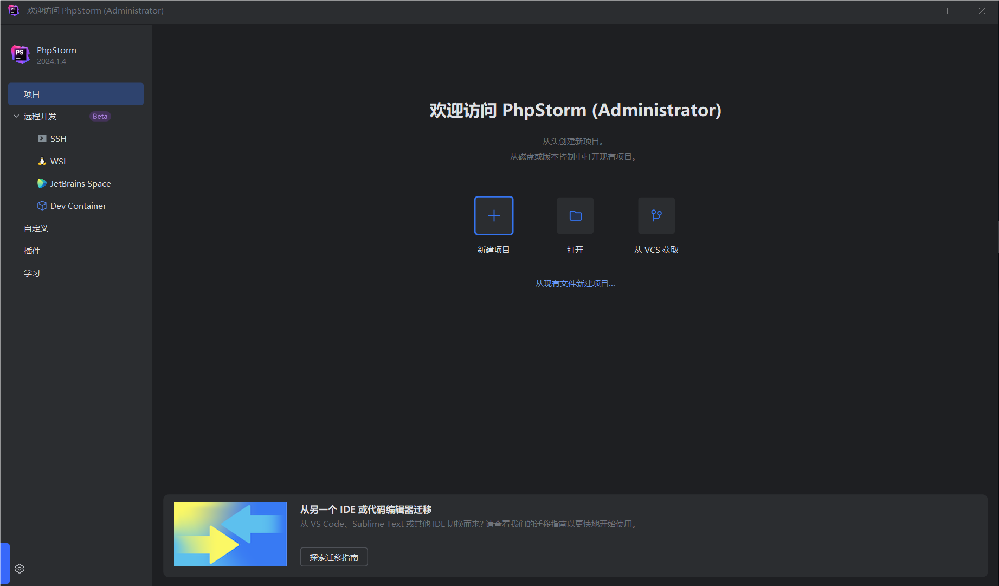

> 不要在意这个软件名为什么是`PhPStorm`, 反正操作一样

## 如何创建项目

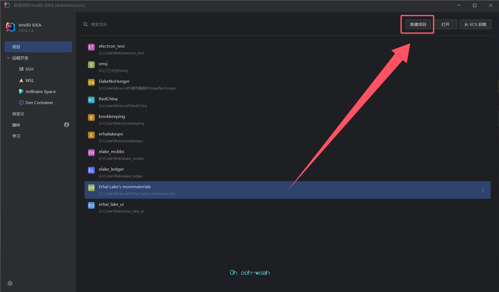

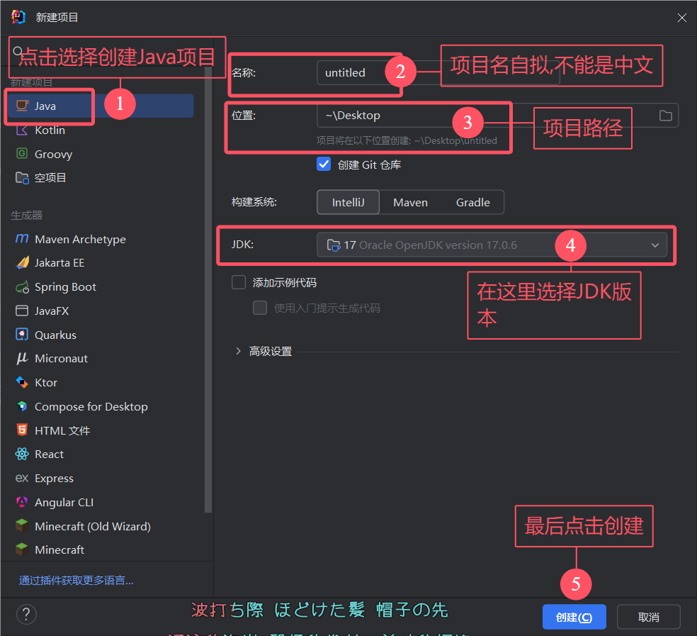

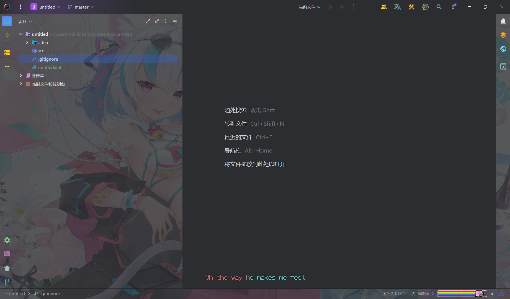

这样一个全新的项目就创建好了

## 修改IJ背景(题外话)

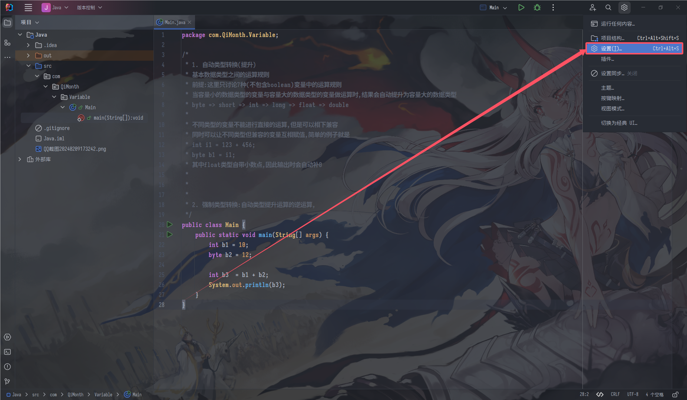

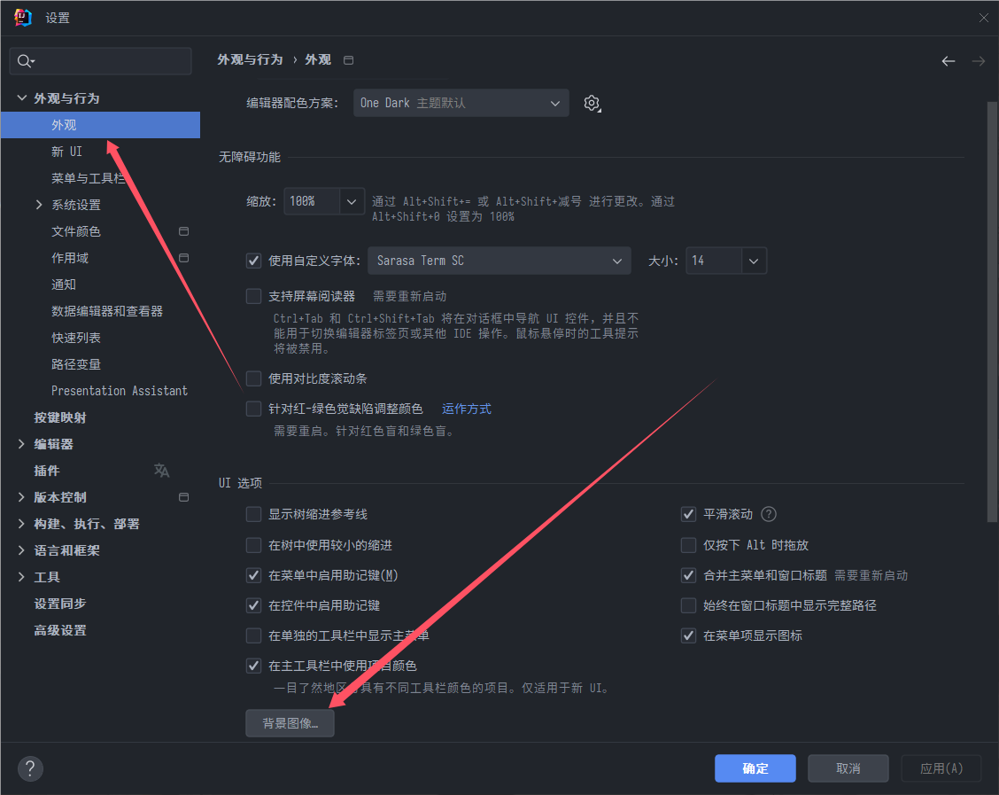

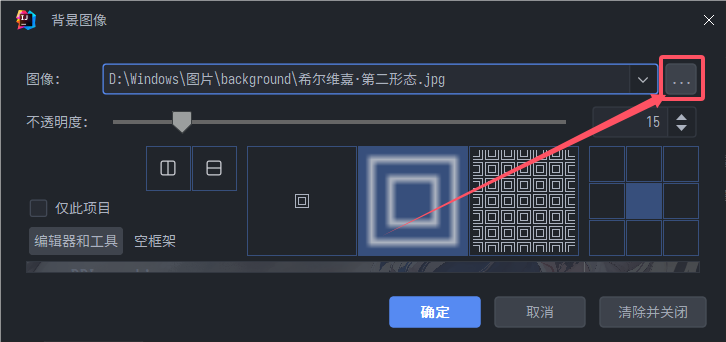

其它按照自己的需求更改即可
