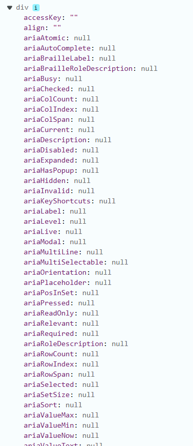

# WebAPI基本认知

## 作用和分类

就是通过JS调用WebAPI,去操作网页和浏览器

WebAPI分两大类

**DOM**: 文档对象模型

**BOM**: 浏览器对象模型(用于操作浏览器的.例如弹窗,控制台输出等)

## DOM

### DOM是什么

DOM(Document Object Model **文档对象模型**)是用来呈现以及与任意**Html**或**XML**文档交互的API

用通俗易懂的话来说,DOM是浏览器提供的一套专门用来**操作网页内容**的功能

作用: 开发页面内容特效和实现用户交互

### DOM树是什么

将页面文档以树结构直观的表现出来,我们称之为文档树或DOM树

**DOM树直观的体现了标签与标签之间的关系**

举个例子:

```html
<!DOCTYPE html>
<html lang="zh_CN">

<head>
    <meta charset="UTF-8">
    <meta name="viewport" content="width=device-width, initial-scale=1.0">
    <title>Demo</title>
</head>

<body>
    <p>文本</p>
    <div>
        <a href="www.elake.top" title="点我">官网</a>
    </div>
</body>

</html>
```

```mermaid
flowchart TD; document --> html; html --> hrad;hrad --> meta --> charset(charset); hrad --> title1[title] --> Demo{Demo}; html --> body; body --> p --> 文本{文本}; body --> div --> a; a --> href(href); a --> title2(title); a --> 官网{官网}; 元素节点[元素节点] --> 属性节点(属性节点) --> 文本节点{文本节点}
```

### DOM对象(重要)

DOM对象: 浏览器根据html便签生成的**JS对象**

* 所有的标签属性都可以在这个对象上面找到
* 修改这个对象的属性会自动映射到标签身上

举个例子:

```html
<!DOCTYPE html>
<html lang="zh_CN">

<head>
    <meta charset="UTF-8">
    <meta name="viewport" content="width=device-width, initial-scale=1.0">
    <title>Demo</title>
</head>

<body>
    <div>Test</div>
    <script>
        const Div = document.querySelector('div')
        console.log(Div)
        console.log(typeof Div)
        // object
    </script>
</body>

</html>
```

展开在控制台输出的`Div`,可以看见里面有很多的属性



DOM的核心思想: 把网页内容当做**对象**来处理

document对象

* 是DOM里提供的一个**对象**
* 所有他提供的属性和方法都是**用来访问和操作网页内容的**,例如:`Document.write()`
* 网页所有内容都在`document`里面
