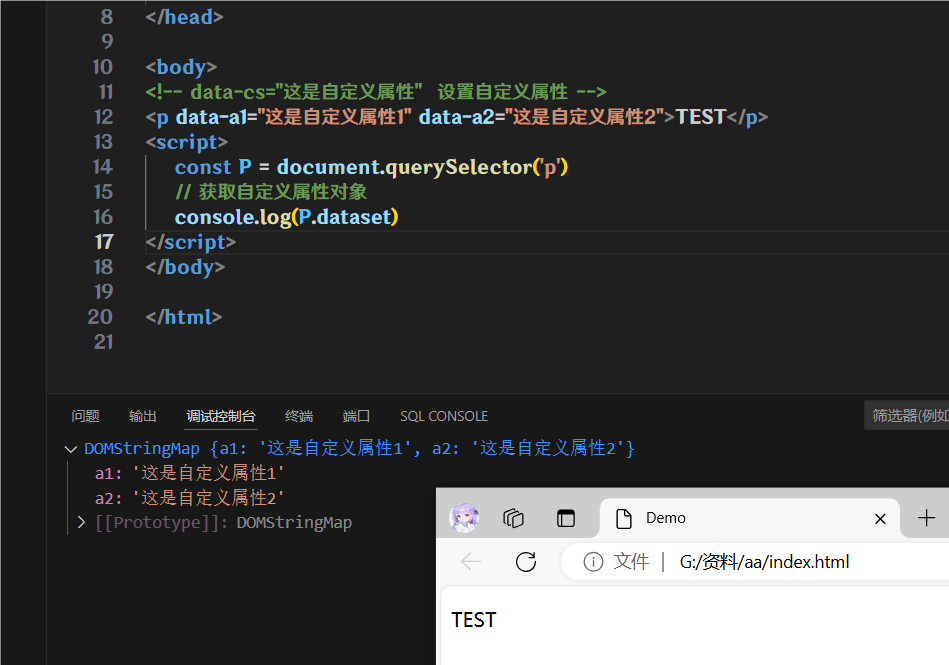
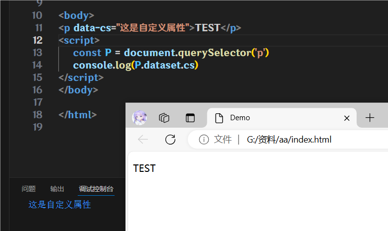
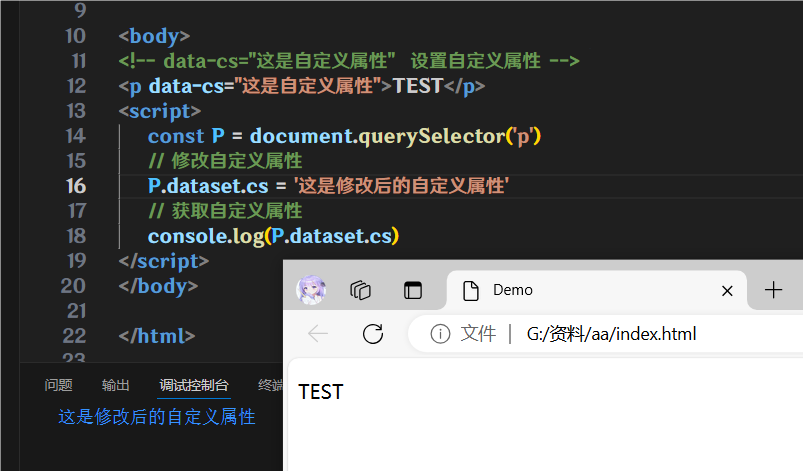
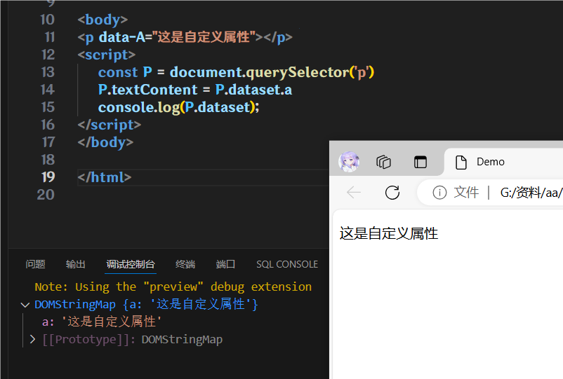

# 自定义属性

标准属性:标签天生自带的属性, 比如`class`, `id`, `title`等, 可以直接使用点语法操作的, 比如`disabled`, `checked`, `selected`

自定义属性:`data-自定义`, 这些属性前面是`data-`开头的就是自定义属性

## 获取自定义属性对象

`对象.dataset`

```html
<!-- data-cs="这是自定义属性"  设置自定义属性 -->
<p data-a1="这是自定义属性1" data-a2="这是自定义属性2">TEST</p>
<script>
    const P = document.querySelector('p')
    // 获取自定义属性对象
    console.log(P.dataset)
</script>
```



## 获取自定义属性

`对象.dataset.自定义属性名`

```html
<!-- data-cs="这是自定义属性"  设置自定义属性 -->
<p data-cs="这是自定义属性">TEST</p>
<script>
    const P = document.querySelector('p')
    // 获取自定义属性
    console.log(P.dataset.cs)
</script>
```



## 修改自定义属性

`对象.dataset.自定义属性名 = 新值`

```html
<!-- data-cs="这是自定义属性"  设置自定义属性 -->
<p data-cs="这是自定义属性">TEST</p>
<script>
    const P = document.querySelector('p')
    // 修改自定义属性
    P.dataset.cs = '这是修改后的自定义属性'
    // 获取自定义属性
    console.log(P.dataset.cs)
</script>
```



:::warning
如果你的自定义属性有大小, 那么你应该用小写才能引用, 例子可以看下面的

我这个例子写了一个`data-A`的自定义属性, 那么我引用的时候, 就需要`P.dataset.a`

如果写成`P.dataset.A`, 你将获取不到任何值
:::

## 写点东西玩一下

p标签的内容就是自定义属性的内容

```html
<p data-A="这是自定义属性"></p>
<script>
    const P = document.querySelector('p')
    P.textContent = P.dataset.a
    console.log(P.dataset)
</script>
```


