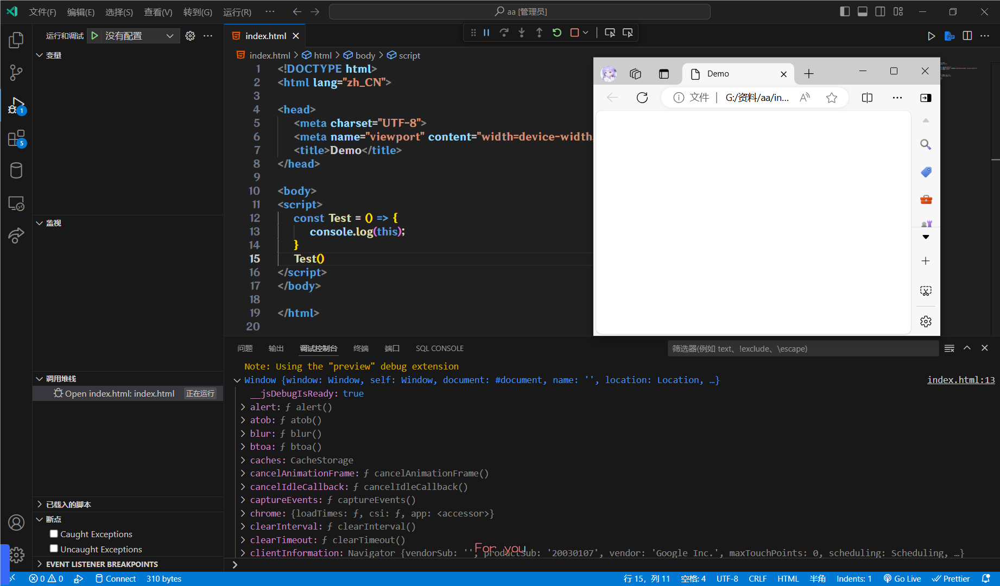

# 环境对象

函数内部特殊的**变量`this`**, 它代表着当前函数运行时所处的环境, 使用`this`可以时我们的代码更加简洁

## this的指向

1. 函数的调用方式不同, `this`指向的对象也不同
2. **谁调用, `this`就是谁**是判断`this`指向的粗略规则
3. 直接调用函数, 其实相当于是`windows.函数`, 所以`this`指向`windows`

## 举个例子

```html
<script>
    const Test = () => {
        console.log(this)
    }
    Test()
</script>
```



## 到底有什么用

比如说, 点击一个按钮, 按钮自己改变颜色

```html
<button>按钮</button>
<script>
    const But = document.querySelector('button')
    But.addEventListener('click', function () {
        this.style.backgroundColor = '#80ceff'
    })
</script>
```


如果我们用原来的方法, 代码是这样的

```html
<button>按钮</button>
<script>
    const But = document.querySelector('button')
    But.addEventListener('click', function () {
        But.style.backgroundColor = '#80ceff'
    })
</script>
```

:::warning
这里不能使用箭头函数, 不然`this`指向的是函数了
:::

看起来好像没什么用, 那就康康下面的使用场景


如果你不使用`this`, 就很难知道你鼠标悬浮的到底是哪一个标签(简化代码)
