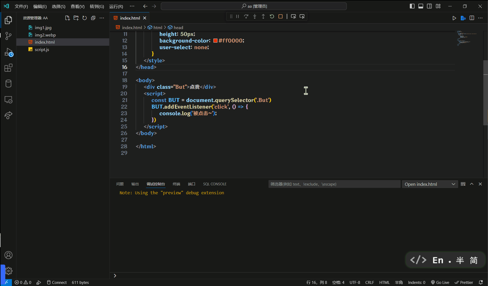
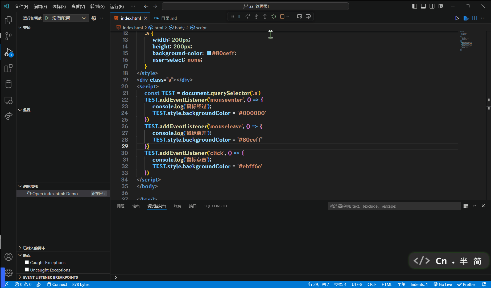
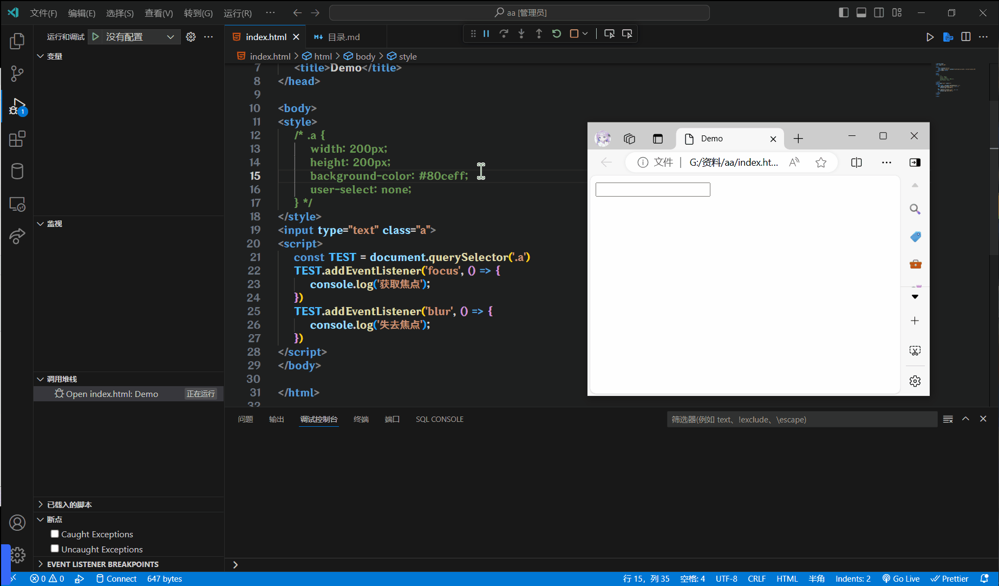
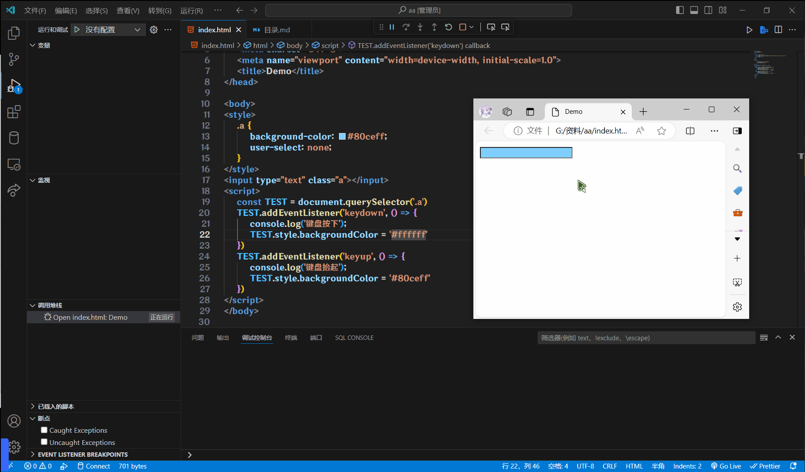
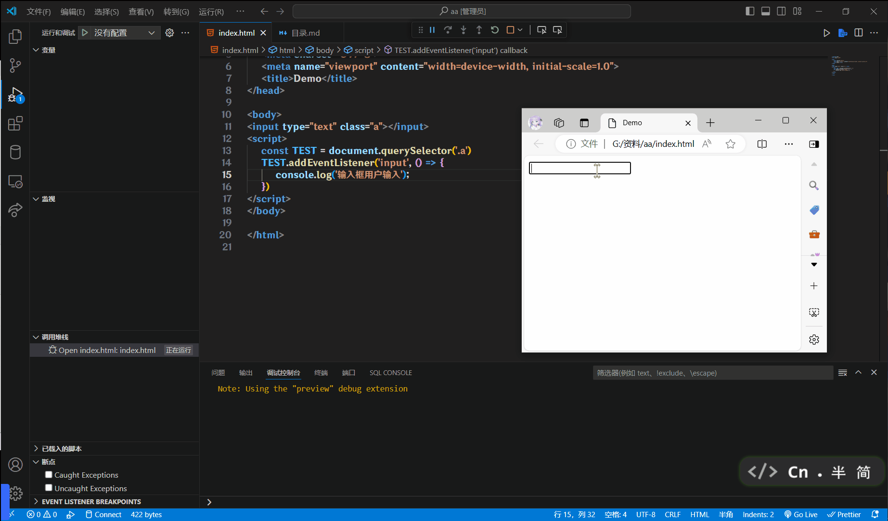
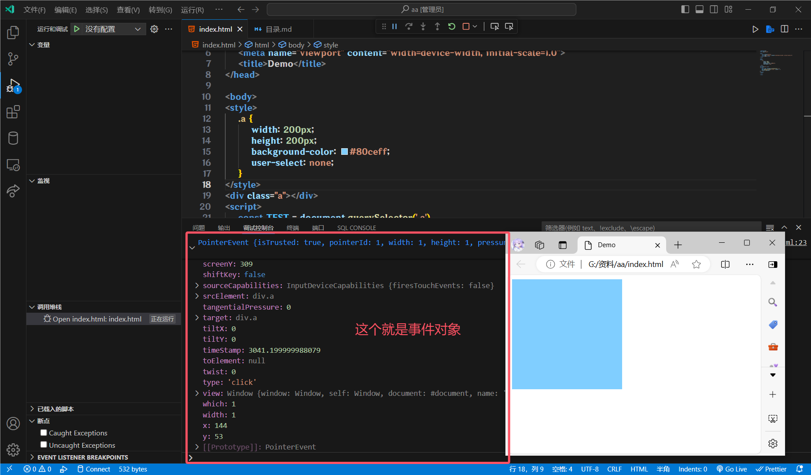
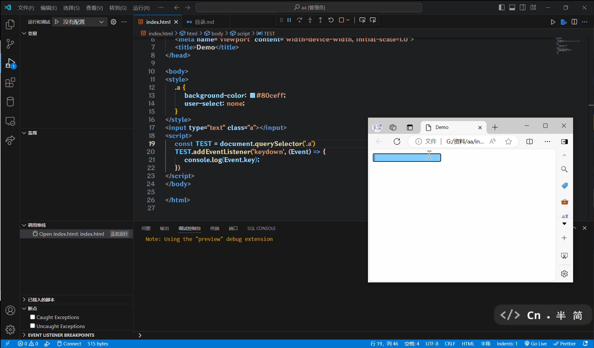

# 事件监听

## 简单了解一下

什么是时间?

事件是在编程时, 系统内发生的**动作**或者发生的事情

比如:用户在网页上**点击**了一个按钮(当按钮被点击)

什么是事件监听?

就是让程序检测是否有事件产生, 一旦有事件触发, 就立即调用一个函数做出响应, 也称为绑定事件或者注册事件

比如鼠标经过显示下拉菜单, 点击可以播放的轮播图等等

`事件源.addEventListener('事件类型',  函数)`

事件监听三要素

* **事件源**: 那个DOM元素被事件触发了, 要获取DOM元素
* **事件类型**: 用什么方式触发, 比如鼠标点击`click`, 鼠标经过`mouseover`
* **事件调用的函数**: 要做什么事

```html
<style>
    .But {
        width: 200px;
        height: 50px;
        background-color: #ff0000;
        user-select: none;
    }
</style>
<div class="But">点我</div>
<script>
    const But = document.querySelector('.But')
    But.addEventListener('click', () => {
        console.log('被点击~')
    })
</script>
```



## 事件监听版本

### DOM L0

`事件源.on事件 = function() {}`

```js
const But = document.querySelector('.But')
But.onclick = () => {
    alert(1)
}
But.onclick = () => {
    alert(2)
}
// 点击按钮, 弹出的是2
// L0的写法会被覆盖, 现在已经不用了
```

### DOM L2

`事件源.addEventListener('事件类型', 函数)`

```js
const But = document.querySelector('.But')
But.addEventListener('click', () => {
    alert(1)
})
But.addEventListener('click', () => {
    alert(2)
})
// 点击按钮, 弹出的是1和2
// L2是现在的写法, 不会出现事件覆盖的情况
```

### 区别

on方式会被覆盖, **addEventListener**方式可以绑定多次, 拥有事件更多特性, 推荐使用

### 发展史

* DOM L0: 是DOM发展的第一个版本. L: level
* DOM L1: 于1998年10月1日成为W3C推荐标准
* DOM L2: 使用`addEventListener`注册事件
* DOM L3: 在DOM L2的基础上重新定义了这些事件, 并且添加了一些新事件类型

## 事件类型

* 鼠标事件
    * `click`: 鼠标点击
    * `mouseenter`: 鼠标经过
    * `mouseleave`: 鼠标离开
* 焦点事件
    * `focus`: 表单获取焦点
    * `blur`: 表单失去焦点
* 键盘事件
    * `keydown`: 键盘按下
    * `keyup`: 键盘抬起
* 文本事件
    * `input`: 输入框用户输入

这些事件类型是不是一看就认识, 坏消息是, 在代码编辑器里写的时候, 事件类型是没有代码提示的

### 鼠标事件

```html
<style>
    .a {
        width: 200px;
        height: 200px;
        background-color: #80ceff;
        user-select: none;
    }
</style>
<div class="a"></div>
<script>
    const Test = document.querySelector('.a')
    Test.addEventListener('mouseenter', () => {
        console.log('鼠标经过')
        Test.style.backgroundColor = '#000000'
    })
    Test.addEventListener('mouseleave', () => {
        console.log('鼠标离开')
        Test.style.backgroundColor = '#80ceff'
    })
    Test.addEventListener('click', () => {
        console.log('鼠标点击')
        Test.style.backgroundColor = '#ebff6c'
    })
</script>
```



### 焦点事件

```html
<input type="text" class="a">
<script>
    const Test = document.querySelector('.a')
    Test.addEventListener('focus', () => {
        console.log('获取焦点')
    })
    Test.addEventListener('blur', () => {
        console.log('失去焦点')
    })
</script>
```



### 键盘事件

```html
<style>
    .a {
        background-color: #80ceff;
        user-select: none;
    }
</style>
<input type="text" class="a">
<script>
    const Test = document.querySelector('.a')
    Test.addEventListener('keydown', () => {
        console.log('键盘按下')
        Test.style.backgroundColor = '#ffffff'
    })
    Test.addEventListener('keyup', () => {
        console.log('键盘抬起')
        Test.style.backgroundColor = '#80ceff'
    })
</script>
```



### 文本事件

```html
<input type="text" class="a">
<script>
    const Test = document.querySelector('.a')
    Test.addEventListener('input', () => {
        console.log('输入框用户输入')
        console.log(Test.value)
    })
</script>
```



## 事件对象

### 事件对象是什么

* 也是一个对象, 这个对象里有触发时的相关信息
* 例如: 鼠标点击事件中, 事件对象就存储了鼠标点的位置信息

### 使用场景

键盘事件可以判断用户按下了哪个键, 比如用户按下了回车键, 发送信息

### 怎么获取

在事件绑定的回调函数的第一个参数就是事件对象

一般命名为: `event`, `e`

例子(鼠标点击):

```html
<style>
    .a {
        width: 200px;
        height: 200px;
        background-color: #80ceff;
        user-select: none;
    }
</style>
<div class="a"></div>
<script>
    const Test = document.querySelector('.a')
    Test.addEventListener('click', (Event) => {
    console.log(Event)
})
</script>
```



### 最常见的一些属性

* `type`: 获取当前的事件类型
* `clientX`, `clientY`: 获取光标相对于浏览器可见窗口左上角的位置
* `offsetX`, `offsetY`: 获取光标相对于当前DOM元素左上角的位置
* `key`: 用户按下的键盘键的值(现在不提倡使用`keyCode`, 已被废弃)

### Demo

```html
<style>
    .a {
        background-color: #80ceff;
        user-select: none;
    }
</style>
<input type="text" class="a">
<script>
    const Test = document.querySelector('.a')
    Test.addEventListener('keydown', (Event) => {
        console.log(Event.key)
    })
</script>
```


