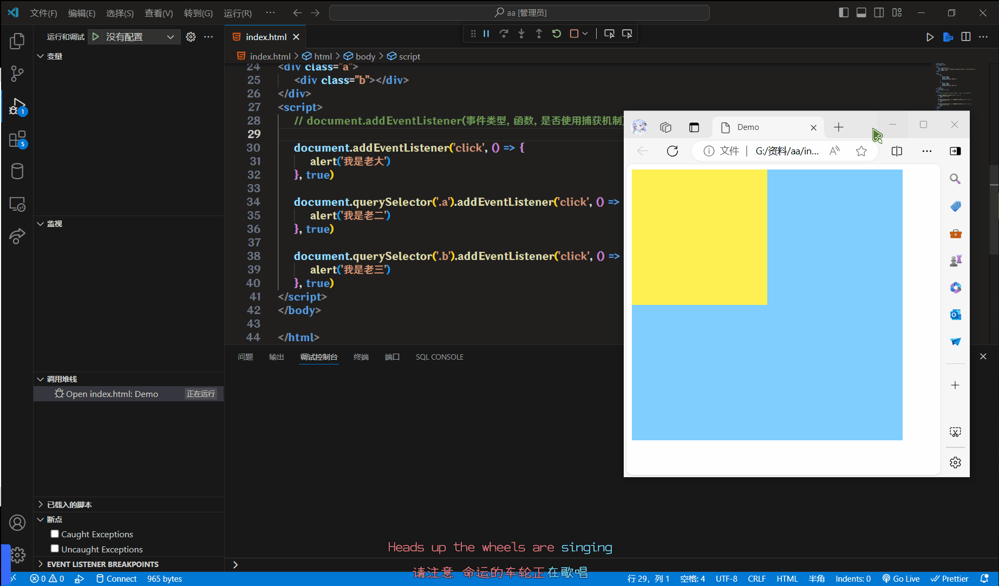
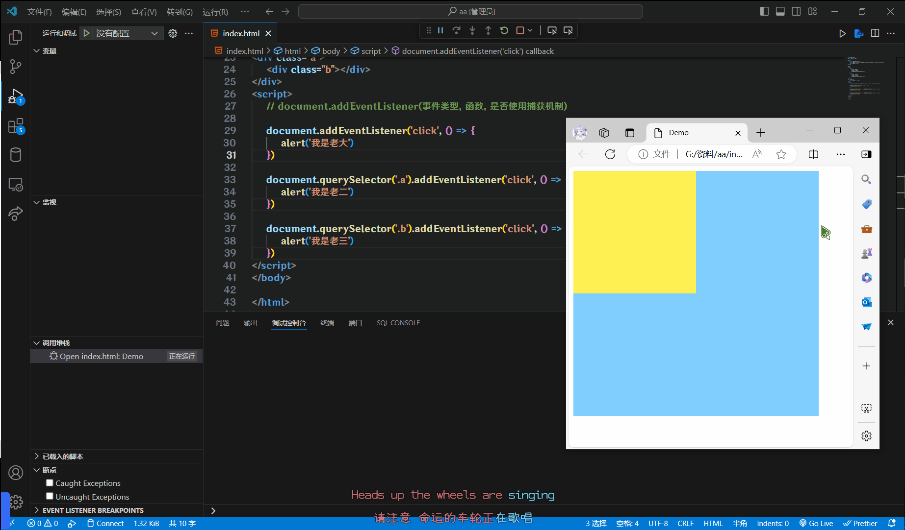

# 事件流

**事件流**指的是事件完整执行过程中的流动路径

## 两个阶段

1. 捕获阶段
   1. 例子: Document -> Element html -> Element body -> Element div
2. 冒泡阶段
   1. 例子:  Element div -> Element body -> Element html -> Document

这两个阶段就好比你来找我Play

来的时候是先进入广东省, 在到佛山市, 最后在到三水

回去的时候, 就是将这个顺序反过来, 先出三水, 随后是佛山, 广东

**在实际写代码的时候, 很少使用捕获, 基本都是使用事件冒泡为主**

## 事件捕获

从DOM的根元素开始去执行对应的事件(从外到内)

```html
<style>
    .a {
        width: 400px;
        height: 400px;
        background-color: #80ceff;
    }
    .b {
        width: 200px;
        height: 200px;
        background-color: #fff152;
    }
</style>
<div class="a">
    <div class="b"></div>
</div>
<script>
    // document.addEventListener(事件类型, 函数, 是否使用捕获机制)

    document.addEventListener("click", () => {
        alert("我是老大")
    }, true)

    document.querySelector(".a").addEventListener("click", () => {
        alert("我是老二")
    }, true)

    document.querySelector(".b").addEventListener("click", () => {
        alert("我是老三")
    }, true)
</script>
```



可以看见, 点击老三的时候, 事件从DOM开始流动的

## 事件冒泡

当一个元素的事件被触发时, 同样的事件将会在该元素的所有祖先元素中依次被触发.这一过程被称为事件冒泡

事件冒泡**默认是存在的**

DOM L2事件监听第三个参数默认是`false`, 默认都是冒泡

如果不启用捕获, 就是从老三开始流动

```html
<style>
    .a {
        width: 400px;
        height: 400px;
        background-color: #80ceff;
    }
    .b {
        width: 200px;
        height: 200px;
        background-color: #fff152;
    }
</style>
<div class="a">
    <div class="b"></div>
</div>
<script>
    document.addEventListener("click", () => {
        alert("我是老大")
    })

    document.querySelector(".a").addEventListener("click", () => {
        alert("我是老二")
    })

    document.querySelector(".b").addEventListener("click", () => {
        alert("我是老三")
    })
</script>
```



## 阻止传播

因为默认就有冒泡模式的存在, 所以容易导致事件影响到父级元素

若想要把事件就限制在当前的元素内, 就需要阻止事件冒泡

前提是拿到阻止事件冒泡需要的事件对象

`事件对象.stopPropagation()`

此方法可以阻断事件流动传播, 不光在冒泡阶段有效, 捕获阶段也有效

```html
<style>
    .a {
        width: 400px;
        height: 400px;
        background-color: #80ceff;
    }
    .b {
        width: 200px;
        height: 200px;
        background-color: #fff152;
    }
</style>
<div class="a">
    <div class="b"></div>
</div>
<script>
    document.addEventListener("click", () => {
        alert("我是老大")
    })

    document.querySelector(".a").addEventListener("click", (Event) => {
        alert("我是老二")
        // Event.stopPropagation()
    })

    document.querySelector(".b").addEventListener("click", (Event) => {
        alert("我是老三")
        Event.stopPropagation()
    })
</script>
```


## 事件解绑

### on事件方法

直接使用`null`覆盖掉就可以实现事件的解绑

```js
BUT.onclick = () => {
    alert("点击了")
}
// 解绑
BUT.onclick = null
```

### addEventListener事件方法

需要使用`removeEventListener(事件类型,  函数,  [捕获或者冒泡阶段])`

:::warning
匿名函数无法解绑
:::

```js
BUT.addEventListener("click", Fn)
// 解绑
BUT.removeEventListener("click", Fn)
```
