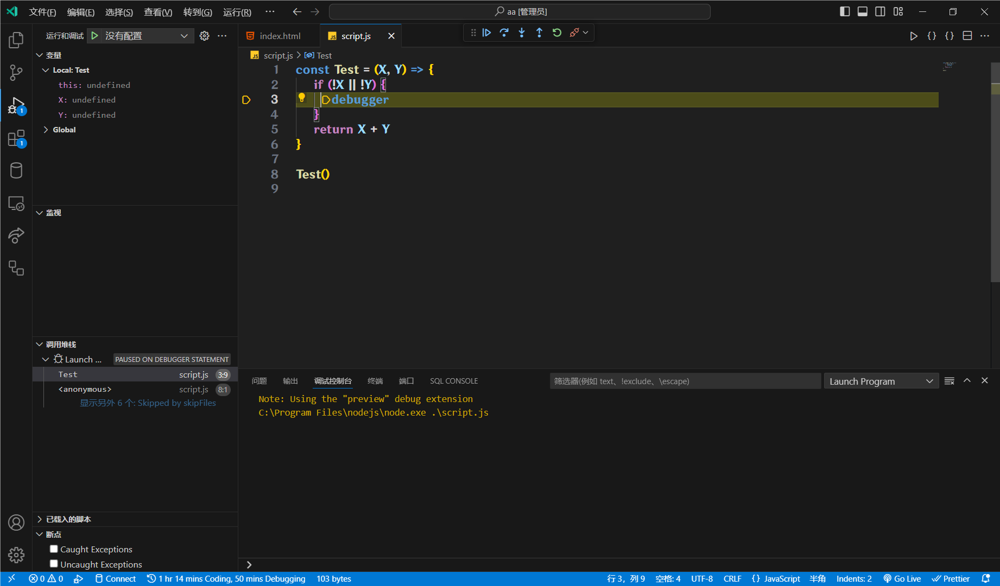

# 异常处理

## throw抛异常

异常处理是指预估代码执行过程中可能发生的错误, 然后最大程度的避免错误的发生, 导致整个程序无法继续运行

```js
const Test = (X, Y) => {
    if (!X || !Y) {
        throw new Error("参数不能为空")
    }
    return X + Y
}

Test()
```

:::warning
1. `throw`抛出异常信息, 程序也会终止执行
2. `throw`后面跟的是错误提示信息
3. Error对象配合`throw`使用, 能够设置更详细的错误信息
:::

## try捕获错误信息

我们可以通过try捕获错误信息

* `try`
  * 用于包围可能会抛出异常的代码
  * 如果在`try`块中的代码执行时抛出了异常, 则该异常会被传递到紧随其后的`catch`块进行处理
  * 如果没有异常抛出, `try`块中的代码会正常执行完毕
* `catch`
  * `catch`块紧跟在`try`块之后, 用于捕获`try`块中抛出的异常
  * `catch`块可以定义一个变量(通常命名为`Error`), 这个变量会存储异常对象
  * 在`catch`块中, 你可以定义如何处理这个异常, 比如记录错误信息或者通知用户或者尝试恢复操作
* `finally`
  * `finally`块是可选的, 并且位于`try`和`catch`块之后
  * 无论`try`块中的代码是否抛出异常, `finally`块中的代码总是会执行
  * `finally`块常用于执行清理代码, 比如关闭文件流/释放资源或者执行一些必须执行的代码, 不管之前的操作是否成功


```js
const Test = (X, Y) => {
    if (!X || !Y) {
        throw new Error("参数不能为空")
    }
    return X + Y
}

try {
    Test()
} catch (Error) {
    console.error("捕获到错误:", Error.message);
} finally {
    console.log("无论是否发生错误, 这里都会执行");
}
```

## debugger

用于在编辑器中调试, 当JS解析器执行到包含`debugger`语句的代码行时, 会立即暂停执行并打开调试器

也就是**断点**

```js
const Test = (X, Y) => {
    if (!X || !Y) {
        debugger
    }
    return X + Y
}

Test()
```


