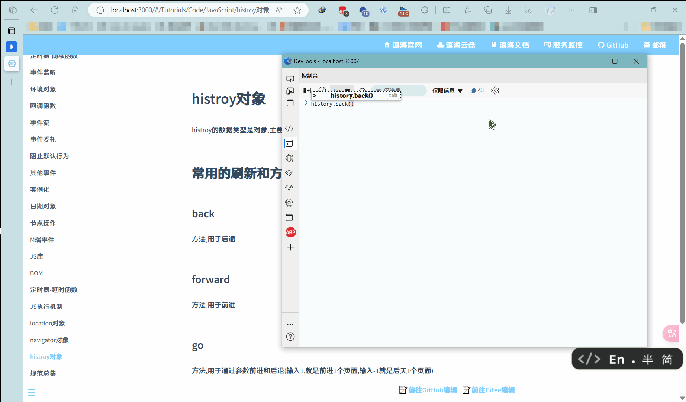
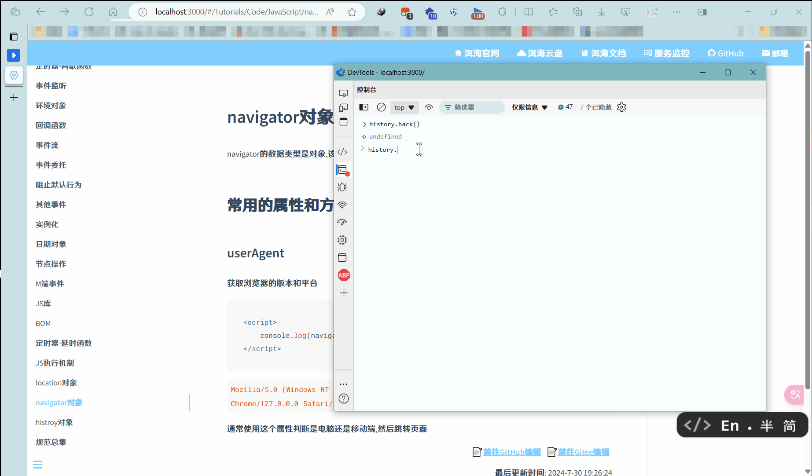
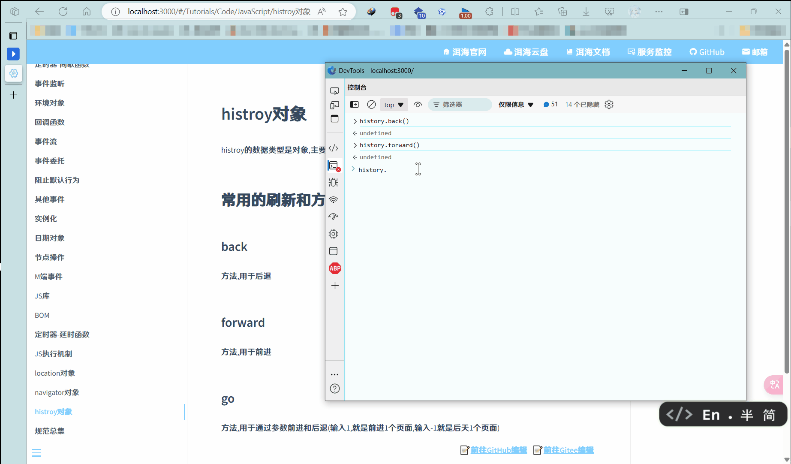

# histroy对象

histroy的数据类型是对象, 主要管理历史记录, 该对象与浏览器地址的操作相对应.如前进, 后退, 历史记录等等

这个对象一般在实际开发中比较少用到, 但是会在一些OA办公系统中见到

## 常用的刷新和方法

### back

方法, 用于后退

### forward

方法, 用于前进

### go

~~还在go, 还在go~~

方法, 用于通过参数前进和后退(输入1, 就是前进1个页面, 输入-1就是后天1个页面)

