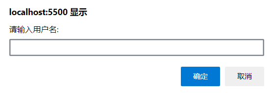
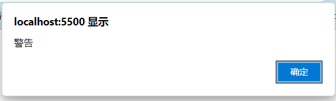
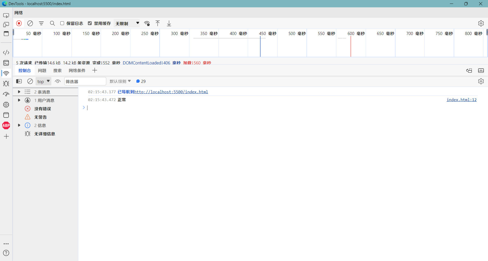

# 输入输出语法

输入输出也可以理解成人与计算机的交互, 用户通过键盘, 鼠标等向计算机输入信息, 计算机处理后再展示结果给用户, 这便是一次输入输出的过程

## 输入

`prompt('提示词')`

作用:显示一个浏览器对话框

例子:

```js
prompt('请输入用户名:')
```



:::warning
这是WebAPI的内容, 原生JS并没有这个语句
:::

## 输出

### 在网页内输出

`document.write('要输出的内容')`

作用:向body内输出内容

:::warning
如果输出的内容写的是标签, 也会被解析成网页元素
:::

例子:

```js
document.write('<h1>标题</h1>')
```


### 浏览器警告框

`alert('要输出的内容')`

作用:页面弹窗警告对话框

例子:

```js
alert('警告')
```



### 控制台打印

`console.log('要输出的内容')`

作用:在控制台输出内容, 程序调试, 日志使用

例子:

```js
console.log('正常')
```


