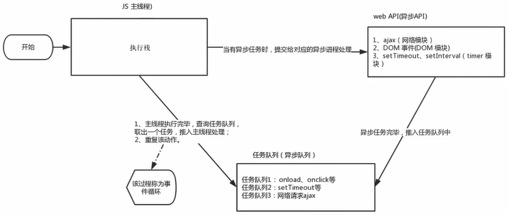

# JS执行机制

## 经典面试题

```js
console.log(1)
setTimeout(() => {
    console.log(2)
}, 1000)
console.log(3)
// 问:输出的顺序是什么
// 答1,3,2
```

延时了1秒钟,所以是132,合理

```js
console.log(1)
setTimeout(() => {
    console.log(2)
}, 0)
console.log(3)
// 问:输出的顺序是什么
// 答1,3,2
```

为什么延时0秒,不应该是立即执行么,怎么还是132?

## 线程

JavaScript语言的一大特点就是**单线程**,也就是说,**同一时间只能做一件事**

:::note
这是因为JavaScript这门脚本语言诞生的使命所致的

JavaScript是为处理页面中用户的交互,以及操作DOM而诞生的.比如我们对某个DOM元素进行添加和删除操作,不能同时进行.应该先添加,之后再删除

单线程就意味着,所有任务需要排队,前一个任务结束,才会执行后一个任务.这样所导致的问题是:

如果JS执行的时间过长,就会造成页面渲染不连贯,导致页面渲染加载堵塞感

为了解决这个问题,利用多核CPU的算力,Html5提出Web Worker标准,运行JavaScript脚本创建多个线程.于是,JS中出现了**同步**和**异步**
:::

### 同步

前一个任务结束后再执行后一个任务,程序的执行顺序与任务的排队顺序是一致的,同步的.举个例子

洗米花费5分钟,煮饭花费40分钟,饭熟了才去切菜花费5分钟,炒菜花费30分钟,一共花费了1个小时30分钟.看不懂?上图!

```mermaid
flowchart TD;洗米5分钟 --> 煮饭40分钟 --> 切菜5分钟 --> 炒菜30分钟 --> 总计1小时20分钟
```

### 异步

你在做一件事情时,因为这件事情会花费很长时间,在做这件事的同时,可以去处理其他事情.举个例子

洗米花费5分钟,煮饭花费40小时,饭还有35分钟熟的时候,去切菜花费5分钟,炒菜花费30分钟,这时饭刚好熟了,一共花费了45个小时.看不懂?上图!

```mermaid
flowchart TD;洗米5分钟 --> 煮饭40分钟 --> 总计45分钟;煮饭40分钟 --> 切菜5分钟 --> 炒菜30分钟 --> 总计45分钟
```

### 本质

同步和异步本质就是执行顺序的不同

### 同步任务

同步任务都是在主线程上执行,形成一个**执行栈**

### 异步任务

JS的异步是通过回调函数实现的

一般而言,异步任务有以下3种类型

1. 普通事件,如`click`,`resize`等
2. 资源加载,如`load`,`error`等
3. 定时器,包括`setInterval`,`setTimeout`等

异步任务相关添加到**任务队列**中(任务队列也称为**消息队列**)

## 机制

1. 先执行**执行栈中的同步任务**
   1. 输出`1`
   2. 输出`3`
2. 异步任务放入消息队列中
   1. 记录`setTimeout(console.log(2), 0)`
3. 一旦执行栈的所有同步任务执行完毕,系统就会按次序读取**消息队列**中的异步任务,于是被读取的异步任务结束等待状态,进入执行栈,开始执行
   1. 输出`2`

由于主线程不断的重复获取任务,执行任务,再获取任务,再执行,所以这种机制被称为**事件循环**(event loop)


