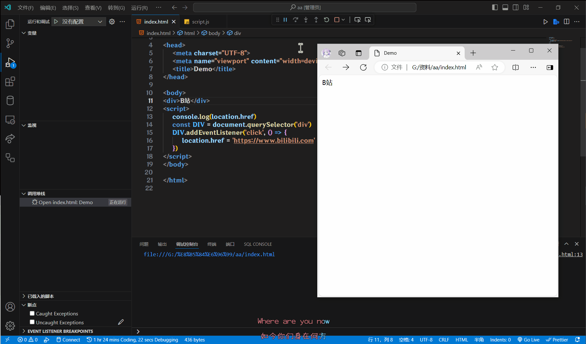
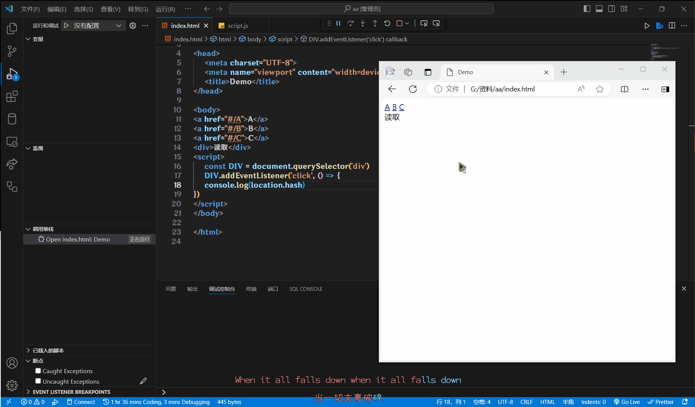
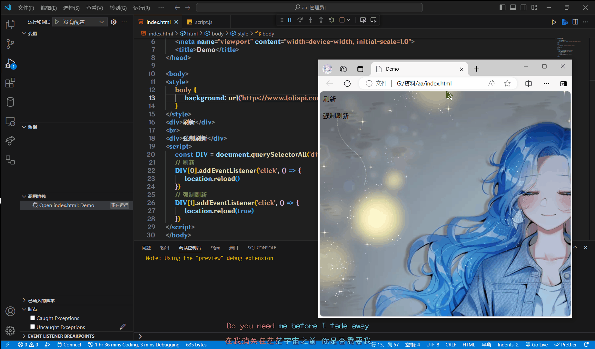

# location对象

location的数据类型是对象, 他拆分并保存了URL地址的各个组成部分

## 常用的属性和方法

### href

获取完整的URL地址, 对其赋值时用于地址的跳转

```html
<div>B站</div>
<script>
    console.log(location.href)
    const Div = document.querySelector('div')
    Div.addEventListener('click', () => {
        location.href = 'https://www.bilibili.com'
    })
</script>
```



### search

获取地址中携带的参数, 就是符号`?`后面的内容

```html
<div>带参</div>
<script>
    console.log(location.search)
    const Div = document.querySelector('div')
    Div.addEventListener('click', () => {
        location.href = 'index.html?a=123&b=456'
    })
</script>
```


### hash

获取地址中的哈希值, 就是符号`#`后面的内容

了解就好, 现在用不到, 就是根据这个哈希值, 获取页面组件的(Vue路由)

```html
<a href="#/A">A</a>
<a href="#/B">B</a>
<a href="#/C">C</a>
<div>读取</div>
<script>
    const Div = document.querySelector('div')
    Div.addEventListener('click', () => {
    	console.log(location.hash)
	})
</script>
```



### reload

刷新页面

如果传入`true`, 可以强制刷新

```html
<style>
    body {
        background: url('https://www.loliapi.com/acg/');
    }
</style>
<div>刷新</div>
<br>
<div>强制刷新</div>
<script>
    const Div = document.querySelectorAll('div')
    // 刷新
    Div[0].addEventListener('click', () => {
        location.reload()
    })
    // 强制刷新
    Div[1].addEventListener('click', () => {
        location.reload(true)
    })
</script>
```

:::tip
强制刷新就是清除页面缓存在刷新, 例如一张图片, 加载一遍后, 被浏览器缓存了, 下次加载可以很快, 但是如果我换了图片, 浏览器不知道, 刷新后, 显示的还是之前的图片, 使用强制刷新, 就可以清除之前的缓存了

浏览器强制刷新的快捷键 `Ctrl + F5`
:::


