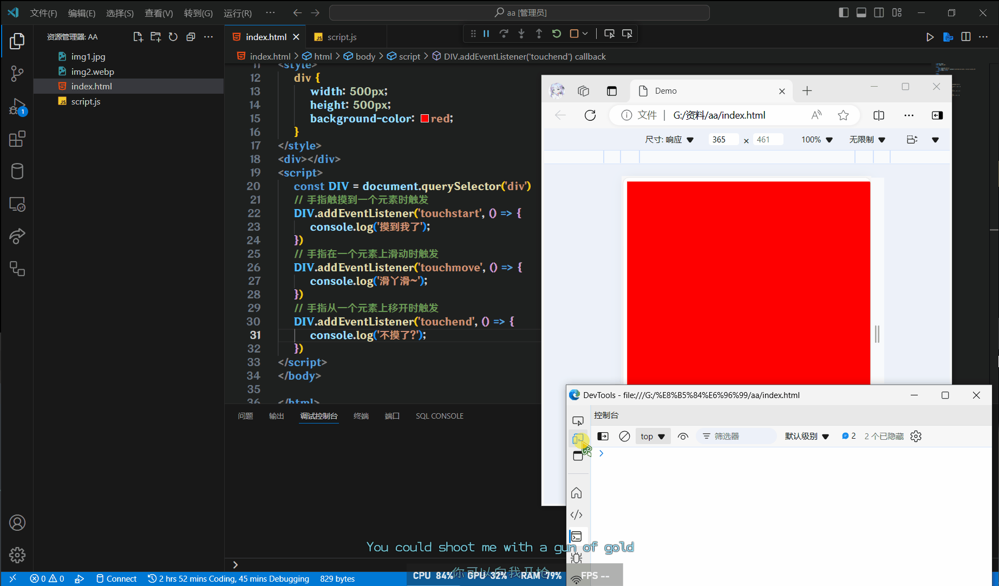

# M端事件

移动端也有自己独特的地方.

## 触屏事件

触屏事件也称触摸事件

Android和IOS都有

### touchstart

`touchstart`手指触摸到一个元素时触发

### touchmove

`touchmove`手指在一个元素上滑动时触发

### touchend

`touchend`手指从一个元素上移开时触发

### 示例

```html
<style>
    div {
        width: 500px;
        height: 500px;
        background-color: red;
    }
</style>
<div></div>
<script>
    const Div = document.querySelector("div")
    // 手指触摸到一个元素时触发
    Div.addEventListener("touchstart", () => {
        console.log("摸到我了")
    })
    // 手指在一个元素上滑动时触发
    Div.addEventListener("touchmove", () => {
        console.log("滑丫滑~")
    })
    // 手指从一个元素上移开时触发
    Div.addEventListener("touchend", () => {
        console.log("不摸了?")
    })
</script>
```

:::tip
调试需要打开控制台的移动端模拟器
:::


