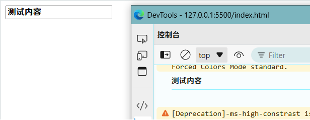
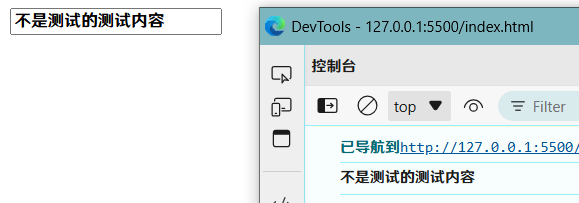
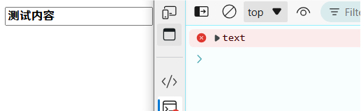
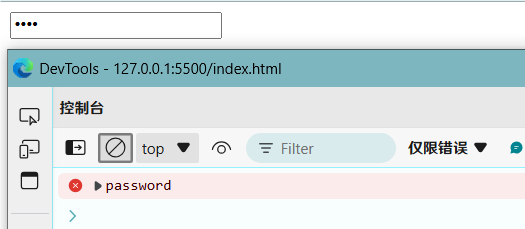
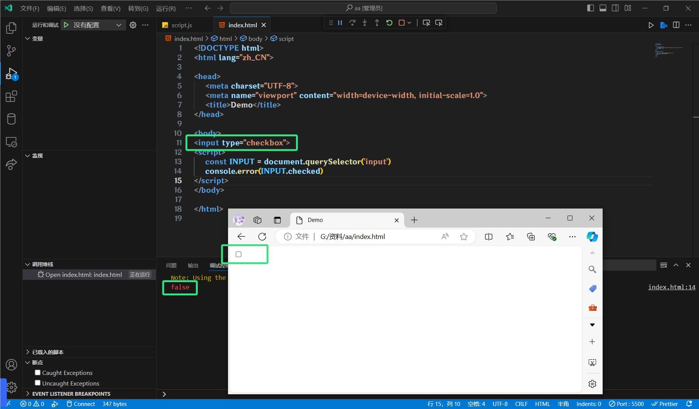
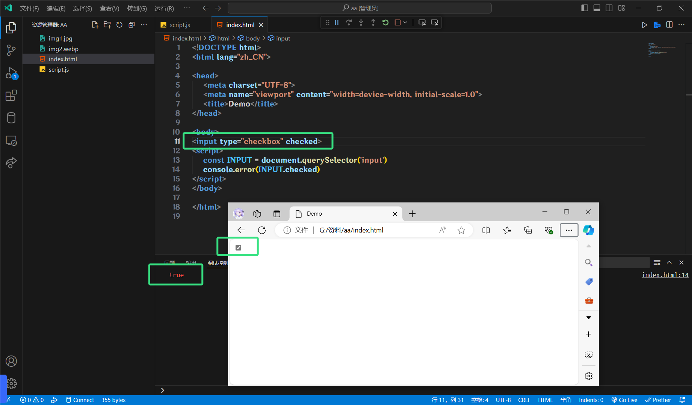
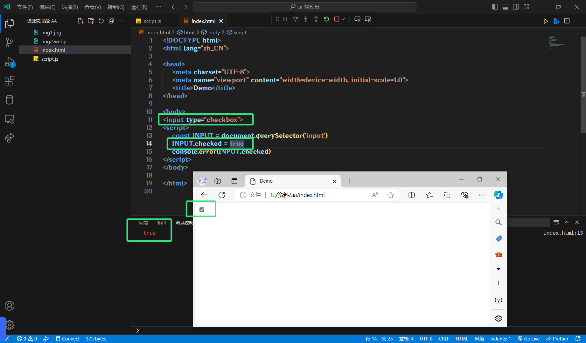
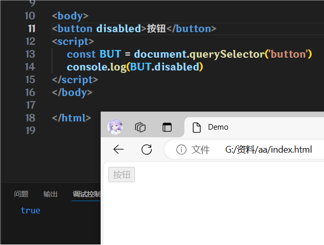
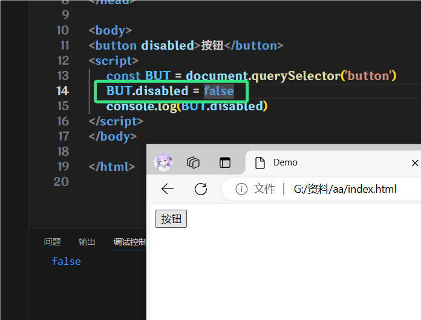

# 操作表单元素

表单很多情况, 也需要修改属性, 比如密码框, 点击小眼睛, 显示密码, 本质就是将密码框, 改为了文本框

正常的有属性有取值的, 跟其他标签属性没有任何区别

获取:`对象.属性名`

设置:`对象.属性名 = 新值`

## 获取输入框值

`对象.value`

```html
<input type="text" value="测试内容">
<script>
    // 获取对象
    const Input = document.querySelector('input')
    // 获取文本框输入的值
    console.log(Input.value)

    // 用以前的方法, 获取表单元素是无效的
    console.log(Input.innerHTML)
</script>
```



所以要拿到输入框内容, 只能用`value`

## 修改输入框值

`对象.value = 新值`

```html
<input type="text" value="测试内容">
<script>
    // 获取对象
    const Input = document.querySelector('input')
    // 设置输入框的值
    Input.value = '不是测试的测试内容'
    // 获取文本框输入的值
    console.log(Input.value)
</script>
```



## 获取表单类型

`对象.type`

```html
<input type="text" value="测试内容">
<script>
    const Input = document.querySelector('input')
    console.log(Input.type)
</script>
```



这里的红色是因为我将`console.log`写成了`console.error`, 以报错的类型输出, 方便我过滤, 也方便你们看, 你们好当做正常的就ok

## 修改表单类型

`对象.type = 新值`

```html
<input type="text" value="测试内容">
<script>
    const Input = document.querySelector('input')
    Input.type = 'password'
    console.log(Input.type)
</script>
```



## 获取选择框选择

我们学H5的时候都知道, 下面这个是多选框, 并且用`checked`默认勾选了

```html
<input type="checkbox" checked>
```

我们用控制台打印一下, 看看`checked`属性发生了什么变化





可以看见, 没有写`checked`的时候, `checked`属性是`false`, 写了就是true了

## 修改选择框选择

那么同样的, 我们一样是可以使用JS控制这个属性

`对象.checked = true|false`

```html
<input type="checkbox">
<script>
    const Input = document.querySelector('input')
    Input.checked = true
    console.log(Input.checked)
</script>
```



## 获取按钮禁用状态

`对象.checked`

都是些和上面重复的东西, 不想写这么多了...

这是按钮

`<button>按钮</button>`

这是按钮, 但是禁用

`<button disabled>按钮</button>`

用JS获取状态

```html
<button disabled>按钮</button>
<script>
    const But = document.querySelector('button')
    console.log(But.disabled)
</script>
```



## 修改按钮禁用状态

`对象.checked = true|false`

```html
<button disabled>按钮</button>
<script>
    const But = document.querySelector('button')
    But.disabled = false
    console.log(But.disabled)
</script>
```


