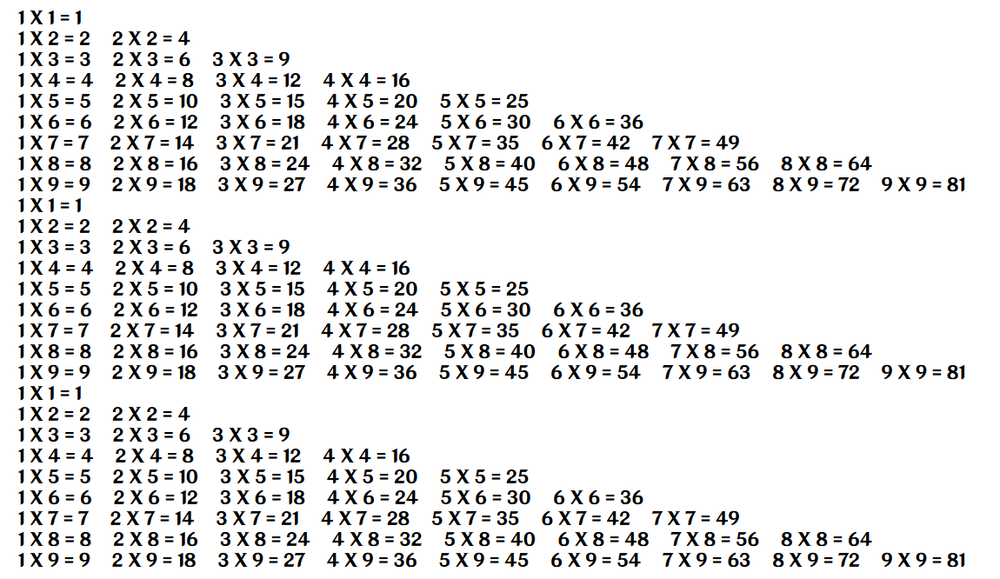

# 具名函数

## 什么是函数

函数就是对一个功能的封装, 用于精简代码, 方便调用的特性, 是编程中的一种重要概念.

举个例子:

我要用JS在网页上输出乘法口诀表, 写了如下代码:

```html
<style>
    span {
        margin: 5px 10px;
    }
</style>
<script>
    for (let I = 1; I <= 9; I++) {
        for (let J = 1; J <= I; J++) {
            document.write(`<span>${J} X ${I} = ${I * J}</span>`)
        }
        document.write('<br>')
    }
</script>
```


这时候, 如果我想多输出几遍, JS就要写成这样:

```js
for (let I = 1; I <= 9; I++) {
    for (let J = 1; J <= I; J++) {
        document.write(`<span>${J} X ${I} = ${I * J}</span>`)
    }
    document.write('<br>')
}
for (let I = 1; I <= 9; I++) {
    for (let J = 1; J <= I; J++) {
        document.write(`<span>${J} X ${I} = ${I * J}</span>`)
    }
    document.write('<br>')
}
for (let I = 1; I <= 9; I++) {
    for (let J = 1; J <= I; J++) {
        document.write(`<span>${J} X ${I} = ${I * J}</span>`)
    }
    document.write('<br>')
}
```

很麻烦, 如果用函数就可以不用写这么多了, 将JS写成这样

```js
function Sheet99() {
	for (let I = 1; I <= 9; I++) {
		for (let J = 1; J <= I; J++) {
			document.write(`<span>${J} X ${I} = ${I * J}</span>`)
		}
		document.write('<br>')
	}
}

Sheet99()
Sheet99()
Sheet99()
```

想输出几遍, 就调用几遍`Sheet99()`



## 函数的声明语法

```js
function 函数名() {
    函数体
}
```

## 函数的命名

* 和变量命名基本一致
* 前缀动词理应小写(如下表)

|   动词   |          含义          |
| :------: | :--------------------: |
|  `can`   | 判断是否可执行某个动作 |
|  `has`   |   判断是否含义某个值   |
|   `is`   |    判断是否为某个值    |
|  `get`   |       获取某个值       |
|  `set`   |       设置某个值       |
|  `add`   |       添加某个值       |
| `delete` |       删除某个值       |
| `update` |       更新某个值       |
|  `load`  |       加载某个值       |
|   ...    |          ...           |

举个例子:获取用户名:`getUserName`, 设置用户名:`serUserName`, 判断性别:`isGender`等

## 函数的调用

```js
函数名()
```

:::warning
声明(定义)的函数必须调用才会真正被执行, 使用`()`调用函数
:::

## 函数传参

> 传参全称:传递参数

```js
function 函数名(形参1, 形参2, ...) {
    函数体
}

函数名(实参1, 实参2, ...)
```

举个例子, 做一个加法的函数:

```js
function getSum(Num1, Num2) {
    console.log(Num1 + Num2)
}

getSum(10, 5)

// 输出 15
```

我们之前使用的`alent('打印')`, `console.log('控制台输出')`, 本质上也是执行函数并传参的体现

## 形参默认值

形参可以看做一个变量, 如果一个变量不给值, 默认是`undefined`

但是, 如果一个用户不输入实参, 刚刚的案例就会出现`undefined + undefined`, 结果是`NaN`

那么我们可以改进一下, 如果不输入实参, 就给形参一个默认值, 可以默认为0

```js
function getSum(Num1 = 0, Num2 = 0) {
    console.log(Num1 + Num2)
}

getSum()

// 输出 0
```

:::warning
这个默认值只会在缺少实参参数传递时才会被执行, 所以有参数会优先执行传递过来的实参, 否则默认为undefined
:::

## 函数返回值

其实我们之前已经接触过了

```js
let result1 = prompt('请输入您的年龄')
let result1 = parseInt('111')
```

将用户输入的内容, 返回到变量中

既然存在**有返回值的函数**, 那自然就存在没有**返回值的函数**

```js
alert('弹窗不需要返回值')
```

所以, 可以根据需求, 来决定是否需要返回值

可以使用`return`关键词, 来将数据返回出函数, 还是拿之前的例子

```js
function getSum(Num1 = 0, Num2 = 0) {
    return Num1 + Num2
}

let Num = getSum(10, 5)
console.log(Num)
console.log(getSum(10, 5))

// 输出 15
```

`getSum`将数据返回到`Num`里, 最后输出到浏览器终端

:::warning
`return`关键词执行后, 函数内后续的代码不会在执行了, 例如:

```js
function getSum(Num1 = 0, Num2 = 0) {
    return Num1 + Num2
    console.log('return下面的代码不会执行了')
}
```
:::

函数除了具名函数, 还会有匿名函数, 且看我下回讲解~

