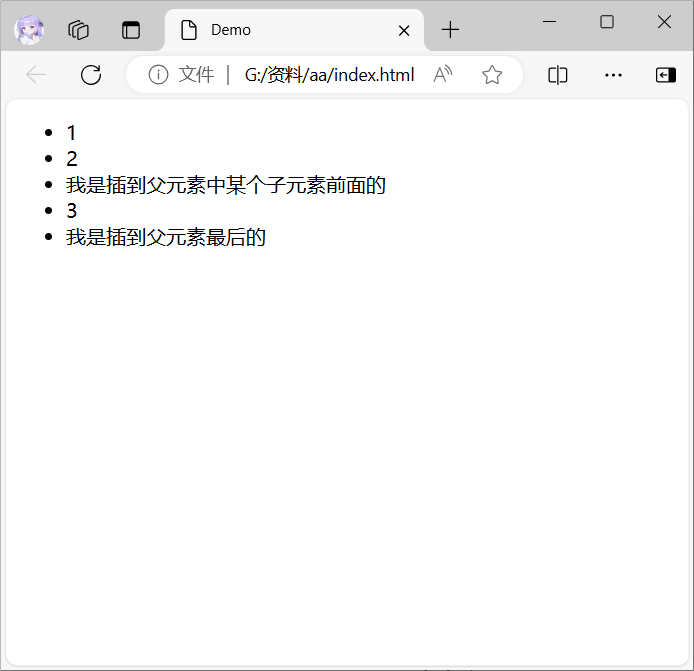
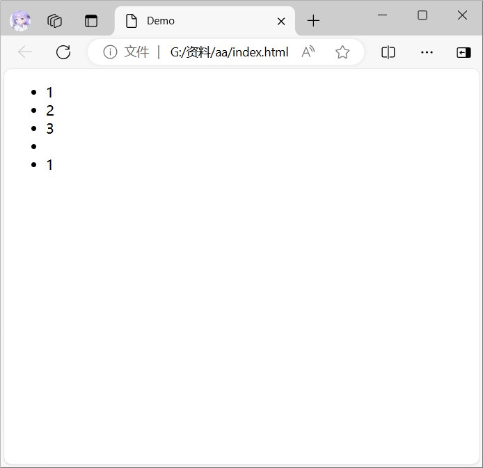
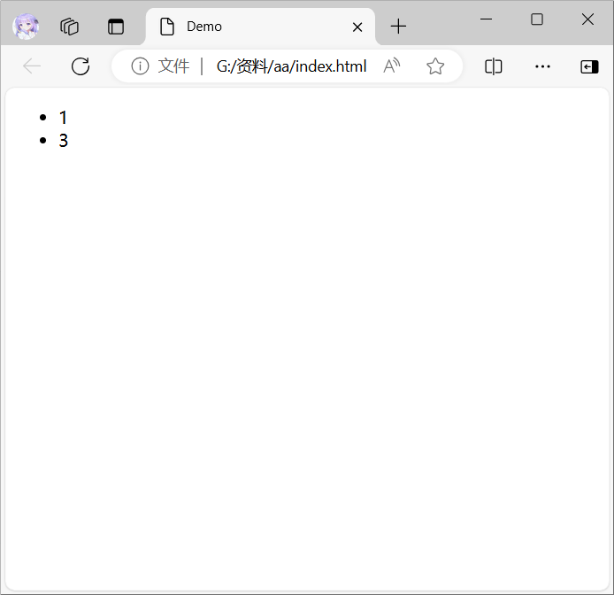

# 节点操作

## DOM节点

DOM树里每一个内容都称为节点

节点类型

* 元素节点
  * 所有的标签, 例如:`body`, `div`
  * `html`是根节点
* 属性节点
  * 所有的属性, 例如`href`
* 文本节点
  * 所有的文本
* 其他

```mermaid
flowchart TD; document --> html; html --> hrad; hrad --> meta --> charset(charset); hrad --> title1[title] --> Demo{Demo}; html --> body; ody --> p --> 文本{文本}; body --> div --> a; a --> href(href); a --> title2(title); a --> 官网{官网}; 元素节点[元素节点] --> 属性节点(属性节点) --> 文本节点{文本节点}
```

## 查找节点

### 父节点查找

`子元素.parentNode`

返回最近一级的父节点, 找不到返回`null`

例如, 可以通过`p`元素获取上一级的`div`元素

```html
<div><p></p></div>
<script>
    console.log(document.querySelector('p').parentNode)
</script>
```

### 子节点查找

`父节点.childNodes`**(了解)**

获取所有**子节点**, 包括文本节点(空格, 换行), 注释节点等等

`父节点.children`**(重点)**

仅获取所有**子元素**

返回一个伪数组

例如, 可以通`ul`元素获取所有子元素

```html
<ul>
    <li></li>
    <li></li>
    <li></li>
    <li></li>
    <li></li>
</ul>
<script>
    console.log(document.querySelector('ul').children)
</script>
```

### 兄弟关系查找

下一个兄弟节点

`nextElementSibling`

上一个兄弟节点

`previousElementSibling`

```html
<div>
    <p></p>
    <span></span>
    <i></i>
</div>
<script>
    // 下一个
    console.log(document.querySelector('span').nextElementSibling)
    // 返回i元素

    // 上一个
    console.log(document.querySelector('span').previousElementSibling)
    // 返回p元素
</script>
```

## 增加节点

新增节点一般分为两步

1. 创建一个新的节点
2. 把创建的新节点放到指定的元素内部

### 创建节点

`document.createElement('标签名')`

### 追加节点

将创建的新节点插入元素里

#### 插到父元素最后

`父元素.appendChild(要插入的元素)`

#### 插到父元素中某个子元素前面

`父元素.insertBefore(要插入的元素, 插到在哪个元素前面)`

```html
<ul>
    <li>1</li>
    <li>2</li>
    <li class="A">3</li>
</ul>
<script>
    // 创建元素
    const New1 = document.createElement('li')
    // 写点内容
    New1.textContent = '我是插到父元素最后的'
    // 插到父元素最后
    document.querySelector('ul').appendChild(New1)

    // 创建元素
    const New2 = document.createElement('li')
    // 写点内容
    New2.textContent = '我是插到父元素中某个子元素前面的'
    // 插到父元素中某个子元素前面
    document.querySelector('ul').insertBefore(New2, document.querySelector('.A'))
</script>
```



### 克隆节点

`元素.cloneNode(布尔值)`

如果传入`true`, 则代表克隆时会包含后代节点一起克隆

如果传入`false`, 则代表克隆时不包含后代节点

默认为`false`

```html
<ul>
    <li>1</li>
    <li>2</li>
    <li>3</li>
</ul>
<script>
    const Ul = document.querySelector('ul')
    // 克隆元素
    const New1 = Ul.children[0].cloneNode()
    const New2 = Ul.children[0].cloneNode(true)
    // 插到父元素最后
    Ul.appendChild(New1)
    UL.appendChild(New2)
</script>
```



## 删除节点

`父元素.removeChild(要删除的元素)`

:::warning
如果不存在父子关系, 则无法删除
:::

:::note
删除节点和隐藏节点(`display: none`)的区别

隐藏节点虽然没有了, 但还是在html节点中的

删除节点是直接从html节点中删除
:::

```html
<ul>
    <li>1</li>
    <li>2</li>
    <li>3</li>
</ul>
<script>
    const Ul = document.querySelector('ul')
    // 删除节点
    Ul.removeChild(Ul.children[1])
</script>
```


