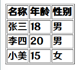

# 对象

PS: 不是你们那个对象, 哦对, 你没对象()

## 痛点

```js
const Arr = [100, 100, 100]
```

这3个100分别是什么意思?  你猜呗~

* 保存用户信息, 比如姓名, 年龄, 电话号码...用以前学过的数据类型方便么?
  * 肯定不方便(为了文档继续写下去, 你说方便也要认为不方便)
* 我们是不是需要一种全新的数据类型, 可以详细描述某个数据
  * 那是必须的~

## 对象是什么

对象(object): JS里的一种数据类型

可以理解为是一种无序的数据集合

:::tip
数组是有序的数据集合
:::

可以用来描述某个事物, 例如描述一个人(姓名, 年龄, 性别等信息), 如果用多个变量保存则比较散, 用对象比较统一

```js
const Obj = {
    Name: "张三",
    Age: 18,
    Gender: "男"
}
```

这是一个简单的对象, 可以清晰看见哪个是名称, 哪个是年龄, 哪个是性别

## 声明对象

```js
const 对象名 = {}
// 提倡使用这种方法来写

const 对象名 = new Object()
// 这种方法会在以后写构造函数的时候填坑

// {}是对象的字面量
```

对象由属性和方法组成

属性: 信息或叫特征(名词).例如: 名称, 年龄, 性别等...

方法: 功能或叫行为(动词).例如: 打电话, 发短信, 玩游戏等...

```js
const 对象名 = {
    属性名: 属性值,
    方法名: 函数
}
```

:::warning
1. 属性是成对出现的, 包括属性名和值, 他们之间使用英文`:`分隔
2. 多个属性之间使用英文`, `分隔
3. 属性就是依附在对象的变量(外面是变量, 对象内是属性)
4. 属性名可以使用`“”`或`‘’`, **一般情况下省略**, 除非名称遇到特殊符号, 例如空格, 中横线等

对象是可以使用`const`声明的, 尽管有增加或删除的操作
:::

## 操作对象

对象本质是无序的数据集合, 操作数据无非就是增删改查语法

### 增

```js
对象名.属性名 = 属性值
```

### 删

了解一下就行了, 因为在严格模式里, 是不允许直接删除的

```js
delete 对象名.属性名
```

### 改

```js
对象名.属性名 = 属性值
```

### 查

```js
对象名.属性名
```

:::warning
如果属性有特殊字符需要特殊处理

```js
const Obj = {
    "Name-Test": "张三"
}

console.log(Obj["Name-Test"])
// 张三
```

1. 属性需要用`‘’`或`“”`包起来
2. 访问需要使用`对象名["属性名"]`
:::

## 对象中的方法

对象中, 是可以存储方法的

:::warning
1. 方法是由方法名和函数两部分构成, 它们之间使用`:`分隔
2. 多个属性之间使用英文`, `分隔
3. 方法是依附在对象中的函数
4. 方法名可以使用`“”`或`‘’`, 一般情况下省略, 除非名称遇到特殊字符, 例如:空格, 中横线等
:::

```js
const Obj = {
    Name: "张三",
    Test: function () {
        console.log(Obj.Name)
    },
    getSum(Num1, Num2) {
        Num1 = Num1 || 0
        Num2 = Num2 || 0
        return Num1 + Num2
    }
}

Obj.Test()
// 张三

console.log(Obj.getSum(10, 15))
// 25
```

## 遍历对象

对象是=是无序的, 没有规律, 不想数组, 有规律的下标

for遍历对象的问题

* 对象没有像数组一样的`length`属性, 所以无法确定长度
* 对象没有规律, 所以没有像数组一样的下标

既然有这么多问题, 那该怎么用for遍历呢, 可以使用`for in`

```js
const Obj = {
    Name: "张三",
    Age: 18,
    Gender: "男"
}

for (const Item in Obj) {
    // 打印属性名
    console.log(Item)
    // 打印属性值
    console.log(Obj[Item])
}
```

最好不要使用`for in`去遍历数组

:::warning
这里是使用`Obj[Item]`获取属性值的!

为什么非得用这个才能获取?让你用你就用呗, 哪有这么多废话()

我们`Item`返回的是一个字符串, 如果你用另一种写法, 相当于这样:`Obj."Name"`

这是绝对不行的, 需要使用`Obj[]`, 加上`Item`就成了`Obj["Name"]`

**这个一定要理解了, 很容易搞不清楚**
:::

## 来和数组套娃一下(Demo)

```js
const Arr = [
    { Name: "张三", Age: 18, Gender: "男" },
    { Name: "李四", Age: 20, Gender: "男" },
    { Name: "小美", Age: 15, Gender: "女" },
]
```

如何遍历这个数组对象, 并输出?

```js
for (let i = 0; i < Arr.length; i++) {
    console.log(`名称: ${Arr[i].Name} 年龄: ${Arr[i].Age} 性别: ${Arr[i].Gender}`)
}

// 名称: 张三 年龄: 18 性别: 男
// 名称: 李四 年龄: 20 性别: 男
// 名称: 小美 年龄: 15 性别: 女
```

那我想打印到网页上呢?

```html
<table border="1">
    <tr>
        <th>名称</th>
        <th>年龄</th>
        <th>性别</th>
    </tr>
      // 还没写到Dom操作, 所以js只能写在这里
    <script src="script.js"></script>
</table>
```

```js
for (let i = 0; i < Arr.length; i++) {
    document.write(`
        <tr>
            <td>${Arr[i].Name}</td>
            <td>${Arr[i].Age}</td>
            <td>${Arr[i].Gender}</td>
        </tr>
        `)
}
```



## 什么是内置对象

JS内部提供的对象, 包含各种属性和方法给开发者调用.

我们之前使用过哪些内置对象?

* `document.write()`
* `console.log()`

下一篇, 来讲内置对象最常用的数学对象**Math**
