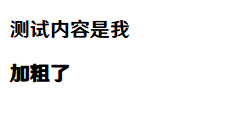

# 操作元素内容

DOM对象都是根据标签生成的, 所以操作标签, 本质上就是操作DOM对象

如果想要修改标签元素里面的内容, 则可以使用以下几种方式:

1. `对象.innerText = ""`
2. `对象.textContent = ""`
3. `对象.innerHTML = ""`

## innerText

将文本内容添加/更新到任意标签位置

只能显示纯文本, **不能解析标签**

```html
<p class="Test1">我是测试内容</p>
<p class="Test2">我是测试内容</p>
<script>
    const Test1 = document.querySelector(".Test1")
    const Test2 = document.querySelector(".Test2")
    Test1.innerText = "测试内容是我"
  	Test2.innerText = "<strong>加粗了</strong>"
</script>
```


## textContent

和`innerText`使用方式一样, 只能显示纯文本, **不能解析标签**

```html
<p class="Test1">我是测试内容</p>
<p class="Test2">我是测试内容</p>
<script>
    const Test1 = document.querySelector(".Test1")
    const Test2 = document.querySelector(".Test2")
    Test1.textContent = "测试内容是我"
  	Test2.textContent = "<strong>加粗了</strong>"
</script>
```


:::note
1. `textContent`是W3C的规范属性, 而`innerText`是IE特有的.
2. 在某些情况下, `textContent`比`innerText`具有更好的性能, 因为它不会触发回流(reflow)或重绘(repaint), 而`innerText`可能会.
3. `textContent`返回元素内所有文本的节点, 包括`<script>`和`<style>`元素的内容, 而`innerText`会忽略这些元素, 并且不会返回隐藏元素的文本
:::

:::warning
所以为了确保代码的可维护性和跨浏览器兼容性, 建议使用`textContent`来设置或获取元素的文本内容

`textContent`是更安全, 更标准的选择
:::

## innerHTML

将文本内容添加/更新到任意标签位置

**会解析标签**, 多标签建议使用模板字符

```html
<p class="Test1">我是测试内容</p>
<p class="Test2">我是测试内容</p>
<script>
    const Test1 = document.querySelector(".Test1")
    const Test2 = document.querySelector(".Test2")
    Test1.innerHTML = "测试内容是我"
    Test2.innerHTML = "<strong>加粗了</strong>"
</script>
```


