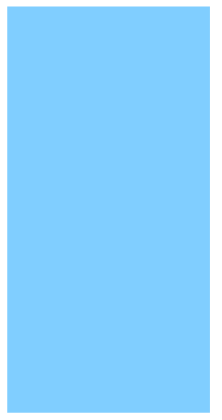
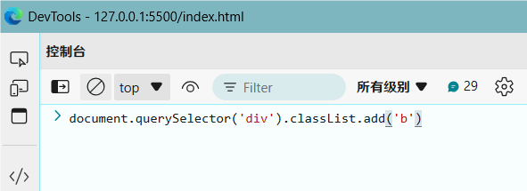
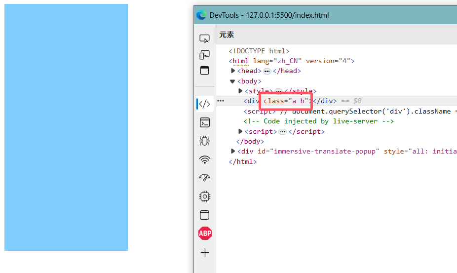
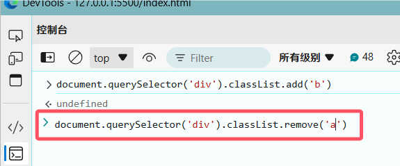
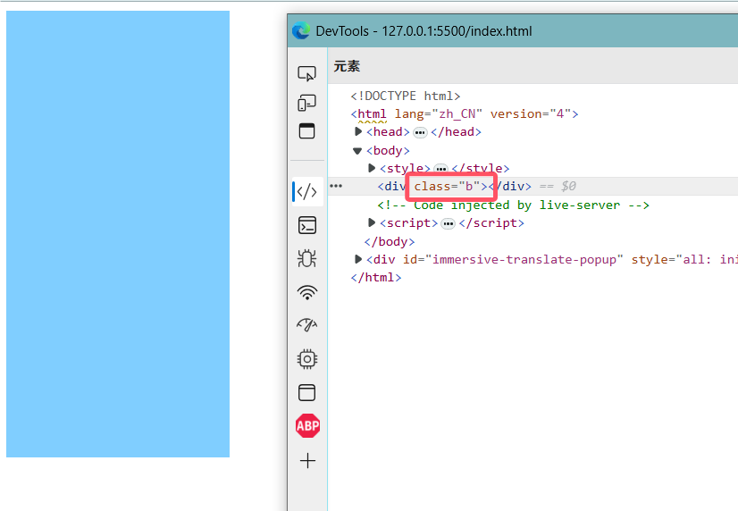
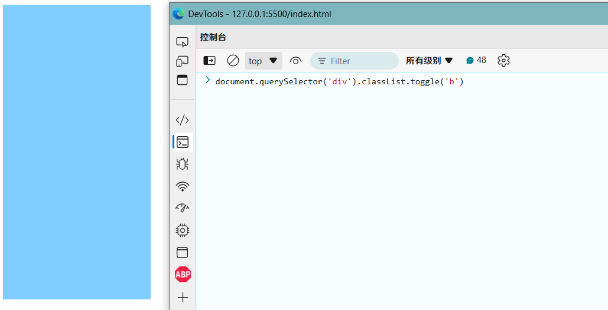
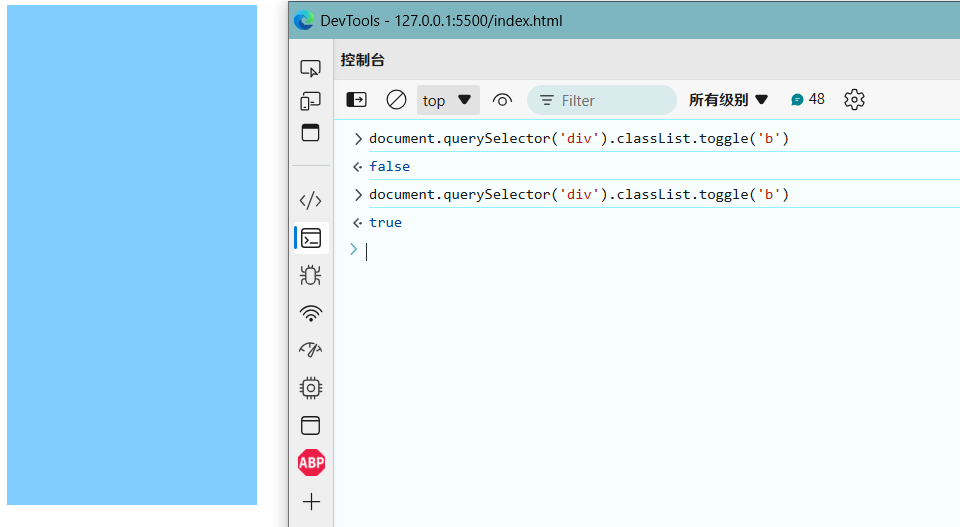

# 操作元素样式

## 直接修改样式

除了操作元素内容和属性外,还可以通过JS设置或修改标签元素的样式

`对象.style.样式名 = ''`

```html

```


```html

<script>
    document.querySelector('img').style.height = '100px'
</script>
```


:::warning
CSS中,像这样`background-color`的样式,使用js修改需要写成这样`backgroundColor`(小驼峰命名法)

`对象.style.backgroundColor = ''`

用JS修改CSS样式和CSS是一样的,都是要写单位的,如果是修改背景图片之类的,一样要写`url(xxx)`
:::

## 修改class

### className

上面是直接修改CSS样式的,那如果我要修改的样式十分的多,就不方便了

所以我们可以使用`元素.className = '类名'`直接使用写在CSS表里的样式

```html
<style>
    .a {
        width: 200px;
        height: 200px;
        background-color: #000;
    }
    .b {
        width: 200px;
        height: 400px;
        background-color: #80ceff;
    }
</style>
<div></div>
<script>
    // 使用样式a
    document.querySelector('div').className = 'a'
</script>
```


我们只需要修改一下JS,就可以获得样式b了

```html
<script>
    document.querySelector('div').className = 'b'
</script>
```



:::tip
`className`是替换,不会保留原本的class,如果只需要添加一个类,需要保留之前的类名

那有没有什么办法,可以不使用`className`替换,更方便的加入一个类,删除一个类,切换一个类呢?

往下看~
:::

### classList

```html
<style>
    .a {
        width: 200px;
        height: 200px;
        background-color: #000;
    }
    .b {
        width: 200px;
        height: 400px;
        background-color: #80ceff;
    }
</style>
<div class="a"></div>
```

#### 加入一个类

`元素.classList.add('类名')`

这个方法可以在原本的基础上,加入一个类

这里可以看见,原本的class只有a的


然后在控制台执行这段JS

```js
document.querySelector('div').classList.add('b')
```



就可以发现class比原先多了一个b



#### 删除一个类

`元素.classList.remove('类名')`

这个方法可以在原本的基础上,删除一个类

在控制台执行这段JS

```js
document.querySelector('div').classList.remove('a')
```



就可以发现class现在只剩个b了



#### 切换一个类

`元素.classList.toggle('类名')`

这个方法可以像个开关一个,如果class中有这个类了,执行这个方法,就会删除这个类,再次执行,就会加回来

继续在控制台执行这段JS

```js
document.querySelector('div').classList.toggle('b')
```



可以看见返回了false,并且盒子消失了,因为class现在什么都没有


再次执行刚刚的JS

返回了true,并且盒子又出现了


