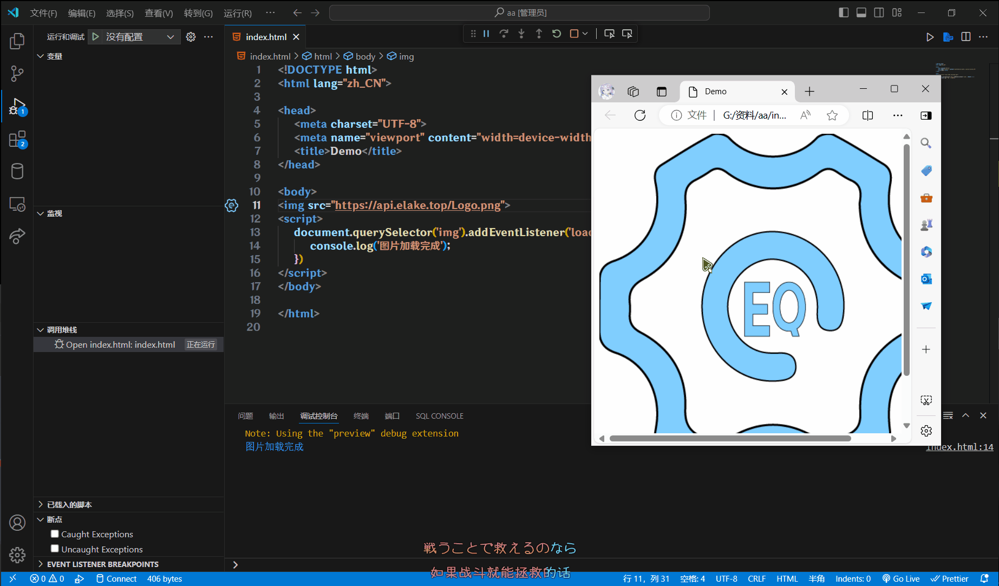
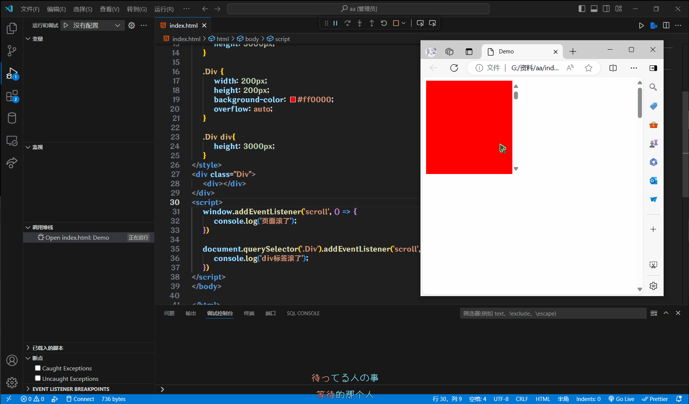
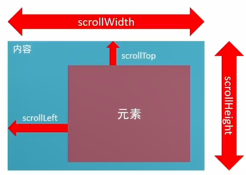
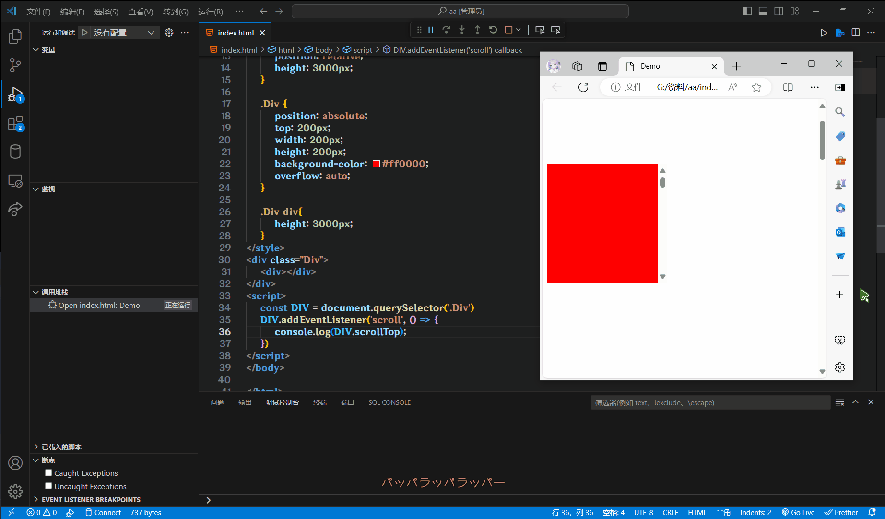
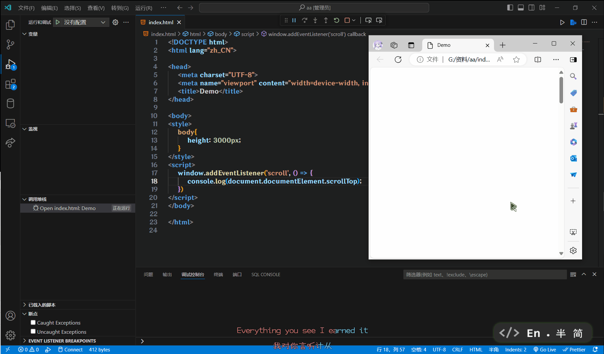
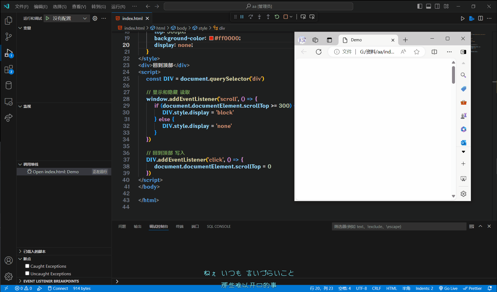
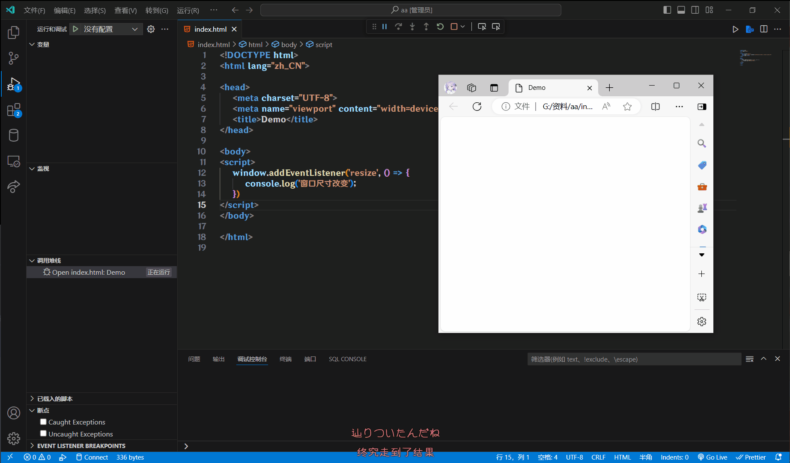
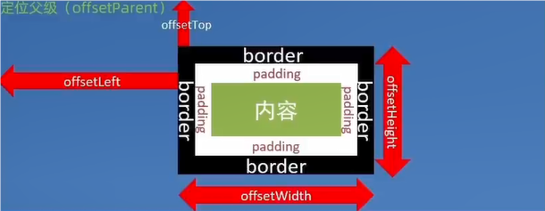

# 其他事件

## 加载事件

### load

这个事件可以监听外部资源(图片, 外联CSS, JS等)加载完成

这个是监听最大的`window`, 也就是说要等待网页所有东西都加载完

```js
// 等待页面所有资源加载完成, 就会执行回调函数
window.addEventListemer('load', () => {
    console.log('页面加载完成')
})
```

这个是监听图片的, 其他视频外联CSS, JS等, 同理

```html

<script>
    document.querySelector('img').addEventListener('load', () => {
        console.log('图片加载完成')
    })
</script>
```



### DOMContentLoaded

这个事件可以监听Html文档加载并解析完成, 无需等待样式表, 图片等资源

这个事件只能监听`document`

```js
document.addEventListener('DOMContentLoaded', () => {
    console.log('Html文档加载完成')
})
```

## 滚动事件

### scroll

这个事件可以监听所有带滚动条的元素, 比如文本框, div标签, 或者整个页面

```html
<style>
    body{
        height: 3000px;
    }

    .Div {
        width: 200px;
        height: 200px;
        background-color: #ff0000;
        overflow: auto;
    }

    .Div div{
        height: 3000px;
    }
</style>
<div class="Div"><div></div></div>
<script>
    window.addEventListener('scroll', () => {
        console.log('页面滚了')
    })

    document.querySelector('.Div').addEventListener('scroll', () => {
        console.log('div标签滚了')
    })
</script>
```



### 扩展:获取位置

Ps: 好难写...不是很好理解, 要经常实践

`scrollLeft`和`scrollTop`属性

用于获取被卷去的大小, 也就是获取元素内容往左, 往上滚出去看不到的距离

这两个值是可以**读写**的



#### 获取元素内部的滚动距离

```html
<style>
    .Div {
        width: 200px;
        height: 200px;
        background-color: #ff0000;
        overflow: auto;
    }

    .Div div{
        height: 3000px;
    }
</style>
<div class="Div">
    <div></div>
</div>
<script>
    const Div = document.querySelector('.Div')
    Div.addEventListener('scroll', () => {
        console.log(Div.scrollTop)
    })
</script>
```



#### 获取页面的滚动距离

:::tip
H5对于获取一些特定的元素, 有专门的写法

`body`可以通过`document.body`获取

`html`可以通过`document.documentElement`获取
:::

```html
<style>
    body{
        height: 3000px;
    }
</style>
<script>
    window.addEventListener('scroll', () => {
        console.log(document.documentElement.scrollTop)
    })
</script>
```



#### 实践一下

做一个页面滚动到300就显示返回顶部按钮的Demo

```html
<style>
    body {
        position: relative;
        height: 3000px;
    }
    div {
        position: absolute;
        top: 500px;
        background-color: #ff0000;
        display: none;
    }
</style>
<div>回到顶部</div>
<script>
    const Div = document.querySelector('div')

    // 显示和隐藏 读取
    window.addEventListener('scroll', () => {
        if (document.documentElement.scrollTop >= 300) {
            Div.style.display = 'block'
        } else {
            Div.style.display = 'none'
        }
    })

    // 回到顶部 写入
    Div.addEventListener('click', () => {
        document.documentElement.scrollTop = 0
    })
</script>
```



## 尺寸事件

### resize

这个事件看见监听窗口尺寸改变

```html
<script>
    window.addEventListener('resize', () => {
        console.log('窗口尺寸改变')
    })
</script>
```



### 扩展:获取宽高

Ps: 好难写...不是很好理解, 要经常实践

#### clien

`clientWidth`和`clientHeight`属性

用于获取元素的内部宽高

如果元素是隐藏的, 获取到的值为0

这个属性是只读的, 不能进行写入

* 包含
    * 内容的宽高
    * 填充(`padding`)
* 不包含
    * 边框(`border`)
    * 外边距(`margin`)
    * 滚动条

#### offse

`offseWidth`和`offseHeight`属性

用于获取元素的布局宽高

如果元素是隐藏的, 获取到的值为**0**

这个属性是**只读**的, 不能进行**写入**

* 包含
    * 内容的宽高
    * 填充(`padding`)
    * 边框(`border`)
    * 滚动条
* 不包含
    * 外边距(`margin`)

#### 区别

```html
<style>
    .A {
        width: 200px;
        height: 100px;
        padding: 20px;
        border: 5px solid black;
        margin: 10px;
        overflow: auto;
    }

    .B {
       height: 200px;
    }
</style>
<div class="A">
    <div class="B">滚动条</div>
  </div>
<script>
    const A = document.querySelector('.A')
    console.log(`clientWidth: ${A.clientWidth}, clientHeight: ${A.clientHeight}`)
    // clientWidth: 225, clientHeight: 140

    console.log(`offsetWidth: ${A.offsetWidth}, offsetHeight: ${A.offsetHeight}`)
    // offsetWidth: 250, offsetHeight: 150
</script>
```

### 扩展:获取位置

`offsetTop`和`offsetLeft`属性

用于获取元素位置, 看最近一级带有定位的祖先元素

这个属性是只读的, 不能进行写入

```html
<style>
    .A {
        width: 200px;
        height: 100px;
        padding: 20px;
        border: 5px solid black;
        margin: 10px;
    }
</style>
<div class="A"></div>
<script>
    const A = document.querySelector('.A')
    console.log(`offsetTop: ${A.offsetTop}, offsetLeft: ${A.offsetLeft}`)
    // offsetTop: 10, offsetLeft: 18
</script>
```

### 扩展: 一键获取位置和尺寸

`getBoundingClientRect()`

这个方法可以一次性获取元素的位置信息尺寸信息的对象

```html
<style>
    .A {
        width: 200px;
        height: 100px;
        padding: 20px;
        border: 5px solid black;
        margin: 10px;
    }
</style>
<div class="A"></div>
<script>
    const A = document.querySelector('.A')
    console.log(`offsetWidth: ${A.offsetWidth}, offsetHeight: ${A.offsetHeight}`)
    console.log(A.getBoundingClientRect())
</script>
```


