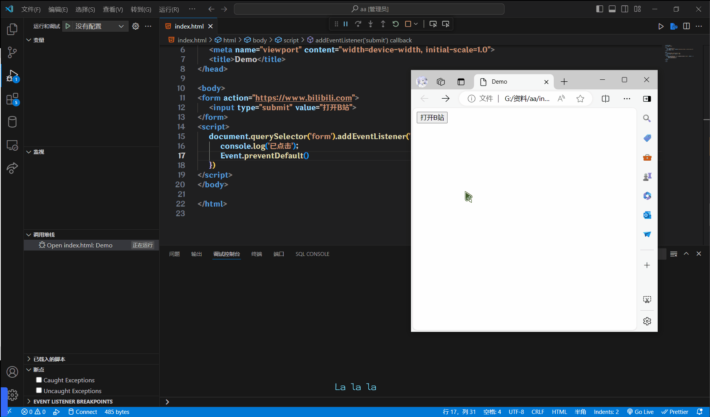
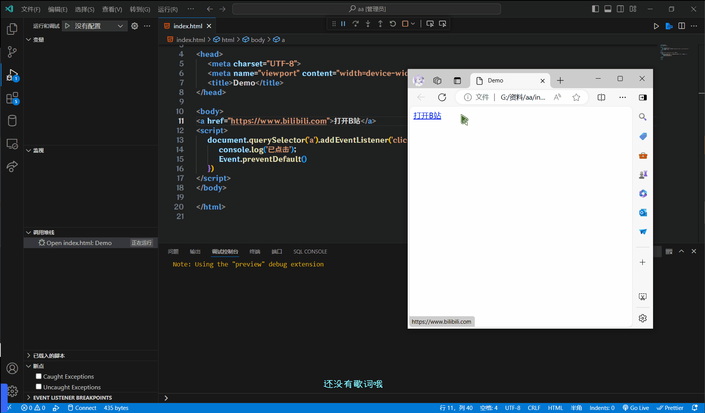

# 阻止默认行为

之前讲了阻止传播, 来补个知识点, 阻止默认行为

我们在某些情况下需要阻止默认行为的发生, 比如阻止链接跳转, 表单域跳转等

`Event.preventDefault()`

## 表单域跳转

```html
<form action="//www.bilibili.com">
    <input type="submit" value="打开B站">
</form>
<script>
    document.querySelector("form").addEventListener("submit", (Event) => {
        console.log("已点击")
        Event.preventDefault()
    })
</script>
```



## 链接跳转

```html
<a href="//www.bilibili.com">打开B站</a>
<script>
    document.querySelector("a").addEventListener("click", (Event) => {
        console.log("已点击")
        Event.preventDefault()
    })
</script>
```


