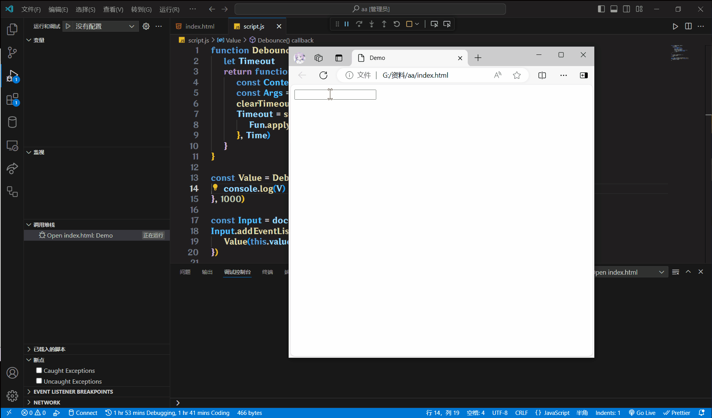

# 防抖

**防抖**(Debounce), 一个单位时间内, 频繁触发事件, **只执行最后一次**

举个例子: 防抖就像是在游戏中使用回城技能, 如果在回城过程中受到攻击, 回城计时会重置, 只有当玩家在一段时间内没有被攻击, 回城才会成功

使用场景:

搜索框输入, 只需用户**最后**一次输入完, 在发送请求

手机号, 邮箱验证的格式检查

```js
// 我在这里写的防抖是通用的, 你完全可以直接复制粘贴走
// 这个代码块就当做使用说明了
function Debounce(Fun, Time) {
    let Timeout
    return function () {
        const Context = this
        const Args = arguments
        clearTimeout(Timeout)
        Timeout = setTimeout(function () {
            Fun.apply(Context, Args)
        }, Time)
    }
}

const Value = Debounce((V) => console.log(V), 1000)

const Input = document.querySelector("input")
Input.addEventListener("input", function () {
    Value(this.value)
})
```



