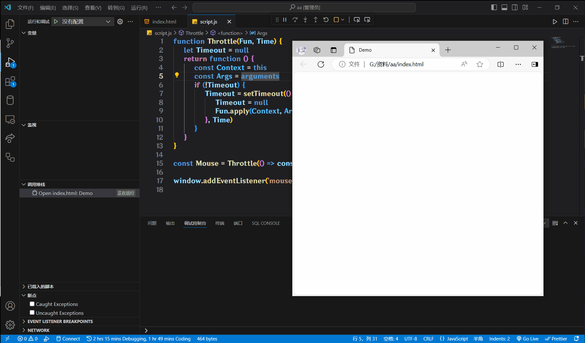

# 节流

**节流**(Throttle), 一个单位时间内, 频繁触发事件, **只执行一次**

举个例子: 节流就像是在游戏中使用技能, 每个技能都有自己的冷却时间(CD), 即使你连续点击技能按钮, 技能也只会在冷却时间结束后才能再次使用

使用场景:

鼠标移动, 页面尺寸等高频事件

```js
// 我在这里写的节流是通用的, 你完全可以直接复制粘贴走
// 这个代码块就当做使用说明了
function Throttle(Fun, Time) {
    let Timeout = null
    return function () {
        const Context = this
        const Args = arguments
        if (!Timeout) {
            Timeout = setTimeout(() => {
                Timeout = null
                Fun.apply(Context, Args)
            }, Time)
        }
    }
}

const Mouse = Throttle(() => console.log("在这1秒内进行了鼠标移动"), 1000)

window.addEventListener("mousemove", Mouse)
```



