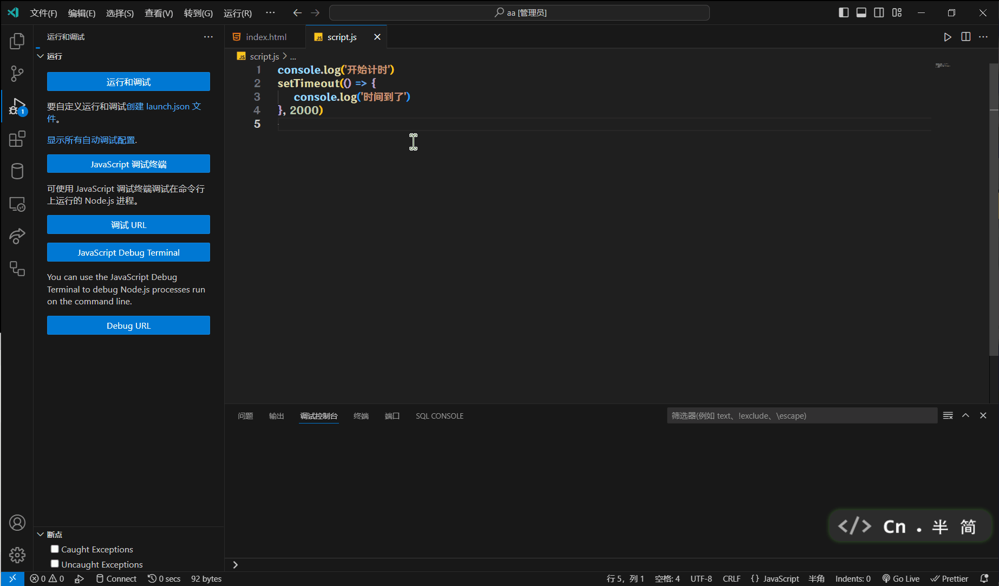

# 定时器-延时函数

JS内置的一个用来让代码延迟执行的函数

`setTimeout(函数, 延迟毫秒数)`

`setTimeout`仅执行一次, 所以可以理解为把一段代码延迟执行

```js
console.log('开始计时')
setTimeout(() => {
    console.log('时间到了')
}, 2000)
```



和间歇函数一样有返回值, 返回定时器ID

使用`clearTimeout(定时器ID)`关闭定时器, 这里不在过多赘述, 可以翻[定时器-间歇函数](TimerIntervalFunction)的看
