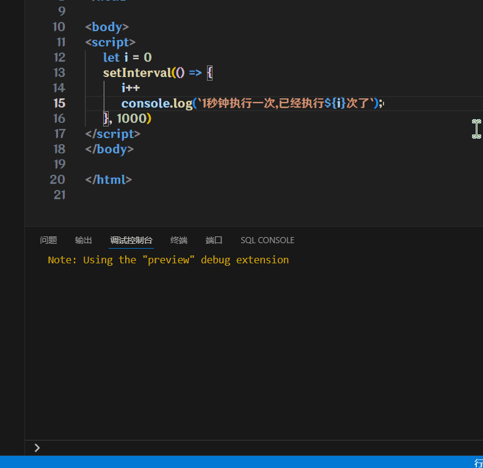
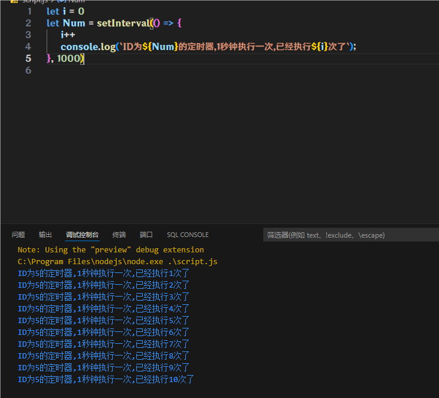
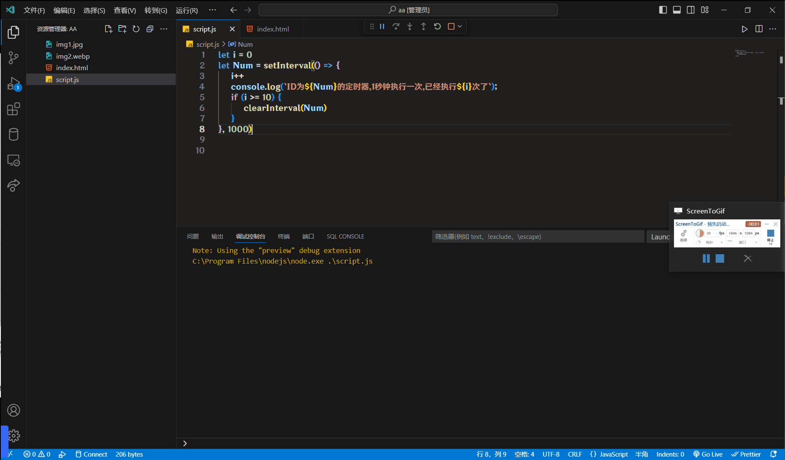

# 定时器-间歇函数

## 开启定时器

`setInterval(函数, 间隔时间)`

作用: 每隔一段时间, 就调用一次函数

间隔时间的不用加单位, 但是单位是毫秒(ms)

```js
let i = 0
setInterval(() => {
    i++
    console.log(`1秒钟执行一次, 已经执行${i}次了`)
}, 1000)
```



:::warning
如果调用的是函数, `setInterval(Demo, 1000)`的`Demo`不能像平时那样加括号, 加括号会报错的

```js
let i = 0
const Demo = () =>  {
       i++
       console.log(`1秒钟执行一次,已经执行${i}次了`)
}

setInterval(Demo, 1000)
```
:::

## 返回值

定时器在开启的时候, 会被分配一个整数型的ID, 有了这个ID, 我们才能对定时器进行操作

:::warning
定时器的ID如果要使用变量存储, 需要使用`let`, 因为定时器**每次**开启, 都会分配一个ID, 除非你的定时器只开一次
:::

```js
let i = 0
let Num = setInterval(() => {
    i++
    console.log(`ID为${Num}的定时器, 1秒钟执行一次, 已经执行${i}次了`)
}, 1000)
```



## 关闭定时器

`clearInterval(定时器ID)`


