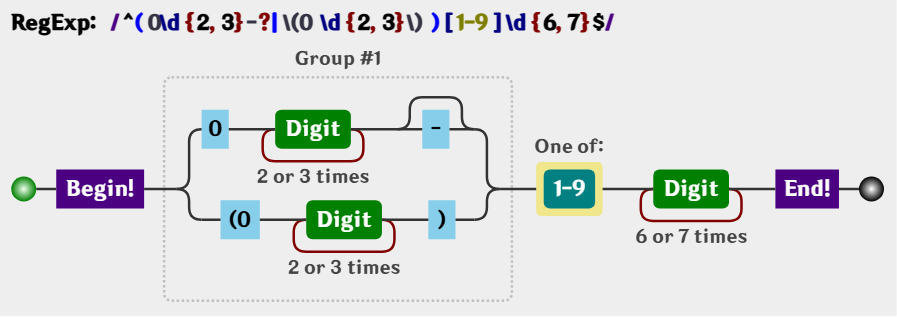

# 构建

对于一门语言的掌握程度怎么样, 可以有两个角度来衡量:读和写

不仅要看懂别人的解决方案, 也要能独立地解决问题.代码是这样, 正则表达式也是这样

与读相比, 写往往更为重要, 这个道理是不言而喻的

对正则的运用, 首重就是:如何针对问题, 构建一个合适的正则表达式?

## 平衡法则

构建正则有一点非常重要, 需要做到下面几点的平衡:

1. 匹配预期的字符串
2. 不匹配非预期的字符串
3. 可读性和可维护性
4. 效率

## 构建正则前提

### 是否能使用正则

正则太强大了, 以至于我们随便遇到一个操作字符串问题时, 都会下意识地去想, 用正则该怎么做.但我们始终要提醒自己, 正则虽然强大, 但不是万能的, 很多看似很简单的事情, 还是做不到的

比如匹配这样的字符串:1010010001....

虽然很有规律.但是只靠正则就是无能为力

### 是否有必要使用正则

要认识到正则的局限, 不要去研究根本无法完成的任务.同时, 也不能走入另一个极端:无所不用正则.能用字符串API解决的简单问题, 就不该正则出马

### 是否有必要构建一个复杂的正则

比如密码匹配问题, 要求密码长度6-12位, 由数字, 小写字符和大写字母组成, 但必须至少包括2种字符

`/(?!^[0-9]{6,12}$)(?!^[a-z]{6,12}$)(?!^[A-Z]{6,12}$)^[0-9A-Za-z]{6,12}$/`

这个正则其实可以使用多个小正则来做:

`/^[0-9A-Za-z]{6,12}$/`

`/^[0-9]{6,12}$/`

`/^[A-Z]{6,12}$/`

`/^[a-z]{6,12}$/`

## 准确性

所谓准确性, 就是能匹配预期的目标, 并且不匹配非预期的目标

这里提到了**预期**二字, 那么我们就需要知道目标的组成规则

不然没法界定什么样的目标字符串是符合预期的, 什么样的又不是符合预期的

下面将举例说明, 当目标字符串构成比较复杂时, 该如何构建正则, 并考虑到哪些平衡

### 匹配固定电话

比如要匹配如下格式的固定电话号码:

`055188888888`

`0551-88888888`

`(0551)88888888`

第一步, 了解各部分的模式规则

上面的电话, 总体上分为区号和号码两部分(不考虑分机号和+86的情形)

区号是0开头的3到4位数字, 对应的正则是:`0\d{2,3}`

号码是非0开头的7到8位数字, 对应的正则是:`[1-9]\d{6,7}`

因此, 匹配`055188888888`的正则是:`/^0\d{2,3}[1-9]\d{6,7}$/`

匹配`0551-88888888`的正则是:`/^0\d{2,3}-[1-9]\d{6,7}$/`

匹配`(0551)88888888`的正则是:`/^\(0\d{2,3}\)[1-9]\d{6,7}$/`

第二步, 明确形式关系

这三者情形是或的关系, 可以构建分支:

`/^0\d{2,3}[1-9]\d{6,7}$|^0\d{2,3}-[1-9]\d{6,7}$|^\(0\d{2,3}\)[1-9]\d{6,7}$/`

提取公共部分:

`/^(0\d{2,3}|0\d{2,3}-|\(0\d{2,3}\))[1-9]\d{6,7}$/`

进一步简写:

`/^(0\d{2,3}-?|\(0\d{2,3}\))[1-9]\d{6,7}$/`

其可视化形式:

上面的正则构建过程略显罗嗦, 但是这样做, 能保证正则是准确的

上述三种情形是或的关系，这一点很重要，不然很容易按字符是否出现的情形把正则写成:

`/^\(?0\d{2,3}\)?-?[1-9]\d{6,7}$/`

虽然也能匹配上述目标字符串, 但也会匹配`(0551-88888888`这样的字符串.当然, 这不是我们想要的

其实这个正则也不是完美的, 因为现实中, 并不是每个3位数和4位数都是一个真实的区号

这就是一个平衡取舍问题, 一般够用就行

## 效率

保证了准确性后, 才需要是否要考虑要优化.大多数情形是不需要优化的, 除非运行的非常慢.什么情形正则表达式运行才慢呢?我们需要考察正则表达式的运行过程(原理)

正则表达式的运行分为如下的阶段:

1. 编译
2. 设定起始位置
3. 尝试匹配
4. 匹配失败的话, 从下一位开始继续第3步
5. 最终结果:匹配成功或失败

匹配会出现效率问题, 主要出现在上面的第3阶段和第4阶段

因此, 主要优化手法也是针对这两阶段的

### 使用具体型字符组代替通配符消除回溯

而在第三阶段, 最大的问题就是回溯

例如, 匹配双引用号之间的字符.如, 匹配字符串123`abc`456中的`abc`

如果正则用的是:`/".*"/,`, 会在第3阶段产生4次回溯(粉色表示`.*`匹配的内容):

| 步骤 |           文本           |
| :--: | :----------------------: |
|  1   |    |
|  2   |    |
|  3   |    |
|  4   |    |
|  5   |    |
|  6   |    |
|  7   |    |
|  8   |    |
|  9   |  |
|  10  |  |
|  11  |  |
|  12  |  |
|  13  |  |

如果正则用的是:`/".*?"/`, 会产生2次回溯(粉色表示`.*?`匹配的内容):

| 步骤 |           文本           |
| :--: | :----------------------: |
|  1   |  |
|  2   |  |
|  3   |  |
|  4   |  |
|  5   |  |

因为回溯的存在, 需要引擎保存多种可能中未尝试过的状态, 以便后续回溯时使用.注定要占用一定的内存

此时要使用具体化的字符组.来代替通配符`.`.以便消除不必要的字符.此时使用正则`/"[^"]*"/`.即可

### 使用非捕获型分组

因为括号的作用之一是, 可以捕获分组和分支里的数据.那么就需要内存来保存它们

当我们不需要使用分组引用和反向引用时, 此时可以使用非捕获分组.例如:

`/^[+-]?(\d+\.\d+|\d+|\.\d+)$/`

可以修改成:

`/^[+-]?(?:\d+\.\d+|\d+|\.\d+)$/`

### 独立出确定字符

例如`/a+/`, 可以修改成`/aa*/`

因为后者能比前者多确定了字符a.这样会在第四步中, 加快判断是否匹配失败, 进而加快移位的速度

### 提取分支公共部分

比如/`^abc|^def/`, 修改成`/^(?:abc|def)/`

又比如`/this|that/`, 修改成`/th(?:is|at)/`

这样做, 可以减少匹配过程中可消除的重复

### 减少分支数量缩小范围

`/red|read/`, 可以修改成`/rea?d/`.此时分支和量词产生的回溯的成本是不一样的.但这样优化后, 可读性会降低的
