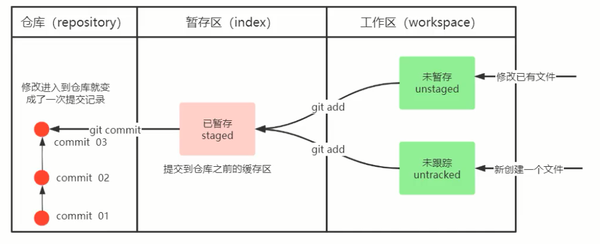

# 常见指令

Git工作目录下对于文件的修改(增加,删除,更新)会存在几个状态,这些修改的状态会随着我们执行Git的命令而发生变化.

## 初始化Git仓库

`git inif`

## 加入暂存区

将工作区的文件,加入暂存区

`git add 单个文件名|通配符`

通配符`.`是所有(一般是这么做的)

## 提交本地仓库

将暂存区的文件提交到本地仓库的当前分支

`git commit -m "注释"`

注释是必填的

## 查看文件的修改状态

查看文件的修改状态(暂存区,工作区)

`git status`

## 查看提交日志

查看提交日志信息

`git log [参数]`

* 参数

  * --all 显示所有分支
  * --pretty=oneline 将提交信息显示为一行
  * --abbrev-commit 使输出的commit更简短
  * --graph 以图的形式输出

  如果想直接看到一个直观的效果,不想输这么多参数,可以直接`git-log`

## 版本回退

版本切换

`git reset --hard commitID`

commitID 可以用`git log`查看

## 查看版本回退日志

查看版本回退日志

`git reflog`

## 添加文件到忽略列表

不希望一些文件被git管理

在工作目录创建一个文件`.gitignore`(文件名固定)

然后在里面写上要忽略的文件名/目录,支持通配符,一行一个
