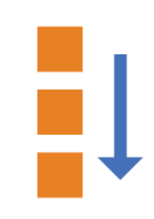
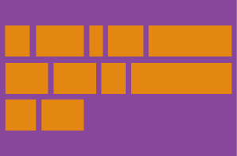
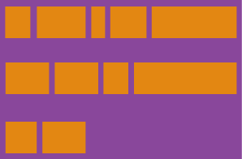

# Flex弹性布局

Flex布局是 **浏览器提倡** 的布局模型,非常使用结构化布局,提供强大的 **空间布局** 和 **对齐** 能力

Flex模型 **不会** 产生浮动布局中的 **脱标** 现象,布局网页 **更简单,更灵活**

Flex模型有6个属性:

* `flex-direction`
* `flex-wrap`
* `flex-flow`
* `justify-content`
* `align-items`
* `align-content`

项目也有6个属性:

* `order`
* `flex-grow`
* `flex-shrink`
* `flex-basis`
* `flex`
* `align-self`

## 基本概念

采用 `Flex` 布局的元素,称为Flex容器(flex container),简称 **容器**

它的所有子元素自动成为容器成员,称为Flex项目(flex item),简称 **项目**


容器默认存在两根轴: **水平的主轴(main axis)** 和 **垂直的交叉轴(cross axis)**

主轴的开始位置(与边框的交叉点)叫做main start,结束位置叫做main end

交叉轴的开始位置叫做cross start,结束位置叫做cross end

项目默认沿主轴排列

单个项目占据的主轴空间叫做main size,占据的交叉轴空间叫做cross size

## flex-direction属性

`flex-direction` 属性决定主轴的方向(即项目的排列方向)

属性值:

`row` :主轴为 **水平方向** ,起点在 **左端** (默认值)


`row-reverse` :主轴为 **水平方向** ,起点在 **右端**


`column` :主轴为 **垂直方向** ,起点在 **上沿**



`column-reverse` :主轴为 **垂直方向** ,起点在 **下沿**


## flex-wrap属性

默认情况下,项目都排在一条线(轴线)上.

`flex-wrap` 属性定义,如果一条轴线排不下,如何换行

属性值:

`nowrap` :不换行(默认值)


`wrap` :换行,第一行在 **上方**


`wrap-reverse` :换行,第一行在 **下方**


## flex-flow属性

`flex-flow` 属性是 `flex-direction` 属性和 `flex-wrap` 属性的简写形式

默认值为: `row nowrap`

## justify-content属性

`justify-content` 属性定义了项目在主轴上的对齐方式

属性值:

`flex-start` :左对齐(默认值)


`flex-end` :右对齐


`center` :居中


`space-between` :两端对齐,项目之间的间隔都相等


`space-around` :每个项目两侧的间隔相等.所以,项目之间的间隔比项目与边框的间隔大一倍


`space-evenly` :均匀排列每个元素,每个元素之间的间隔相等


## align-items属性

`align-items` 属性定义项目在交叉轴上如何对齐

属性值:

`flex-start` :交叉轴的起点对齐


`flex-end `:交叉轴的终点对齐


`center` :交叉轴的中点对齐


`baseline` :项目的第一行文字的基线对齐


`stretch` :如果项目未设置高度或设为auto,将占满整个容器的高度(默认值)


## align-content属性

`align-content` 属性定义了多根轴线的对齐方式.如果项目只有一根轴线,该属性不起作用

属性值:

`flex-start` :与交叉轴的起点对齐


`flex-end` :与交叉轴的终点对齐


`center `:与交叉轴的中点对齐



`space-between` :与交叉轴两端对齐,轴线之间的间隔平均分布



`space-around` :每根轴线两侧的间隔都相等.所以,轴线之间的间隔比轴线与边框的间隔大一倍


`stretch` :轴线占满整个交叉轴(默认值)


## order属性

`order `属性定义项目的排列顺序.数值越小,排列越靠前,默认为0


## flex-grow属性

`flex-grow` 属性定义项目的放大比例,默认为0,即如果存在剩余空间,也不放大

如果所有项目的 `flex-grow` 属性都为1,则它们将等分剩余空间(如果有的话).如果一个项目的 `flex-grow` 属性为2,其他项目都为1,则前者占据的剩余空间将比其他项多一倍


## flex-shrink属性

`flex-shrink` 属性定义了项目的缩小比例,默认为1,即如果空间不足,该项目将缩小

如果所有项目的 `flex-shrink` 属性都为1,当空间不足时,都将等比例缩小.如果一个项目的 `flex-shrink` 属性为0,其他项目都为1,则空间不足时,前者不缩小

负值对该属性无效


## flex-basis属性

`flex-basis` 属性定义了在分配多余空间之前,项目占据的主轴空间(main size).浏览器根据这个属性,计算主轴是否有多余空间.它的默认值为auto,即项目的本来大小

它可以设为跟width或height属性一样的值,则项目将占据固定空间

## flex属性

`flex` 属性是 `flex-grow` , `flex-shrink` 和 `flex-basis` 的简写,默认值为0 1 auto.后两个属性可选

该属性有两个快捷值: `auto` (1 1 auto)和 `none` (0 0 auto)

建议优先使用这个属性,而不是单独写三个分离的属性,因为浏览器会推算相关值

## align-self属性

`align-self` 属性允许单个项目有与其他项目不一样的对齐方式,可覆盖 `align-items` 属性.默认值为 `auto` ,表示继承父元素的 `align-items` 属性,如果没有父元素,则等同于 `stretch`

该属性可能取6个值,除了 `auto` ,其他都与 `align-items` 属性完全一致


## 例子

```html
<div class="box">
    <div>1</div>
    <div>2</div>
    <div>3</div>
    <div>4</div>
</div>
```

```css
.box {
    width: 50%;
    padding: 20px;
    background-color: pink;
    display: flex;
    justify-content: space-around;
}

.box div{
    width: 100px;
    height: 100px;
    background-color: yellow;
}
```

