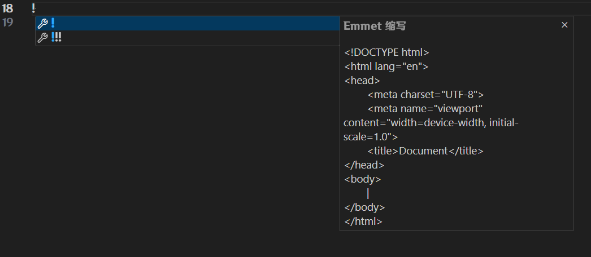
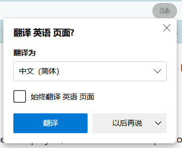

# Html骨架

```html
<html>
	<head>
        <title>网页标题</title>
	</head>
	<body>
        网页主体
	</body>
</html>
```

`html`: **整个网页**,网页的所有内容都要在这里面

`head`: **网页头部**,存放给浏览器看的代码,如引入 **CSS** 等

`body`: **网页主体**,存放给用户展示的代码,如图片,文字等

`title`: **网页的标题**

## VSCode快速生成骨架

新建一个文件夹,并用 **VSCode** 打开,新建一个 `index.html` 文件(网页名可以自定义,但首页默认为index)

在编辑框输入一个 `!` 注意:是英文的感叹号



这时候鼠标点击第一个,或者按 **Tab** 键补全,就可以一键生成骨架了

## 解析VSCode生成的骨架

```html
<!DOCTYPE html>
<html lang="en">
<head>
	<meta charset="UTF-8">
	<meta name="viewport" content="width=device-width, initial-scale=1.0">
	<title>Document</title>
</head>
<body>
	
</body>
</html>
```

`<!DOCTYPE html>`: 声明该网页使用 **Html5** 进行渲染

`lang="en"`: `html` 属性,声明网页的语言, `en` 为英文, `zh_CN` 为简体中文,像 **edge** 这样自带翻译的浏览器,会根据这一行判断是否需要弹窗翻译窗口



`<meta charset="UTF-8">`: 声明该网页使用UTF-8编码

`<meta name="viewport" content="width=device-width, initial-scale=1.0">`: 设置网页在移动设备上的显示方式, `width=device-width` 表示页面的宽度应该等于设备的宽度, `initial-scale=1.0` 表示页面的初始缩放比例为1.0,即不进行缩放

`<title>Document</title>`: 网页标题

`<body></body>`: 写网页主体的地方