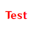
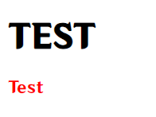
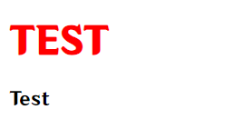

# 初识CSS

**CSS** 是一种样式表语言,用来美化网页内容

## 引用

**CSS** 有3中引用方式,分别是: **内部样式表** , **外部样式表**, **行内样式表**

### 内部样式表

将 **CSS** 代码写在 `style` 标签内

```html
<!DOCTYPE html>
<html lang="zh_CN">
<head>
    <meta charset="UTF-8">
    <meta name="viewport" content="width=device-width, initial-scale=1.0">
    <title>初识CSS</title>
    <style>
        p{
            color: red;
        }
    </style>
</head>
<body>
    <p>Test</p>
</body>
</html>
```



### 外部样式表

将 **CSS** 代码写在另一个文件中,后缀为 `.css`

使用 `link` 标签引用, `rel` 属性为 `stylesheet` , `href` 属性填CSS地址

```html
<!DOCTYPE html>
<html lang="zh_CN">
<head>
    <meta charset="UTF-8">
    <meta name="viewport" content="width=device-width, initial-scale=1.0">
    <title>初识CSS</title>
    <link rel="stylesheet" href="style.css">
</head>
<body>
    <p>Test</p>
</body>
</html>
```

```css	
p{
    color: red;
}
```


### 行内样式表

在标签中加入 `style` 属性,在 `style` 属性中直接写 **CSS**

```html
<!DOCTYPE html>
<html lang="zh_CN">
<head>
    <meta charset="UTF-8">
    <meta name="viewport" content="width=device-width, initial-scale=1.0">
    <title>初识CSS</title>
</head>
<body>
    <p style="color: red;">Test</p>
</body>
</html>
```


在代码量较少的时候,可以使用 **内部样式表** ,方便查看,但代码量大了,反而会臃肿杂乱,这时候就可以使用 **外部样式表** 了, **行内样式表** 一般配合 **Js** 使用

## 注释

在 **CSS** 中,注释是由 `/* 注释 */` 组成的

## 选择器

作用: 规定 **CSS** 样式会被应用到哪些元素上

选择器有很多,按下面就行分类,详见 [Mozilla文档](https://developer.mozilla.org/zh-CN/docs/Web/CSS/CSS_Selectors)

* [基本选择器](https://developer.mozilla.org/zh-CN/docs/Web/CSS/CSS_Selectors#%E5%9F%BA%E6%9C%AC%E9%80%89%E6%8B%A9%E5%99%A8)
  * [通用选择器](https://developer.mozilla.org/zh-CN/docs/Web/CSS/Universal_selectors)
  * [标签选择器](https://developer.mozilla.org/zh-CN/docs/Web/CSS/Type_selectors)
  * [类选择器](https://developer.mozilla.org/zh-CN/docs/Web/CSS/Class_selectors)
  * [ID 选择器](https://developer.mozilla.org/zh-CN/docs/Web/CSS/ID_selectors)
  * [属性选择器](https://developer.mozilla.org/zh-CN/docs/Web/CSS/Attribute_selectors)
* [分组选择器](https://developer.mozilla.org/zh-CN/docs/Web/CSS/CSS_Selectors#%E5%88%86%E7%BB%84%E9%80%89%E6%8B%A9%E5%99%A8%EF%BC%88grouping_selector%EF%BC%89)
  * [选择器列表](https://developer.mozilla.org/zh-CN/docs/Web/CSS/Selector_list)
* [组合器](https://developer.mozilla.org/zh-CN/docs/Web/CSS/CSS_Selectors#%E7%BB%84%E5%90%88%E5%99%A8%EF%BC%88combinator%EF%BC%89)
  * [后代组合器](https://developer.mozilla.org/zh-CN/docs/Web/CSS/Descendant_combinator)
  * [直接子代组合器](https://developer.mozilla.org/zh-CN/docs/Web/CSS/Child_combinator)
  * [一般兄弟组合器](https://developer.mozilla.org/zh-CN/docs/Web/CSS/Subsequent-sibling_combinator)
  * [紧邻兄弟组合器](https://developer.mozilla.org/zh-CN/docs/Web/CSS/Next-sibling_combinator)
  * [列组合器](https://developer.mozilla.org/zh-CN/docs/Web/CSS/Column_combinator)
* [伪选择器](https://developer.mozilla.org/zh-CN/docs/Web/CSS/CSS_Selectors#%E4%BC%AA%E9%80%89%E6%8B%A9%E5%99%A8%EF%BC%88pseudo%EF%BC%89)
  * [伪类](https://developer.mozilla.org/zh-CN/docs/Web/CSS/Pseudo-classes)
  * [伪元素](https://developer.mozilla.org/zh-CN/docs/Web/CSS/Pseudo-elements)

### 基本选择器

本文档只介绍基本选择器,其他请自行阅读 [Mozilla文档](https://developer.mozilla.org/zh-CN/docs/Web/CSS/CSS_Selectors)

#### 通用选择器

选择所有元素

`* {}`

例子:

```html
<h1>TEST</h1>
<p>Test</p>
```

```css
* {
    color: red;
}
```


#### 标签选择器

选择所有相同标签的元素

`标签名 {}`

例子:

```html
<h1>TEST</h1>
<p>Test</p>
```

```css
p {
    color: red;
}
```



#### 类选择器

按照给定的 `class` 属性值,选择所有匹配的元素

`.class属性值 {}`

例子:

```html
<h1 class="title">TEST</h1>
<p>Test</p>
```

```css
.title {
    color: red;
}
```



补充:

1. `class` 属性可以塞多项,用空格分割,例如 `<h1 class="title title2 ...">TEST</h1>`
2. `class` 属性可以使用中文赋值,虽然可以,但是并不推荐,请按规范命名!
3. `class` 属性的赋值不能以数字或特殊字符开头,但是 `_` 下划线可以

#### ID 选择器

按照给定的 `id` 属性值,选择一个与之匹配的元素

每个网页中, `id` 属性应当是唯一的

`#id属性值 {}`

例子:

```html
<h1>TEST</h1>
<p id="s">Test</p>
```

```css
#s {
    color: red;
}
```


补充:

1. `id` 属性可以塞多项,用空格分割,例如 `<p id="s1 s2 ...">Test</p>`
2. `id` 属性可以使用中文赋值,虽然可以,但是并不推荐,请按规范命名!
3. `id` 属性的赋值不能以数字或特殊字符开头,但是 `_` 下划线可以

#### 属性选择器

按照给定的属性,选择所有匹配的元素

`选择器[属性]` , `选择器[属性="属性值"]`

例子([来源Mozilla文档](https://developer.mozilla.org/zh-CN/docs/Web/CSS/Attribute_selectors)):

```html
<a href="#internal">内部链接</a>
<a href="http://example.com">示例链接</a>
<a href="#InSensitive">非敏感内部链接</a>
<a href="http://example.org">示例 org 链接</a>
<a href="https://example.org">示例 https org 链接</a>
```

```css
a {
    color: blue;
}

/* 以 "#" 开头的页面内部链接 */
a[href^="#"] {
    background-color: gold;
}

/* 包含 "example" 的链接 */
a[href*="example"] {
    background-color: silver;
}

/* 包含 "insensitive" 的链接，不区分大小写 */
a[href*="insensitive" i] {
    color: cyan;
}

/* 包含 "cAsE" 的链接，区分大小写 */
a[href*="cAsE" s] {
    color: pink;
}

/* 以 ".org" 结尾的链接 */
a[href$=".org"] {
    color: red;
}

/* 以 "https" 开始，".org" 结尾的链接 */
a[href^="https"][href$=".org"] {
    color: green;
}
```

