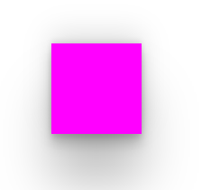

# 阴影

作用:给元素设置 **阴影** 效果

属性名: `box-shadow`

属性值: X轴偏移量 Y轴偏移量 模糊半径 扩散半径 颜色 内外阴影

注意:

* X轴偏移量和Y轴偏移量为 **必须**
* **默认是外阴影** ,内阴影需要添加 `inset`

这里推荐几个阴影预设网站和一些生成器网站

[Beautiful CSS box-shadow examples 阴影预设网站](https://getcssscan.com/css-box-shadow-examples) ☆

[Shadow Palette Generator 阴影生成器](https://www.joshwcomeau.com/shadow-palette/) ☆

[CSS Box Shadow Generator 阴影生成器](https://cssbud.com/css-generator/css-box-shadow-generator/)

[Box Shadows 阴影生成器](https://box-shadow.dev/)

```html
<div></div>
```

```css
div{
    width: 100px;
    height: 100px;
    background-color: fuchsia;
    box-shadow: rgba(0, 0, 0, 0.25) 0px 54px 55px, rgba(0, 0, 0, 0.12) 0px -12px 30px, rgba(0, 0, 0, 0.12) 0px 4px 6px, rgba(0, 0, 0, 0.17) 0px 12px 13px, rgba(0, 0, 0, 0.09) 0px -3px 5px;
}
```

