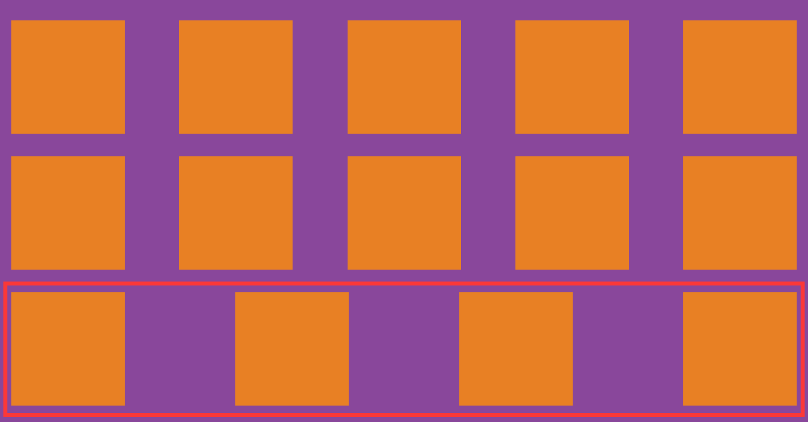
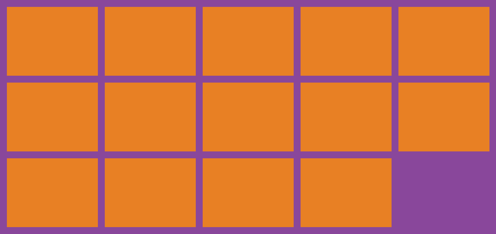
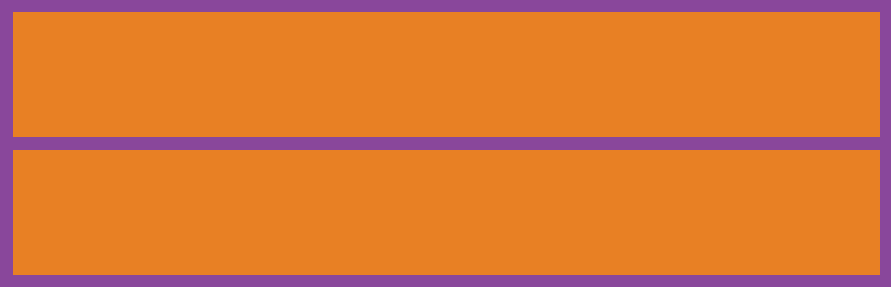
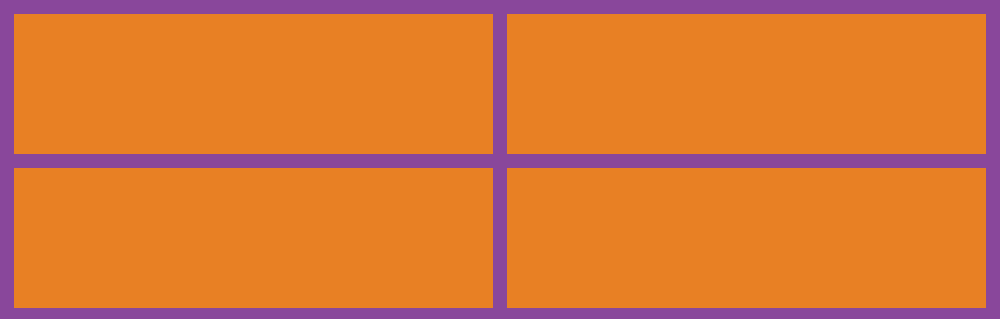
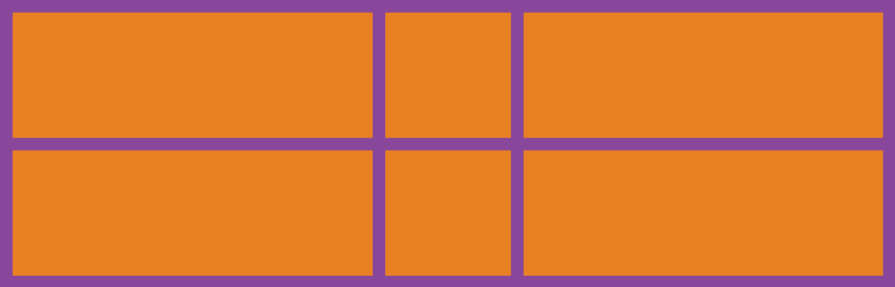
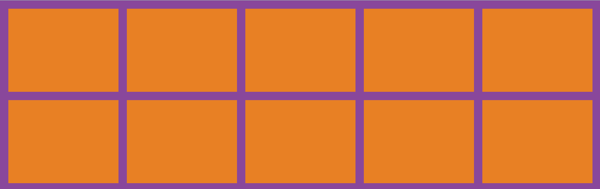
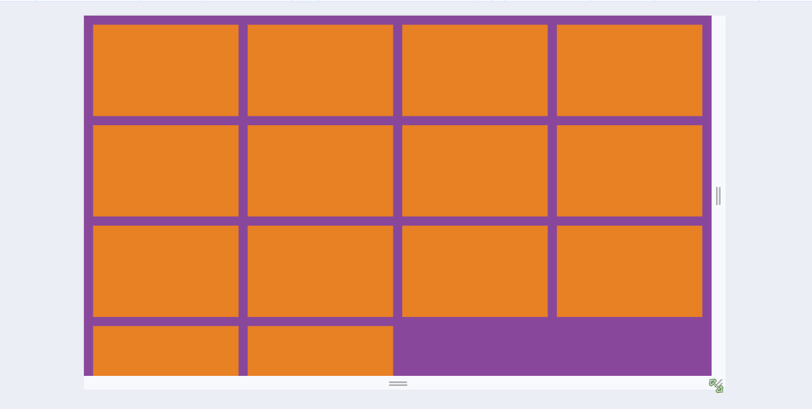
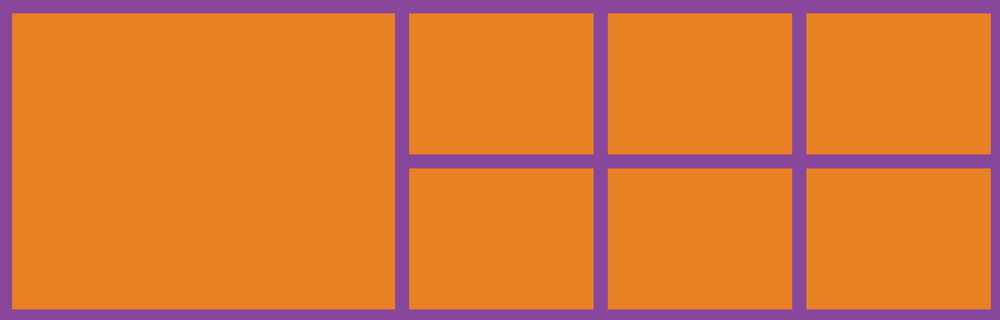

# Grid栅格布局

使用flex布局的痛点:

如果使用 `justify-content: space-between;` 让子元素两端对齐,自动分配中间间距,假设一行4个,如果每一行都是4的倍数那没任何问题,但如果最后一行是2,3个的时候就会出现下面的状况:

```html
<div class="box">
    <div></div>
    <div></div>
    <div></div>
    <div></div>
    <div></div>
    <div></div>
    <div></div>
    <div></div>
    <div></div>
    <div></div>
    <div></div>
    <div></div>
    <div></div>
    <div></div>
</div>
```

```css
.box {
    padding: 20px 0;
    background-color: #89479B;
    display: flex;
    justify-content: space-between;
    flex-wrap: wrap;
}

.box div{
    margin: 20px;
    width: 200px;
    height: 200px;
    background-color: #E88024;
}
```



如果想让最后一行左对齐也是有办法的,能实现但是操作起来有些麻烦,但是如果这种布局使用grid布局的话,就会变的非常容易

```css
.box {
    padding: 20px;
    background-color: #89479B;
    display: grid;
    grid-template-columns: repeat(5, 1fr);
    gap: 20px;
}

.box div{
    height: 200px;
    background-color: #E88024;
}
```

`display: grid` :是转为栅格布局,这个是必须的

`grid-template-columns: repeat(5, 1fr)` :将网格分为几列, `repeat` 是重复,循环, `1fr` 是自适配单位

`gap: 20px` :栅格四周的间隔



看,上面的grid布局,最后一行不是5的倍数,但是可以左对齐,不会有像flex布局一样的特性

## grid-template-columns属性

`grid-template-columns: 1fr;` :独占一行



`grid-template-columns: 1fr 1fr;` :一行分为两列



`grid-template-columns: 1fr 200px 1fr;` :中间固定200px,两边自动平均分配



`grid-template-columns: 1fr 1fr 1fr 1fr 1fr;` :如果多列的值相同,可以使用repeat()函数

`grid-template-columns: repeat(5,1fr)` 当然将1fr缓存固定的px尺寸也可以



`grid-template-columns: repeat(auto-fill, minmax(255px, 1fr));` :这种写法可以用来做响应式布局, `auto-fill` 主轴上指定的宽度或者重复次数是最大可能的正整数, `minmax` 最小值 `255px` , `minmax` 最大值 `1fr` 代表剩余空间的比例

注意:实现这种响应式布局,一定要注意父容器不能使用固定宽度,可以将父容器改为如: `80%` ,这样就能根据屏幕的宽度,自动展示一行展示几个了



## grid-row和grid-column属性

可以控制某个元素占领几份

以grid-row行为例,从第几列开始 / 第几列+想占几个

```css
grid-row: 1/3;
grid-column: 1/3;
```


