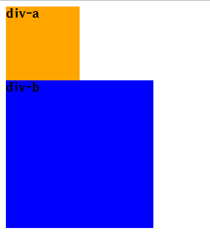

# 使用CSS

目标:使用**CSS**画两个方块



```html
<!DOCTYPE html>
<html lang="zh_CN">

<head>
    <meta charset="UTF-8">
    <meta name="viewport" content="width=device-width, initial-scale=1.0">
    <title>使用CSS</title>
    <style>
        .a{
            width: 100px;
            height: 100px;
            background-color: orange;
        }
        .b{
            width: 200px;
            height: 200px;
            background-color: blue;
        }
    </style>
</head>

<body>
    <div class="a">div-a</div>
    <div class="b">div-b</div>
</body>

</html>
```

## 解析

`width`: 宽度,数值

`height`: 高度,数值

`background-color`: 背景颜色,颜色值

将`class`为`a`的`div`标签 的宽设置为`100px`,高也设置为`100px`,并将背景颜色设置为`orange`

将`class`为`b`的`div`标签 的宽设置为`200px`,高也设置为`200px`,并将背景颜色设置为`blue`
