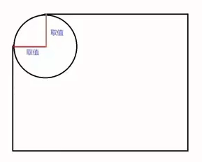
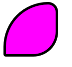

# 圆角

作用:设置元素外边框为圆角

`border-radius: 四角`

`border-radius: 左上右下 左下右上`

`border-radius: 左上 左下右上 右下`

`border-radius: 左上 右上 右下 左下`

属性值:数值/百分比

提升:属性值是圆角的半径



```html
<div></div>
```

```css
div{
    width: 100px;
    height: 100px;
    border: 5px solid black;
    background-color: fuchsia;
    border-radius: 90px 20px 50px 5px;
}
```

