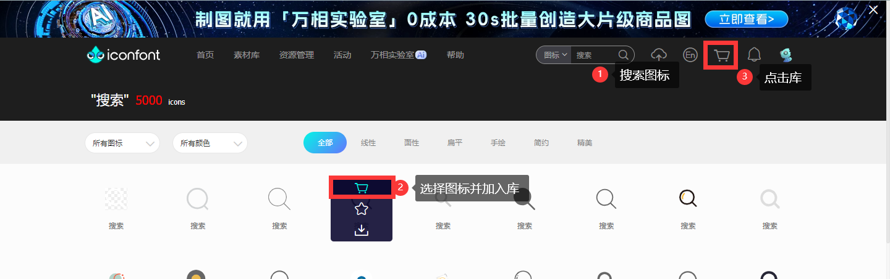
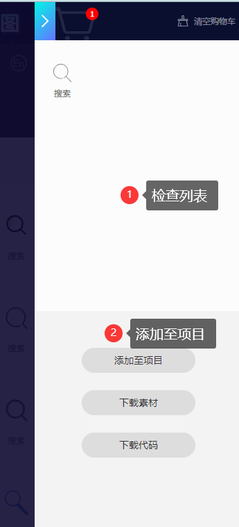
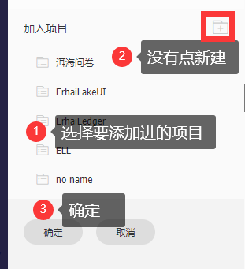
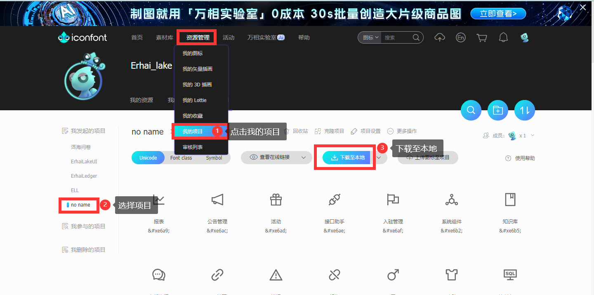
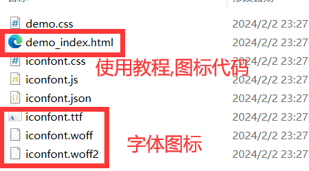
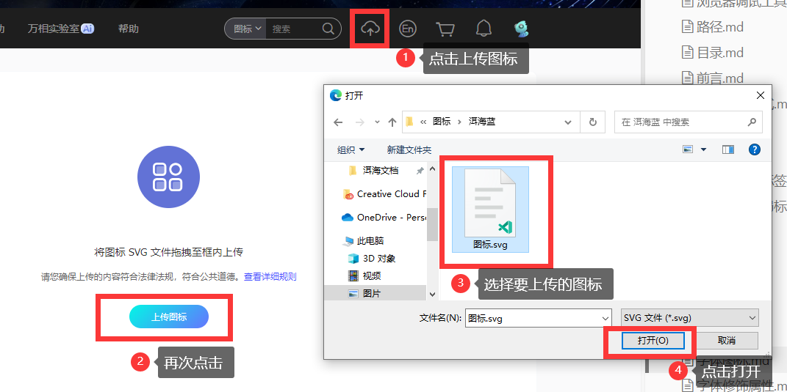
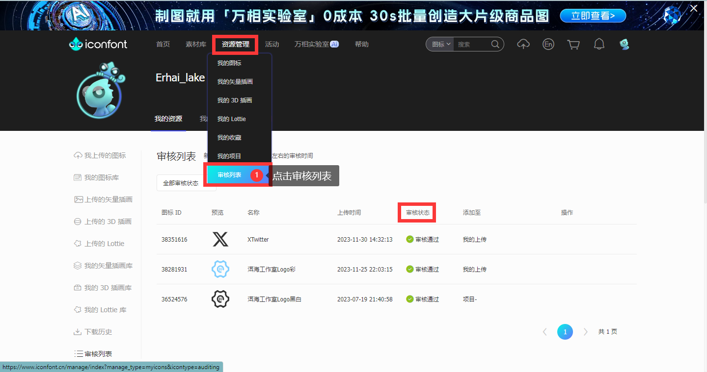

# 字体图标

展示的是**图标**,本质是**字体**

作用:在网页中添加简单地,颜色单一的小图标

优点:

* 灵活性:灵活的修改样式,例如:尺寸,颜色等
* 轻量性:体积小,渲染快,降低服务器请求次数
* 兼容性:几乎兼容所有主流浏览器
* 使用方便:先下载再使用

国内可以使用阿里的[iconfont图标库](https://www.iconfont.cn)

可以直接下载图标源文件,或者添加至项目,合并成字体图标











推荐使用Font class方法,Vue.js推荐使用Symbol方法,根据教程使用即可

引入项目下面生成的 fontclass 代码

```html
<link rel="stylesheet" href="iconfont.css">
```

挑选相应图标并获取类名,应用于页面

```html
<span class="ErhaiLakeUI-icon xxx"></span>
```

## 上传自定义图标

只能上传SVG的矢量图



在确认编辑页面点击去除颜色提交后,等待审核通过后即可

