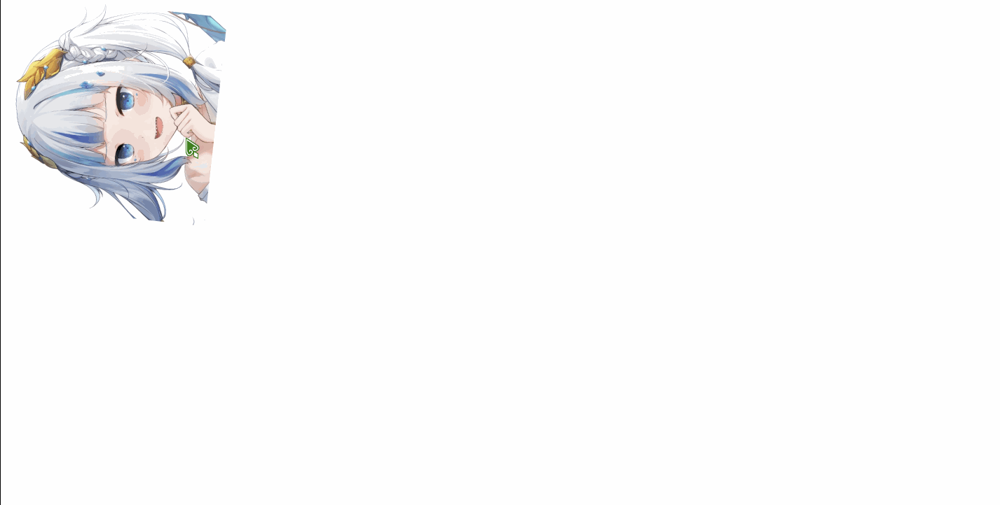
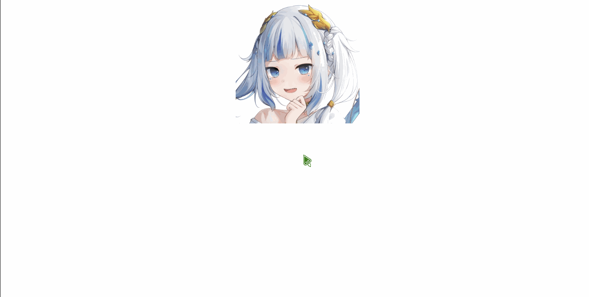

# 平面转换

作用:为元素**添加动态效果**,一般与**过渡**配合使用

概念:改变盒子在**平面**内的**形态**(位移,旋转,缩放,倾斜)

平面转换又叫**2D转换**

属性名:`transform`

例子:

```html

```

```css
img{
    width: 300px;
    height: 300px;
    transition: all 0.5s;
}

img:hover{
    transform: translate(800px) rotate(360deg) scale(2);
}
```


## 平移

`transform: translate(X轴移动距离, Y轴移动距离);`

如果想单独设置XY轴,可以使用以下属性值

`transform: translateX(X轴移动距离);`

`transform: translateY(Y轴移动距离);`

例子:

```html

```

```css
img{
    width: 300px;
    height: 300px;
    transition: all 0.5s;
}

img:hover{
    transform: translate(200px, 200px);
}
```


## 旋转

`transform: rotate(旋转角度);`

如果想单独设置XY轴,可以使用以下属性值

`transform: rotateX(旋转角度);`

`transform: rotateY(旋转角度);`

单位:`deg`

正数顺时针,负数逆时针

例子:

```html

```

```css
img{
    width: 300px;
    height: 300px;
    transition: all 0.5s;
}

img:hover{
    transform: rotate(360deg);
}
```



## 改变转换原点

默认情况下,转换原点是**盒子中心点**

`transform-origin: 水平原点位置 垂直原点位置;`

属性值:

* 方位名:`left`,`top`,`right`,`bottom`,`center`
* 数值
* 百分比

例子:

```html

```

```css
img{
    width: 300px;
    height: 300px;
    transition: all 0.5s;
}

img:hover{
    transform-origin: right bottom;
    transform: rotate(180deg);
}
```


## 多重转换

`transform: 动态效果1 动态效果2;`

每个动态效果用空格分割

例如先平移在旋转:

```css
transform: translate() rotate();
```

## 缩放

`transform: scale(缩放倍率);`

`transform: scale(X轴缩放倍率, Y轴缩放倍率);`

通常,只为`scale`设置一个值,表示X轴和Y轴**等比例缩放**

取值**大于1**为**放大**,**小于1**为**缩小**

例子:

```html

```

```css
img{
    width: 300px;
    height: 300px;
    transition: all 0.5s;
}

img:hover{
    transform: scale(2, 0.8);
}
```


## 倾斜

`transform: skew(倾斜角度);`

单位:`deg`

例子:

```html

```

```css
img{
    width: 300px;
    height: 300px;
    transition: all 0.5s;
}

img:hover{
    transform: skew(30deg);
}
```



## 空间转换

空间:是从坐标轴角度定义的**X,Y,Z**三条坐标轴构成了一个立体空间,**Z轴位置与视线方向相同**

空间转换也叫**3D转换**

## 3D平移

`transform: translate3d(X轴移动距离, Y轴移动距离, Z轴移动距离);`

如果想单独设置XYZ轴,可以使用以下属性值

`transform: translateX(X轴移动距离);`

`transform: translateY(Y轴移动距离);`

`transform: translateZ(Z轴移动距离);`

例子:

```html

```

```css
img{
    width: 300px;
    height: 300px;
    transition: all 0.5s;
}

img:hover{
    transform: translate3d(200px, 200px, 500px);
}
```


由于电脑是平面的,默认状态下无法观察到Z轴的平移效果

## 视距

作用:指定了**观察者**与**Z=0**平面的距离,为元素添加**透视效果**

透视效果:**近大远小,近实远虚**

属性(添加给**父级**,建议取值范围**800~1200**)

`perspective: 视距;`

例子:

```html
<div>
    
</div>
```

```css
div{
    perspective: 1000px;
}

img{
    width: 300px;
    height: 300px;
    transition: all 0.5s;
}

img:hover{
    transform: translateZ(-200px);
}
```


## 3D旋转

`transform: rotate3d(X, Y, Z, 旋转角度);`

`transform: rotateZ(旋转角度);`

X,Y,Z取值为0~1之间的数

单位:`deg`

正数顺时针,负数逆时针

例子:

```html

```

```css
img{
    width: 300px;
    height: 300px;
    transition: all 0.5s;
}

img:hover{
    transform: rotateZ(360deg);
}
```


## 立体呈现

作用:设置元素的**子元素**是位于**3D空间**中还是**平面**中

`transform-style`

属性值:

`flat`:子级处于**平面**中

`preserve-3d`:子级处于**3D空间**

## 3D缩放

`transform: scale3d(X轴缩放倍率, Y轴缩放倍率, Z轴缩放倍率);`

取值**大于1**为**放大**,**小于1**为**缩小**