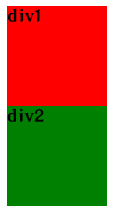
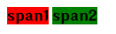
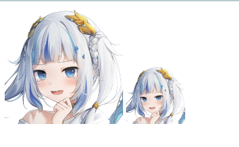

# 显示模式

显示模式:元素的显示方式

作用:布局网页的时候,根据元素的显示模式选择**合适**的元素摆放内容

## 块级元素

* 独占**一行
* 宽度默认是**父**级的**100%**
* 添加**宽高**属性的**生效**

```html
<div class="d1">div1</div>
<div class="d2">div2</div>
```

```css
.d1{
    width: 100px;
    height: 100px;
    background-color: red;
}

.d2{
    width: 100px;
    height: 100px;
    background-color: green;
}
```



## 行内元素

* 一行**可以显示**多个**
* 设置**宽高**属性不**生效**
* 宽高尺寸由**内容撑开**

```html
<span class="span1">span1</span>
<span class="span2">span2</span>
```

```css
.span1{
    background-color: red;
}

.span2{
    background-color: green;
}
```



## 行内块元素

* **一行**可以显示**多个**
* 设置**宽高**属性**生效**
* 宽高尺寸也可以由**内容撑开**

```html


```



## 转换显示模式

属性名:`display`

属性值:

|     属性值     |  效果  |
| :------------: | :----: |
|    `block`     |  块级  |
| `inline-block` | 行内块 |
|    `inline`    |   行   |

