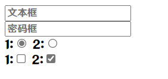
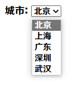

# 表单

作用:收集用户信息

使用场景:

* 登录页面
* 注册页面
* 搜索页面

标签名:`form`双标签

建议:所有用到表单控件的地方都使用`form`嵌套

## 表单控件

### input 标签的基本使用

`input`标签`type`属性的不同,则功能不同

```html
<input type="">
```

type属性:

|   类型   |                         描述                          |
| :------: | :---------------------------------------------------: |
|   text   |                  文本框,输入单行文本                  |
| password |                        密码框                         |
|  radio   | 单选框,允许在多个拥有相同 name 值的选项中选中其中一个 |
| checkbox |   多选框,允许在多个拥有相同 name 值的选项中选中多个   |

这里列出4个常用的,全部可见 [mozilla文档](https://developer.mozilla.org/zh-CN/docs/Web/HTML/Element/input)

```html
<form>
    <input type="text" placeholder="文本框">
    <br>
    <input type="password" placeholder="密码框">
    <br>
    1:<input type="radio" name="a" checked>
    2:<input type="radio" name="a">
    <br>
    1:<input type="checkbox" name="a">
    2:<input type="checkbox" name="a" checked>
    <br>
</form>
```



`placeholder`: 输入框为空时,显示的提升文本

`checked`: 默认选择项

### 下拉菜单

标签名:`select``option`双标签

```html
<form>
    城市:
    <select>
        <option value="bj">北京</option>
        <option value="sh">上海</option>
        <option value="gd">广东</option>
        <option value="sz">深圳</option>
        <option value="wh" selected>武汉</option>
    </select>
</form>
```



默认显示第一项,但是如果项里有`selected`则默认显示有`selected`的

### 文本域

作用:**多行**输入文本

标签名:`textarea`双标签

```html
<textarea>默认显示的文本</textarea>
```

### label标签

作用:网页中,某个标签的说明文本

用`label`标签绑定文本和表单控件1关系,**增大表单控件的点击范围**

写法一:

`label`标签只嵌套内容,不嵌套表单控件

设置`label`标签的`for`属性和表单控件的`id`属性**相同**

```html
<input type="radio" id="man">
<label for="man">男</label>
```

方法二:

使用`label`标签**嵌套文本和表单控件**,不需要属性

```html
<label><input type="radio">女</label>
```

提示:支持`label`标签增大点击范围的表单控件:**文本框,密码框,上传文件,单选框,多选框,下拉菜单,文本域**等等

### 按钮

```html
<buttor type="">按钮</buttor>
```

type属性:

|  类型  |                     描述                     |
| :----: | :------------------------------------------: |
| submit |        提交按钮,点击后,提交数据到后台        |
| reset  |     重置按钮,点击后,将表单控件恢复默认值     |
| button | 普通按钮,默认没有任何功能,一般配合**Js**使用 |

