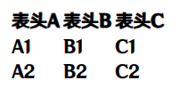
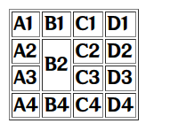
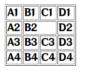
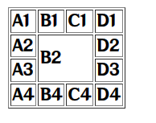

# 表格标签

网页中的表格与Excel表格类似,用来展示数据

标签名:`table``tr``td``th`双标签

`table`: 表格

`tr`: 行

`th`:**表头**单元格

`td`:**内容**单元格

```html
<table>
    <tr>
        <th>表头A</th>
        <th>表头B</th>
        <th>表头C</th>
    </tr>
    <tr>
        <td>A1</td>
        <td>B1</td>
        <td>C1</td>
    </tr>
    <tr>
        <td>A2</td>
        <td>B2</td>
        <td>C2</td>
    </tr>
</table>
```



属性:

* border
  * 边框线宽度,数值,没有单位

## 其他标签名

`thead`: 表格头部

`tboby`: 表格主体

`tfoot`: 表格底部

用途:让表格结构更清晰,方便CSS定位

```html
<table>
    <thead>
        <tr>
            <th>表头A</th>
            <th>表头B</th>
            <th>表头C</th>
        </tr>
    </thead>
    <tbody>
        <tr>
            <td>A1</td>
            <td>B1</td>
            <td>C1</td>
        </tr>
        <tr>
            <td>A2</td>
            <td>B2</td>
            <td>C2</td>
        </tr>
    </tbody>
    <tfoot>
        <tr>
            <td>A结尾</td>
            <td>B结尾</td>
            <td>C结尾</td>
        </tr>
    </tfoot>
</table>
```

## 合并单元格

作用:将**多**个单元格合并成**一**个单元格,以**合并同类信息**

### 步骤

1. 明确合并的目标
2. 保留**最右上角**的单元格,添加属性
   * 跨行合并,保留**最上**单元格
   * 跨列合并,保留**最左**单元格
3. 删除其他单元格

### 跨行合并

`rowspan`合并格数 数值

```html
<table border="1">
    <tr>
        <td>A1</td>
        <td>B1</td>
        <td>C1</td>
        <td>D1</td>
    </tr>
    <tr>
        <td>A2</td>
        <td rowspan="2">B2</td>
        <td>C2</td>
        <td>D2</td>
    </tr>
    <tr>
        <td>A3</td>
        <td>C3</td>
        <td>D3</td>
    </tr>
    <tr>
        <td>A4</td>
        <td>B4</td>
        <td>C4</td>
        <td>D4</td>
    </tr>
</table>
```



### 跨列合并

`colspan`合并格数 数值

```html
<table border="1">
    <tr>
        <td>A1</td>
        <td>B1</td>
        <td>C1</td>
        <td>D1</td>
    </tr>
    <tr>
        <td>A2</td>
        <td colspan="2">B2</td>
        <td>D2</td>
    </tr>
    <tr>
        <td>A3</td>
        <td>B3</td>
        <td>C3</td>
        <td>D3</td>
    </tr>
    <tr>
        <td>A4</td>
        <td>B4</td>
        <td>C4</td>
        <td>D4</td>
    </tr>
</table>
```



### 综合

```html
<table border="1">
    <tr>
        <td>A1</td>
        <td>B1</td>
        <td>C1</td>
        <td>D1</td>
    </tr>
    <tr>
        <td>A2</td>
        <td colspan="2" rowspan="2">B2</td>
        <td>D2</td>
    </tr>
    <tr>
        <td>A3</td>
        <td>D3</td>
    </tr>
    <tr>
        <td>A4</td>
        <td>B4</td>
        <td>C4</td>
        <td>D4</td>
    </tr>
</table>
```

