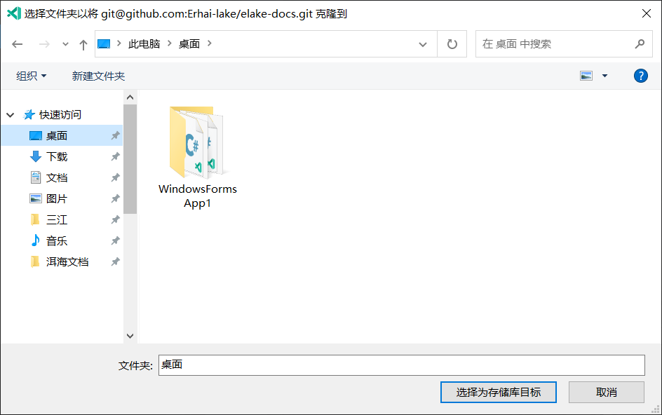

# 在VS Code使用Git

## 在VS Code配置Git

安装好 VS Code 和 Git 后,VS Code会自动识别Git的位置,如果没有自动识别到,则需要手动配置


点击后会打开一个`settings.json`的文件,并且会自动写入配置


如果没有请自行输入:

```json
"git.path": "Git路径,例如:C:/Program Files/Git/cmd/git.exe"
```

## 克隆仓库

点击克隆


在弹窗输入或选择远端仓库


选择保存的位置(不需要新建文件夹)



## 其他功能的使用方法

在VS Code的Git下拉列表中,是VS Code现支持的所有功能(遇到BUG还请用命令行)

不知道有没有必要写,需要的可以[告知一声](https://github.com/Erhai-lake/elake-docs/issues),要的人多的话,应该会更新