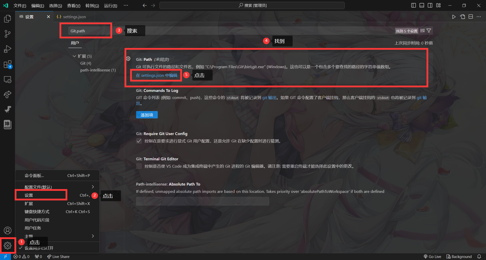

# 在VSCode使用Git

## 在VSCode配置Git

安装好 VSCode 和 Git 后,VSCode会自动识别Git的位置,如果没有自动识别到,则需要手动配置



点击后会打开一个`settings.json`的文件,并且会自动写入配置


如果没有请自行输入:

```json
"git.path": "Git路径,例如:C:/Program Files/Git/cmd/git.exe"
```

## 其他功能的使用方法

不知道有没有必要,需要的可以[告知一声](https://github.com/Erhai-lake/elake-docs/issues),要的人多的话,应该会更新