# 提交或同意PR

> 为了写这篇文档,我快精神分裂了()

PR全称**Pull Request**,用于为对方的代码提交自己的贡献,例如修复BUG,优化性能,新功能等.

这篇文章将使用两个仓库账号进行演示,方便演示从提交到同意.

注意:

* 提交PR前,请检查是否已经有PR或者Issues了,尽量不要重复提交

## GitHub

### (对方)初始化仓库

初始化一个新的仓库,作为教程演示,这里为了方便,就直接在GitHub里新建了

### (己方)复刻仓库

从这一步开始,就正式进入提交PR的步骤了

复刻仓库后,会自动跳转到自己的仓库

### (己方)克隆仓库

复制复刻到自己仓库的SSH链接

在Git中输入`git clone git@github.com:Erhai-lake/Test.git`

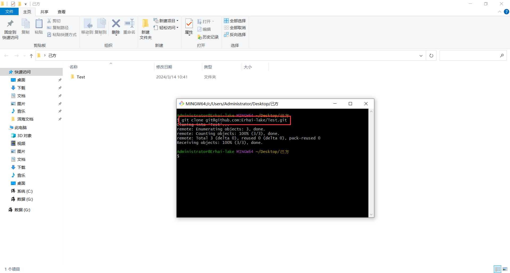

### (己方)新建并切换分支

禁止直接在主分支更改内容,分支的命名尽量简洁,并与解决的问题相关

在Git中输入`git checkout -b ModifyREADME`

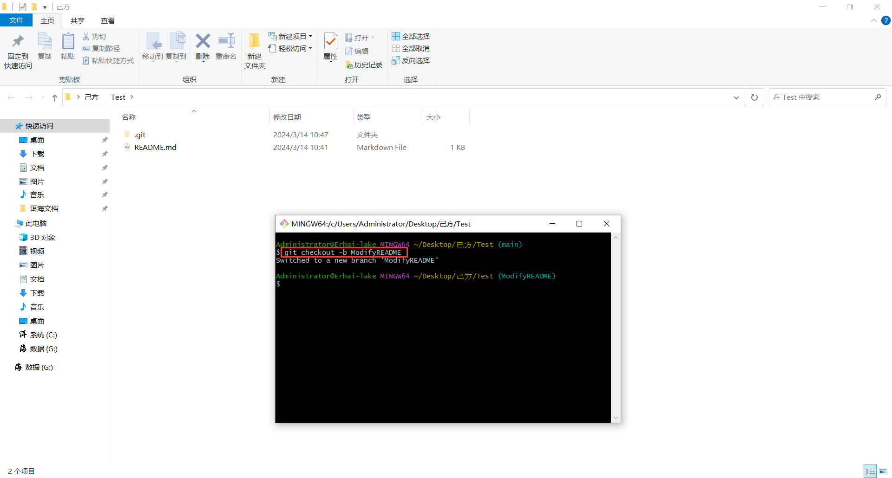

### (己方)编辑代码

这里修改README文件,并新建文本文件作为例子

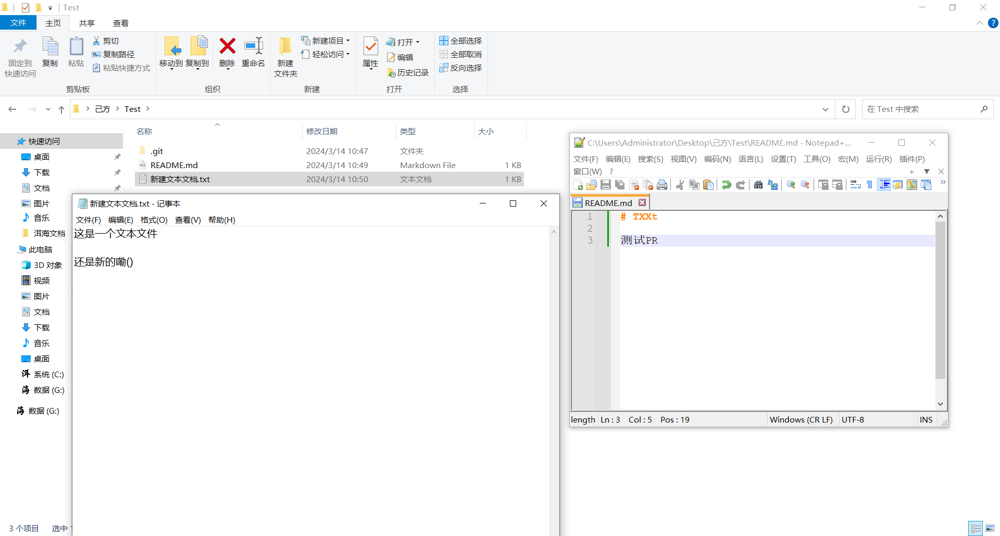

每个人都会有自己的代码风格,到底是用制表符(Tab)还是空格(Space)?每行是80字符还是120字符?这种圣战不应该在PR中出现,PR应该遵循项目已有的风格.例如:如果原来使用的驼峰命名变量,PR中就应该使用驼峰命名,否则有80%的几率会被驳回

### (己方)提交并同步代码到仓库

将修改完的代码同步到GitHub仓库

在Git中输入`git add .`

在Git中输入`git commit -m "修改了README文件,并新建了文本文件"`

在Git中输入`git push --set-upstream origin ModifyREADME`

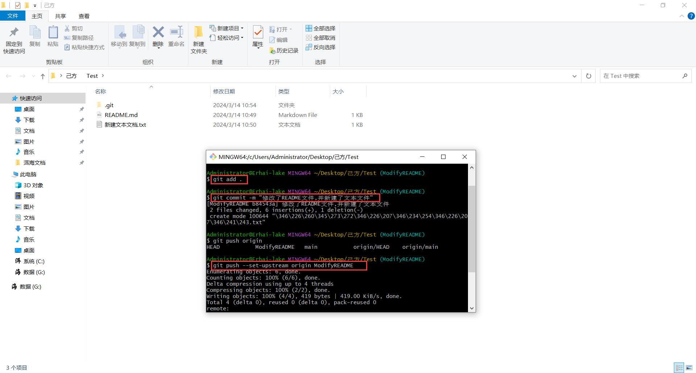

### (己方)提交PR

回到线上仓库

如果对方仓库有说明PR的描述格式,请优先按照格式书写描述!

可以看见你提交的PR已经躺在这里等待处理了(处不处理看对方心情(不是))

点进去可以看见详细信息

如果PR改动很大,你想边改边得到别人及时的反馈,可以先创建PR后,在标题上加上**[WIP]**是Work In Progress的缩写,表示工作还未完成.但尽量不要把未完成的PR提交到别人的项目上(可能会引起别人反感),通常**WIP**的PR都是自己的项目里面使用就行了

### (对方)驳回PR

如果这里点了同意,那就合并了,同步一下本地仓库就完事了

如果不满意,或者有其他需求,请说明告知

### (己方)按照对方的要求修改代码

如果你收到了对方发的消息,例如:

你可以在心里暗骂一声:`BYD,要求还挺多`,然后根据对方的想法修改代码,或者在下方发送评论

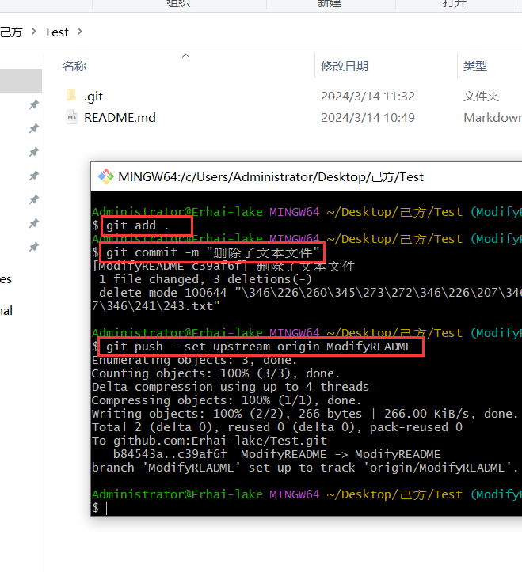

被迫修改了代码,然后提交并同步至仓库

同步后会自动同步到PR

在正常的PR中,可能要改好几次,请放平心态,一切都是为了开源精神

### (对方)同意PR

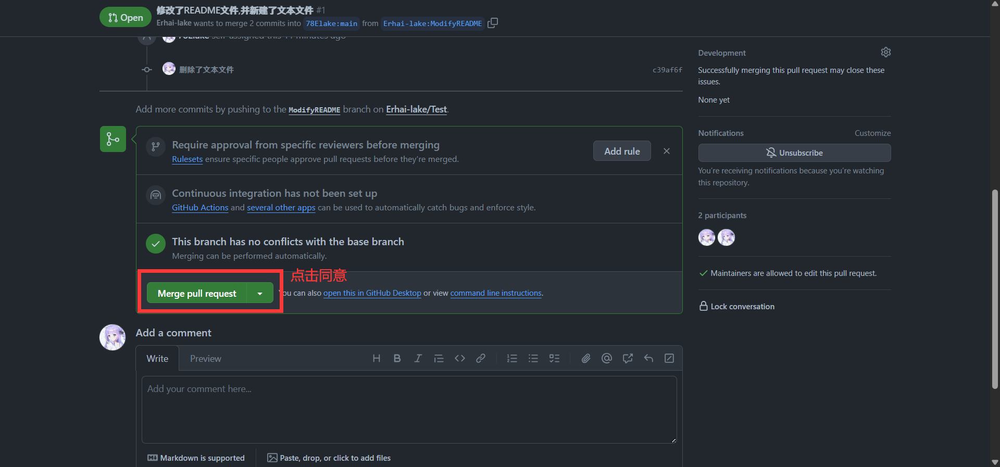

### (双方)PR状态

在对方同意合并后,PR界面会自动关闭,并显示已合并

在项目主页,会显示贡献者

### (对方)同步本地仓库

将远程仓库同步到本地仓库

在Git中输入`git pull`

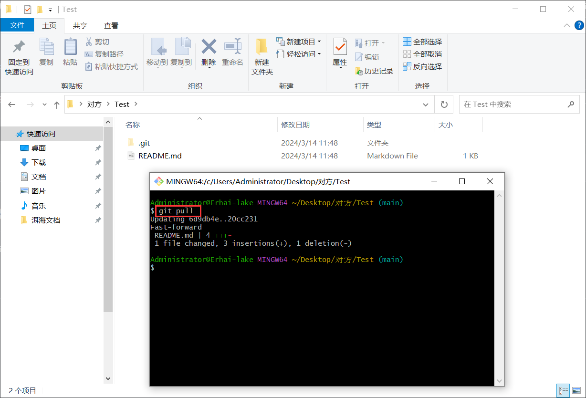

### (己方)删除复刻的仓库

这一步不是必须的,只是保持一个规范的开源协作习惯,减少意外提交错误项目分支的情况发生

来到对方项目主页,找到之前已经合并的提交请求(在关闭的PR列表中),点击 Delete branch

删除本地分支

在Git中输入`git branch -d ModifyREADME`

下次交PR前,先更新本地仓库,在重复以上步骤

在Git中输入`git pull`

## Gitee

### (对方)初始化仓库

由于懒得在注册一个Gitee账号了,所以这里偷柒月的来耍耍

初始化一个新的仓库,作为教程演示,这里为了方便,就直接在Gitee里新建了

### (己方)复刻仓库

从这一步开始,就正式进入提交PR的步骤了

复刻仓库后,会自动跳转到自己的仓库

### (己方)克隆仓库

复制复刻到自己仓库的SSH链接

在Git中输入`git clone git@gitee.com:erhai-lake/test.git`

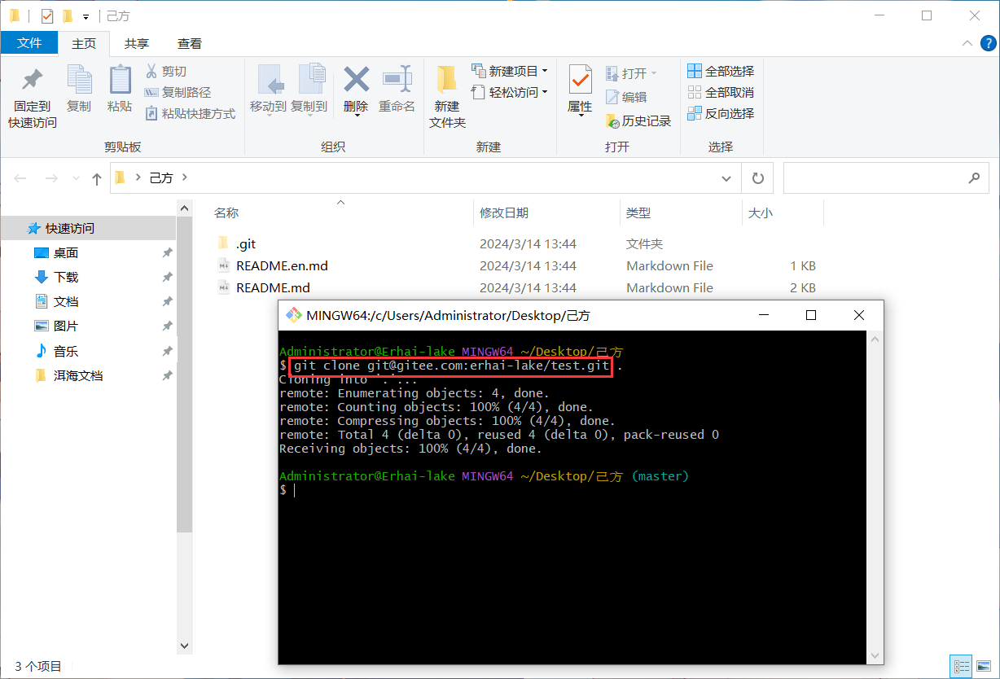

### (己方)新建并切换分支

禁止直接在主分支更改内容,分支的命名尽量简洁,并与解决的问题相关

在Git中输入`git checkout -b ModifyREADME`

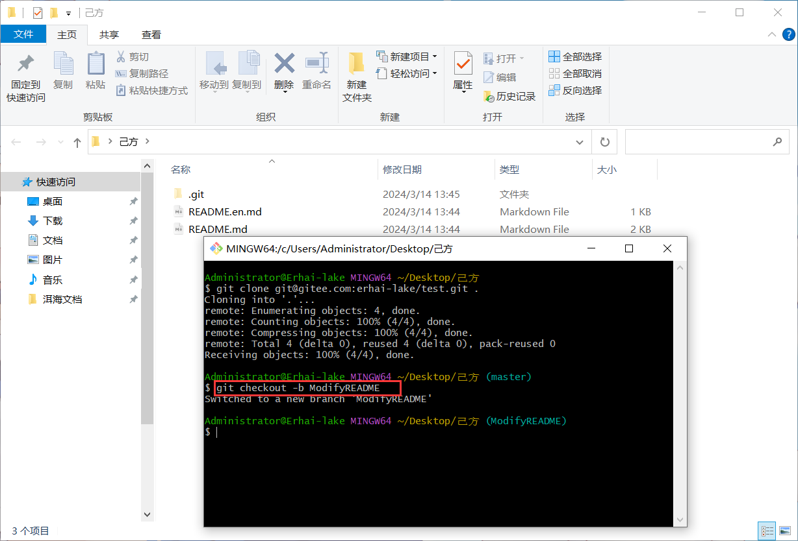

### (己方)编辑代码

这里修改README文件,并删除README.en

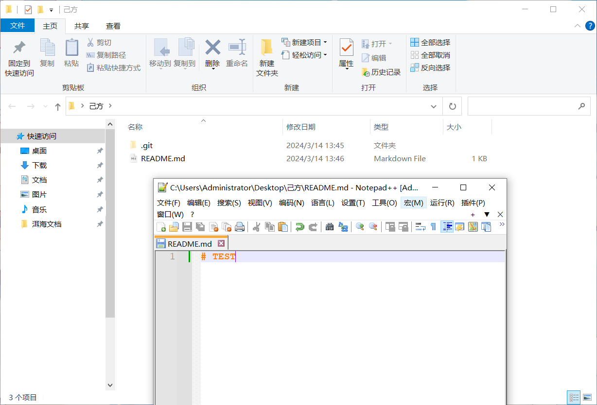

每个人都会有自己的代码风格,到底是用制表符(Tab)还是空格(Space)?每行是80字符还是120字符?这种圣战不应该在PR中出现,PR应该遵循项目已有的风格.例如:如果原来使用的驼峰命名变量,PR中就应该使用驼峰命名,否则有80%的几率会被驳回

### (己方)提交并同步代码到仓库

将修改完的代码同步到GitHub仓库

在Git中输入`git add .`

在Git中输入`git commit -m "修改了README文件,并删除了README.en文件"`

在Git中输入`git push --set-upstream origin ModifyREADME`

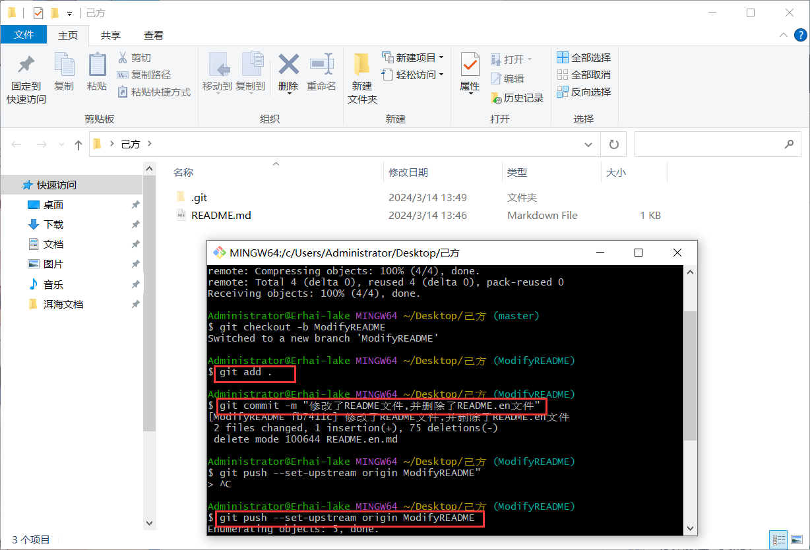

### (己方)提交PR

回到线上仓库

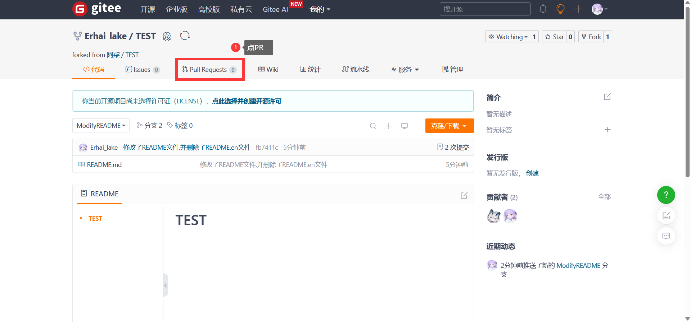

如果对方仓库有说明PR的描述格式,请优先按照格式书写描述!

可以看见你提交的PR已经躺在这里等待处理了(处不处理看对方心情(不是))

点进去可以看见详细信息

如果PR改动很大,你想边改边得到别人及时的反馈,可以先创建PR后,在标题上加上**[WIP]**是Work In Progress的缩写,表示工作还未完成.但尽量不要把未完成的PR提交到别人的项目上(可能会引起别人反感),通常**WIP**的PR都是自己的项目里面使用就行了

### (对方)驳回PR

如果这里通过了两个测试,并点击了合并,那就合并了,同步一下本地仓库就完事了

如果不满意,或者有其他需求,请说明告知

### (己方)按照对方的要求修改代码

如果你收到了对方发的消息,例如:

你可以在心里暗骂一声:`BYD,要求还挺多`,然后根据对方的想法修改代码,或者在下方发送评论

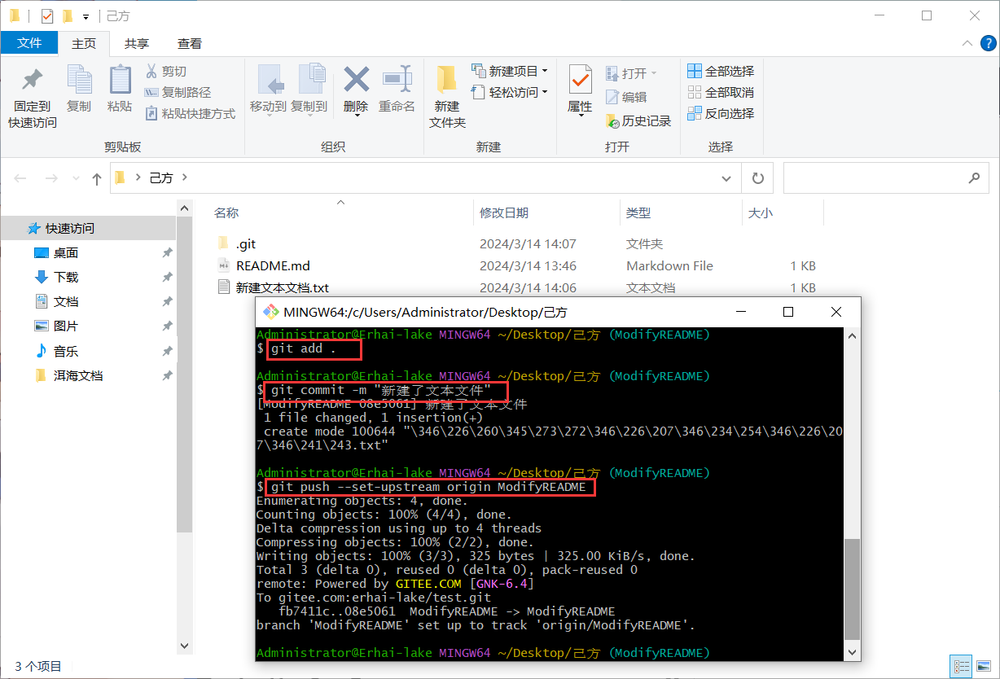

被迫修改了代码,然后提交并同步至仓库

同步后会自动同步到PR

在正常的PR中,可能要改好几次,请放平心态,一切都是为了开源精神

### (对方)同意PR

### (双方)PR状态

在对方同意合并后,PR界面会自动关闭,并显示已合并

在项目主页,会显示贡献者

### (对方)同步本地仓库

将远程仓库同步到本地仓库

在Git中输入`git pull`

### (己方)删除复刻的仓库

这一步不是必须的,只是保持一个规范的开源协作习惯,减少意外提交错误项目分支的情况发生

来到对方项目主页,找到之前已经合并的提交请求(在关闭的PR列表中),点击 Delete branch

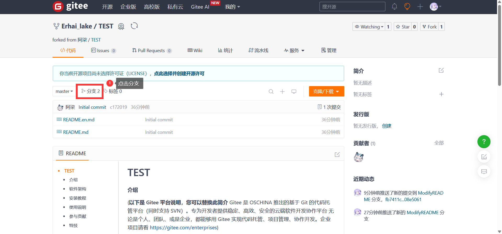

删除本地分支

在Git中输入`git branch -d ModifyREADME`

下次交PR前,先更新本地仓库,在重复以上步骤

在Git中输入`git pull`
