# Flex弹性布局

Flex布局是**浏览器提倡**的布局模型,非常使用结构化布局,提供强大的**空间布局**和**对齐**能力

Flex模型**不会**产生浮动布局中的**脱标**现象,布局网页**更简单,更灵活**

Flex模型有6个属性:

* `flex-direction`
* `flex-wrap`
* `flex-flow`
* `justify-content`
* `align-items`
* `align-content`

项目也有6个属性:

* `order`
* `flex-grow`
* `flex-shrink`
* `flex-basis`
* `flex`
* `align-self`

## 基本概念

采用`Flex`布局的元素,称为Flex容器(flex container),简称**容器**

它的所有子元素自动成为容器成员,称为Flex项目(flex item),简称**项目**


容器默认存在两根轴:**水平的主轴(main axis)**和**垂直的交叉轴(cross axis)**

主轴的开始位置(与边框的交叉点)叫做main start,结束位置叫做main end

交叉轴的开始位置叫做cross start,结束位置叫做cross end

项目默认沿主轴排列

单个项目占据的主轴空间叫做main size,占据的交叉轴空间叫做cross size

## flex-direction属性

`flex-direction`属性决定主轴的方向(即项目的排列方向)

属性值:

`row`:主轴为**水平方向**,起点在**左端**(默认值)

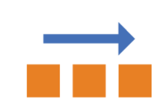

`row-reverse`:主轴为**水平方向**,起点在**右端**

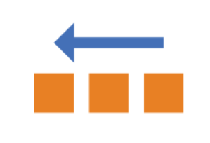

`column`:主轴为**垂直方向**,起点在**上沿**

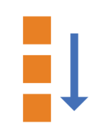

`column-reverse`:主轴为**垂直方向**,起点在**下沿**

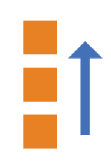

## flex-wrap属性

默认情况下,项目都排在一条线(轴线)上.

`flex-wrap`属性定义,如果一条轴线排不下,如何换行

属性值:

`nowrap`:不换行(默认值)


`wrap`:换行,第一行在**上方**

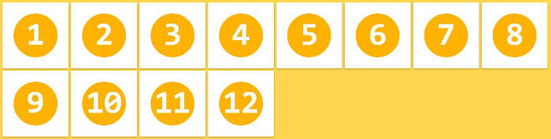

`wrap-reverse`:换行,第一行在**下方**

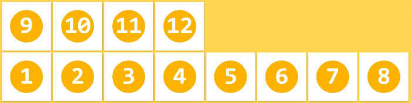

## flex-flow属性

`flex-flow`属性是`flex-direction`属性和`flex-wrap`属性的简写形式

默认值为:`row nowrap`

## justify-content属性

`justify-content`属性定义了项目在主轴上的对齐方式

属性值:

`flex-start`:左对齐(默认值)


`flex-end`:右对齐


`center`:居中


`space-between`:两端对齐,项目之间的间隔都相等


`space-around`:每个项目两侧的间隔相等.所以,项目之间的间隔比项目与边框的间隔大一倍


`space-evenly`:均匀排列每个元素,每个元素之间的间隔相等


## align-items属性

`align-items`属性定义项目在交叉轴上如何对齐

属性值:

`flex-start`:交叉轴的起点对齐


`flex-end`:交叉轴的终点对齐


`center`:交叉轴的中点对齐

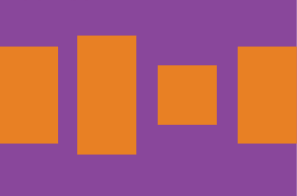

`baseline`:项目的第一行文字的基线对齐

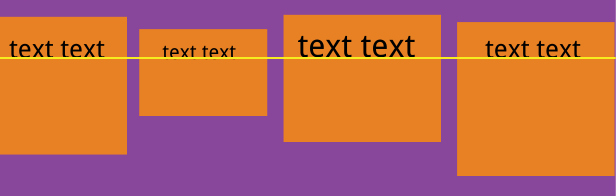

`stretch`:如果项目未设置高度或设为auto,将占满整个容器的高度(默认值)

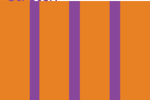

## align-content属性

`align-content`属性定义了多根轴线的对齐方式.如果项目只有一根轴线,该属性不起作用

属性值:

`flex-start`:与交叉轴的起点对齐

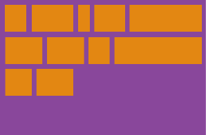

`flex-end`:与交叉轴的终点对齐

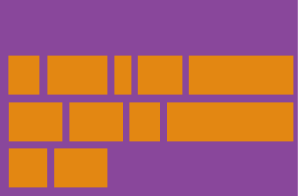

`center`:与交叉轴的中点对齐

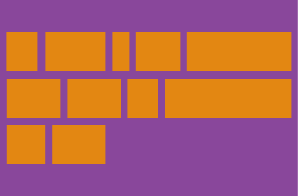

`space-between`:与交叉轴两端对齐,轴线之间的间隔平均分布

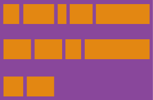

`space-around`:每根轴线两侧的间隔都相等.所以,轴线之间的间隔比轴线与边框的间隔大一倍

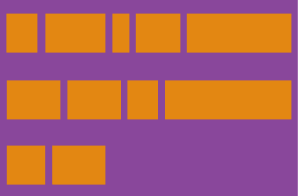

`stretch`:轴线占满整个交叉轴(默认值)

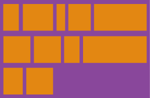

## order属性

`order`属性定义项目的排列顺序.数值越小,排列越靠前,默认为0


## flex-grow属性

`flex-grow`属性定义项目的放大比例,默认为0,即如果存在剩余空间,也不放大

如果所有项目的`flex-grow`属性都为1,则它们将等分剩余空间(如果有的话).如果一个项目的`flex-grow`属性为2,其他项目都为1,则前者占据的剩余空间将比其他项多一倍


## flex-shrink属性

`flex-shrink`属性定义了项目的缩小比例,默认为1,即如果空间不足,该项目将缩小

如果所有项目的`flex-shrink`属性都为1,当空间不足时,都将等比例缩小.如果一个项目的`flex-shrink`属性为0,其他项目都为1,则空间不足时,前者不缩小

负值对该属性无效

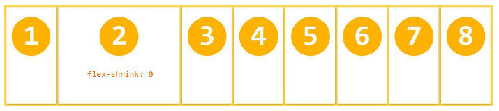

## flex-basis属性

`flex-basis`属性定义了在分配多余空间之前,项目占据的主轴空间(main size).浏览器根据这个属性,计算主轴是否有多余空间.它的默认值为auto,即项目的本来大小

它可以设为跟width或height属性一样的值,则项目将占据固定空间

## flex属性

`flex`属性是`flex-grow`,`flex-shrink`和`flex-basis`的简写,默认值为0 1 auto.后两个属性可选

该属性有两个快捷值:`auto`(1 1 auto)和`none`(0 0 auto)

建议优先使用这个属性,而不是单独写三个分离的属性,因为浏览器会推算相关值

## align-self属性

`align-self`属性允许单个项目有与其他项目不一样的对齐方式,可覆盖`align-items`属性.默认值为`auto`,表示继承父元素的`align-items`属性,如果没有父元素,则等同于`stretch`

该属性可能取6个值,除了`auto`,其他都与`align-items`属性完全一致


## 例子

```html
<div class="box">
    <div>1</div>
    <div>2</div>
    <div>3</div>
    <div>4</div>
</div>
```

```css
.box {
    width: 50%;
    padding: 20px;
    background-color: pink;
    display: flex;
    justify-content: space-around;
}

.box div{
    width: 100px;
    height: 100px;
    background-color: yellow;
}
```

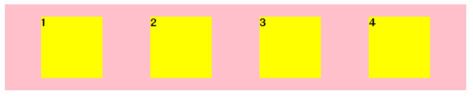

## 布局生成器

老规矩,发几个生成器的网址

[Flex在线工具](http://jack.jackafan.top/zsd/css/flex/) ☆

[Flexible Box Display](https://kexiaolong.gitee.io/flexible-box-display/)