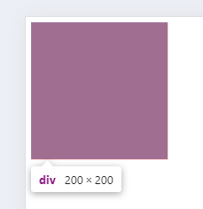

# rem单位

rem单位,是**相对单位**

rem单位是相对于**Html标签的字号**计算结果

1rem=1Html字号大小

例子:

```html
<div></div>
```

```css
html {
    font-size: 20px;
}

div {
    width: 10rem;
    height: 10rem;
    background-color: red;
}
```

